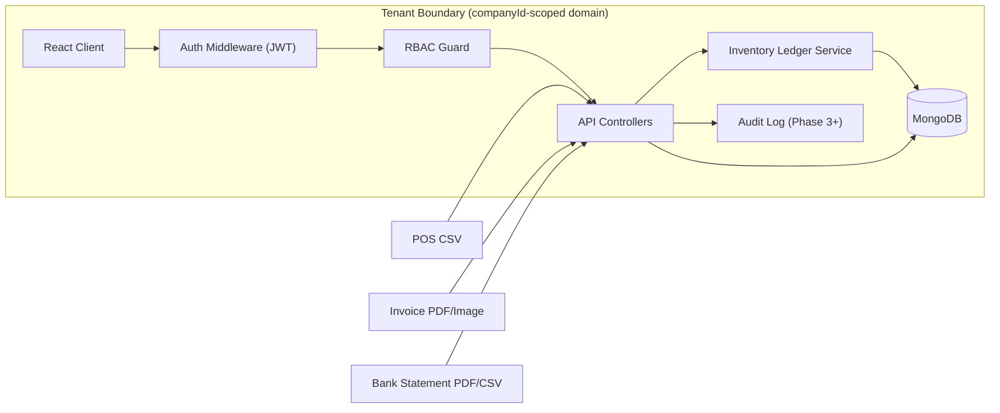
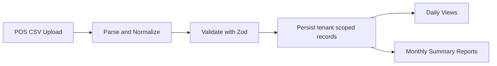
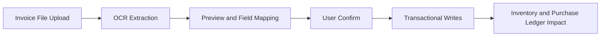
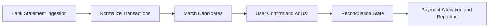

# RetailSync

Multi-tenant retail operations platform for small grocery stores and gas stations.

[](https://www.typescriptlang.org/)
[](https://nodejs.org/)
[](https://pnpm.io/)
[](https://vitejs.dev/)
[](https://react.dev/)
[](https://redux-toolkit.js.org/)
[](https://mui.com/)
[](https://expressjs.com/)
[](https://www.mongodb.com/)
[](https://mongoosejs.com/)
[](https://zod.dev/)
[](https://jwt.io/)
[](https://vitest.dev/)
[](https://www.docker.com/)

## Overview

RetailSync centralizes day-to-day operational and financial workflows for independent retail operators.  
It is implemented as a TypeScript monorepo with a React client, Express API, and MongoDB persistence.

It solves:

- Fragmented POS, inventory, and operational data
- Weak cross-module visibility between sales and stock movement
- Inconsistent role/permission enforcement across teams
- Lack of structured foundation for invoice ingestion and reconciliation workflows
- Missing tenant-safe architecture for multi-company SaaS deployment

## Design Principles

RetailSync is designed around:

- Tenant-safe isolation by default
- Append-only inventory and financial records
- Explicit permission enforcement at the API boundary
- Deterministic ingestion and reconciliation workflows
- Transactional confirm paths for accounting consistency

## Key Features

| Feature | Description |
|---|---|
| Multi-tenant data model | `companyId`-scoped records and request-level tenant context |
| Authentication and onboarding | Register/login/refresh/logout/me + company create/join |
| RBAC | Role-based permission checks per module/action |
| POS CSV ingestion | CSV import and daily/monthly reporting foundations |
| Inventory domain | Items, locations, immutable `InventoryLedger` movement model |
| Client permission gates | Module/action-based route and component gating |
| Invoice OCR ingestion | Invoice ingestion and confirm workflow (Phase 3) |
| Bank statement parsing | Bank ingestion and normalization (Phase 4) |
| Settlement reconciliation | Credit card settlement matching workflows (Phase 4) |
| Supplier payment allocation | Supplier payment allocation workflows (Phase 4) |

## System Architecture



## Monorepo Structure

```text
RetailSync/
  client/        # Vite + React + TypeScript + Redux Toolkit + MUI
  server/        # Express + TypeScript + MongoDB + Mongoose + Zod + JWT
  shared/        # Shared types and Zod schemas
  docs/          # Architecture, operations, testing, roadmap docs
  docker-compose.yml
  pnpm-workspace.yaml
```

## Core Concepts

### Multi-Tenant Model

- Every business document is scoped by `companyId`
- Request context attaches tenant identity server-side
- Controllers and queries enforce tenant-safe filtering

### RBAC Permission Matrix

- Roles: `Admin`, `Member`, `Viewer`
- Authorization is evaluated on module/action tuples
- Action set includes `view`, `create`, `edit`, `delete`, plus module-specific actions
- Server-side checks are authoritative; client gating is UX-only defense-in-depth

### Event-Sourced Inventory

- Inventory mutations are append-only ledger entries (`InventoryLedger`)
- No mutable “current quantity” source of truth
- Stock views are derived from ledger aggregates
- Immutability supports traceability and future audit workflows

### Reconciliation Engine

- Bank and settlement ingestion will feed matching workflows
- Invoice, payments, and statements will converge into reconciliation views
- Confirm flows are planned to use transactional writes for consistency

## Data Flow Diagrams

### POS Import Flow



### Invoice Confirm Flow



### Bank Reconciliation Flow



## Example Workflow

1. Import POS CSV files for a store/day range.
2. Review daily and monthly report views.
3. Manage items and location-level stock movements.
4. Ingest supplier invoices and confirm mapped entries (Phase 3).
5. Ingest bank statements and run matching workflows (Phase 4).
6. Confirm reconciliations and allocate supplier payments (Phase 4).

## Implementation Scope by Phase

| Phase | Scope |
|---|---|
| Phase 0 | Auth, company onboarding, RBAC, dashboard shell |
| Phase 1 | POS CSV import and reports |
| Phase 2 | Items, locations, inventory ledger and stock views |
| Phase 3 | Invoice OCR ingestion + confirm flow |
| Phase 4 | Bank parsing + reconciliation + payment allocation |
| DevOps | Docker + CI artifacts, with infrastructure hardening and workflow stabilization |

## Local Development Setup

### Prerequisites

- Node.js 20+
- pnpm 10+
- MongoDB (local or remote URI), unless using Docker Compose

### Install

```bash
make install
```

Optional direct command:

```bash
pnpm install
```

### Run (workspace)

```bash
make dev
```

Optional direct command:

```bash
pnpm dev
```

### Build / Quality

```bash
make typecheck
make lint
make test
make build
make check
```

### Workspace-specific commands

```bash
make dev-server
make dev-client
pnpm --filter @retailsync/server dev
pnpm --filter @retailsync/client dev
pnpm --filter @retailsync/server test
pnpm --filter @retailsync/client test
pnpm --filter @retailsync/server seed:pos <companyId>
```

## Environment Variables

### Server (`/server/.env`)

| Variable | Example / Default | Required | Notes |
|---|---|---|---|
| `PORT` | `4000` | Yes | API bind port |
| `MONGO_URI` | `mongodb://127.0.0.1:27017/retailsync` | Yes | Mongo connection string |
| `JWT_ACCESS_SECRET` | `replace-with-strong-secret` | Yes | Access token signing secret |
| `JWT_REFRESH_SECRET` | `replace-with-strong-secret` | Yes | Refresh token signing secret |
| `CLIENT_URL` | `http://localhost:5173` | Yes | Allowed client origin |
| `NODE_ENV` | `development` | Yes | Runtime mode |

### Client (`/client/.env`)

| Variable | Example / Default | Required | Notes |
|---|---|---|---|
| `VITE_API_URL` | `http://localhost:4000/api` | Yes | API base URL for client |

### Future modules (Phase 3–4)

| Variable | Value |
|---|---|
| OCR/storage/reconciliation-specific env keys | TBD |

## Testing Strategy

### Test Layers

| Layer | Tooling | Purpose |
|---|---|---|
| Unit | Vitest (server + client) | Utilities, schema behavior, pure logic |
| Integration | Vitest + `mongodb-memory-server` | DB-backed route/model behavior |
| End-to-End | Playwright (roadmap) | Cross-module workflows across UI + API |

## Docker

Start full stack:

```bash
make start
```

Optional direct command:

```bash
docker compose up --build
```

### Services

| Service | Purpose | Port Mapping |
|---|---|---|
| `mongo` | MongoDB persistence | `27017:27017` |
| `server` | Express API | `4000:4000` |
| `client` | Static frontend (Nginx) | `8080:80` |

Notes:

- Client is built and served by Nginx in the containerized runtime.
- Mongo data is persisted using the `mongo_data` Docker volume.
- Compose injects production-oriented server env values in `docker-compose.yml`.
- Secrets in compose are placeholders and should be replaced for non-local environments
- Client build arg currently sets `VITE_API_URL=/api` in container build context

To reset containers and database volume:

```bash
make reset
```

## Roadmap

### Phase 3 Goals

- Supplier invoice ingestion pipeline
- OCR extraction interface and preview/confirm workflow
- Transactional confirm path for consistent writes

### Phase 4 Goals

- Bank statement ingestion and parsing
- Credit card settlement reconciliation workflows
- Supplier payment allocation and matching lifecycle

### Long-Term Direction

- Multi-store operational support
- Stronger analytics/reporting depth
- Forecasting-oriented inventory and cashflow insights

## Security & Architecture Notes

- Tenant isolation is enforced via `companyId` in persistence and query paths
- Inventory uses immutable ledger entries (append-only event model)
- POS import flow is designed for idempotent ingestion behavior
- Refresh-token model is implemented with rotation-oriented auth flow
- Permission checks are enforced on the server; client checks complement UX
- Confirm flows are designed to use transaction-wrapped writes in financial paths
- Invoice and bank lifecycle flows are designed around immutable/void-oriented records
- File uploads currently use local storage; production storage backend is TBD

## Architectural Highlights

- Tenant isolation enforced at persistence and query boundaries
- Server-authoritative role/module/action permission model
- Event-sourced inventory with append-only ledger semantics
- Deterministic matching workflows for reconciliation
- Confirm-path consistency via transactional write boundaries

## Contributing

Contributions should follow existing TypeScript, module, and validation patterns.

Recommended pre-PR flow:

1. Run `pnpm typecheck`, `pnpm lint`, `pnpm test`, `pnpm build`
2. Keep tenant isolation and RBAC behavior intact
3. Update docs for any API, workflow, or environment changes

## License

License: TBD
