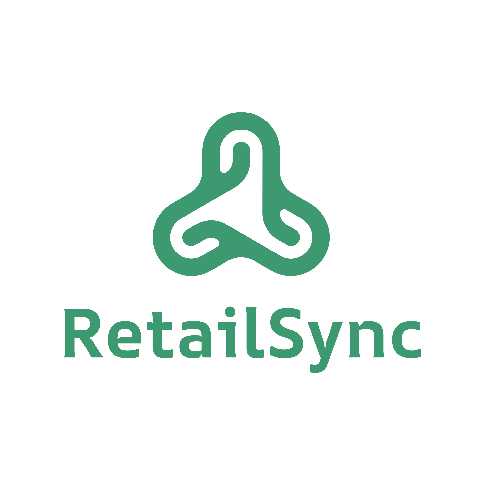
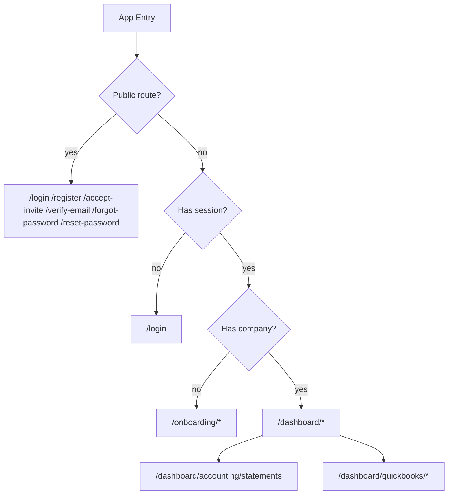

<p align="center">
  
</p>

[](https://www.typescriptlang.org/)
[](https://nodejs.org/)
[](https://pnpm.io/)
[](https://react.dev/)
[](https://vitejs.dev/)
[](https://mui.com/)
[](https://expressjs.com/)
[](https://www.mongodb.com/)

## Overview

RetailSync is a TypeScript monorepo for a financial operations SaaS focused on:
- auth and onboarding
- role-based company access
- POS imports and summaries
- bank statement processing
- QuickBooks operations
- Google Sheets and QuickBooks integrations

The active product is centered on `Dashboard`, `POS`, `Accounting`, `QuickBooks`, `Settings`, and `Access`.

Inventory is no longer part of the supported live product surface.

## Current Product Shape

### Authentication and Onboarding
- Email/password register and login
- Google OAuth sign-in
- Email verification
- Forgot/reset password
- Invite acceptance
- Create company
- Join company
- QuickBooks-assisted company onboarding

### Dashboard Workspaces
- `Dashboard`: company and account context
- `POS`: import, table, analytics, AI view
- `Accounting`: statements list and statement detail
- `QuickBooks`: hub, accounts, contacts, sales, money, operations, reports, tax
- `Settings`: Google Sheets and QuickBooks integration management
- `Access`: users and roles

### Important Notes
- Accounting is intentionally narrowed to statements in the visible app shell.
- QuickBooks is a separate workspace, not an accounting tab.
- Procurement remains hidden/not release-ready.

## Tech Stack

- Frontend: React, Vite, Redux Toolkit, Material UI
- Backend: Express, Mongoose, Zod, JWT
- Shared contracts: shared TypeScript + Zod package
- Testing: Vitest, Supertest, mongodb-memory-server
- Integrations: Google Sheets, Google OAuth, QuickBooks OAuth/API
- Tooling: pnpm workspaces, Docker Compose, GitHub Actions

## Monorepo Structure

```text
RetailSync/
  client/        # React + Vite application
  server/        # Express API
  shared/        # Shared types, schemas, constants
  docs/          # Status, architecture, wireframes, testing docs
```

## Routing Summary


```mermaid
flowchart TD
  Start["App Entry"] --> Public{Public route?}
  Public -- "yes" --> Auth["/login /register /accept-invite /verify-email /forgot-password /reset-password"]
  Public -- "no" --> Protected{Has session?}
  Protected -- "no" --> Login["/login"]
  Protected -- "yes" --> Company{Has company?}
  Company -- "no" --> Onboarding["/onboarding/*"]
  Company -- "yes" --> Dashboard["/dashboard/*"]
  Dashboard --> Accounting["/dashboard/accounting/statements"]
  Dashboard --> QuickBooks["/dashboard/quickbooks/*"]
```

## QuickBooks Workspace

The QuickBooks workspace is organized as a hub plus focused pages:
- Accounts
- Contacts
- Sales
- Money
- Operations
- Reports
- Tax

Implemented operational flows include:
- customer CRUD
- vendor CRUD
- invoice CRUD
- payment CRUD
- deposit CRUD
- check CRUD
- expense CRUD
- transfer CRUD

## Local Development

### Prerequisites

- Node.js 20+
- pnpm 10+
- MongoDB or Docker Desktop

### Install

```bash
pnpm install
```

### Start

```bash
pnpm dev
```

Default local endpoints:
- client: `http://localhost:4630`
- server: `http://localhost:4000`
- health: `http://localhost:4000/health`

### Recommended Validation

```bash
pnpm -r typecheck
pnpm -r build
pnpm -r test
```

## Environment

Important server env:
- `PORT`
- `MONGO_URI`
- `CLIENT_URL`
- `ENCRYPTION_KEY`
- `GOOGLE_OAUTH_CLIENT_ID`
- `GOOGLE_OAUTH_CLIENT_SECRET`
- `GOOGLE_AUTH_REDIRECT_URI`
- `QUICKBOOKS_CLIENT_ID`
- `QUICKBOOKS_CLIENT_SECRET`
- `QUICKBOOKS_INTEGRATION_REDIRECT_URI`
- `SMTP_HOST`
- `SMTP_PORT`
- `SMTP_SECURE`
- `SMTP_USER`
- `SMTP_PASS`
- `SMTP_FROM`

## Documentation Map

- Status: [docs/status.md](/Users/trupal/Projects/RetailSync/docs/status.md)
- Backend API: [docs/backend/api-reference.md](/Users/trupal/Projects/RetailSync/docs/backend/api-reference.md)
- Frontend routing: [docs/frontend/routing-and-permission-gates.md](/Users/trupal/Projects/RetailSync/docs/frontend/routing-and-permission-gates.md)
- Testing matrix: [docs/testing/module-test-matrix.md](/Users/trupal/Projects/RetailSync/docs/testing/module-test-matrix.md)
- Wireframes: [docs/wireframes](/Users/trupal/Projects/RetailSync/docs/wireframes)

## Agent And Skill System

RetailSync includes a repo-level multi-agent operating system for Codex, Cursor, and orchestrated agent workflows.

### Main entrypoint

- Agent system map: [.agents/README.md](/Users/trupal/Projects/RetailSync/.agents/README.md)

### Layer agents

- Manager: [.agents/manager/AGENTS.md](/Users/trupal/Projects/RetailSync/.agents/manager/AGENTS.md)
- Database: [.agents/database/AGENTS.md](/Users/trupal/Projects/RetailSync/.agents/database/AGENTS.md)
- Backend: [.agents/backend/AGENTS.md](/Users/trupal/Projects/RetailSync/.agents/backend/AGENTS.md)
- Integrations: [.agents/integrations/AGENTS.md](/Users/trupal/Projects/RetailSync/.agents/integrations/AGENTS.md)
- Frontend: [.agents/frontend/AGENTS.md](/Users/trupal/Projects/RetailSync/.agents/frontend/AGENTS.md)
- Tester: [.agents/tester/AGENTS.md](/Users/trupal/Projects/RetailSync/.agents/tester/AGENTS.md)

### Domain specialists

- Auth & Onboarding: [.agents/auth-onboarding/AGENTS.md](/Users/trupal/Projects/RetailSync/.agents/auth-onboarding/AGENTS.md)
- Access & RBAC: [.agents/access-rbac/AGENTS.md](/Users/trupal/Projects/RetailSync/.agents/access-rbac/AGENTS.md)
- POS & Sheets: [.agents/pos-sheets/AGENTS.md](/Users/trupal/Projects/RetailSync/.agents/pos-sheets/AGENTS.md)
- Accounting Statements: [.agents/accounting-statements/AGENTS.md](/Users/trupal/Projects/RetailSync/.agents/accounting-statements/AGENTS.md)
- QuickBooks: [.agents/quickbooks/AGENTS.md](/Users/trupal/Projects/RetailSync/.agents/quickbooks/AGENTS.md)
- Release & Docs: [.agents/release-docs/AGENTS.md](/Users/trupal/Projects/RetailSync/.agents/release-docs/AGENTS.md)

### Workflow skills

- Skill index: [.agents/skills/README.md](/Users/trupal/Projects/RetailSync/.agents/skills/README.md)
- Auth workflow: [.agents/skills/auth-onboarding-workflow.md](/Users/trupal/Projects/RetailSync/.agents/skills/auth-onboarding-workflow.md)
- RBAC alignment: [.agents/skills/rbac-and-route-alignment.md](/Users/trupal/Projects/RetailSync/.agents/skills/rbac-and-route-alignment.md)
- POS + Sheets mapping: [.agents/skills/pos-sheets-mapping-workflow.md](/Users/trupal/Projects/RetailSync/.agents/skills/pos-sheets-mapping-workflow.md)
- Statement processing: [.agents/skills/statement-processing-workflow.md](/Users/trupal/Projects/RetailSync/.agents/skills/statement-processing-workflow.md)
- QuickBooks workspace: [.agents/skills/quickbooks-workspace-workflow.md](/Users/trupal/Projects/RetailSync/.agents/skills/quickbooks-workspace-workflow.md)
- Release readiness: [.agents/skills/release-readiness-workflow.md](/Users/trupal/Projects/RetailSync/.agents/skills/release-readiness-workflow.md)

### Cursor support

Cursor-specific rules live in:

- [.cursor/rules](/Users/trupal/Projects/RetailSync/.cursor/rules)

These mirror the same project boundaries so Cursor prompts can reference the same agents and skills directly.

### Recommended usage pattern

1. Pick a domain specialist first.
2. Pick one or more layer agents second.
3. Add the matching workflow skill if the task is complex or repeated.
4. Use Manager for cross-cutting or multi-phase work.

Example prompt:

```text
Use .agents/quickbooks/AGENTS.md, .agents/frontend/AGENTS.md, and .agents/skills/quickbooks-workspace-workflow.md.

Improve the QuickBooks Money workspace without changing provider contracts.
```

## Release Flow

- active branch: `development`
- release target: `production`
- release guide: [RELEASE.md](/Users/trupal/Projects/RetailSync/RELEASE.md)
