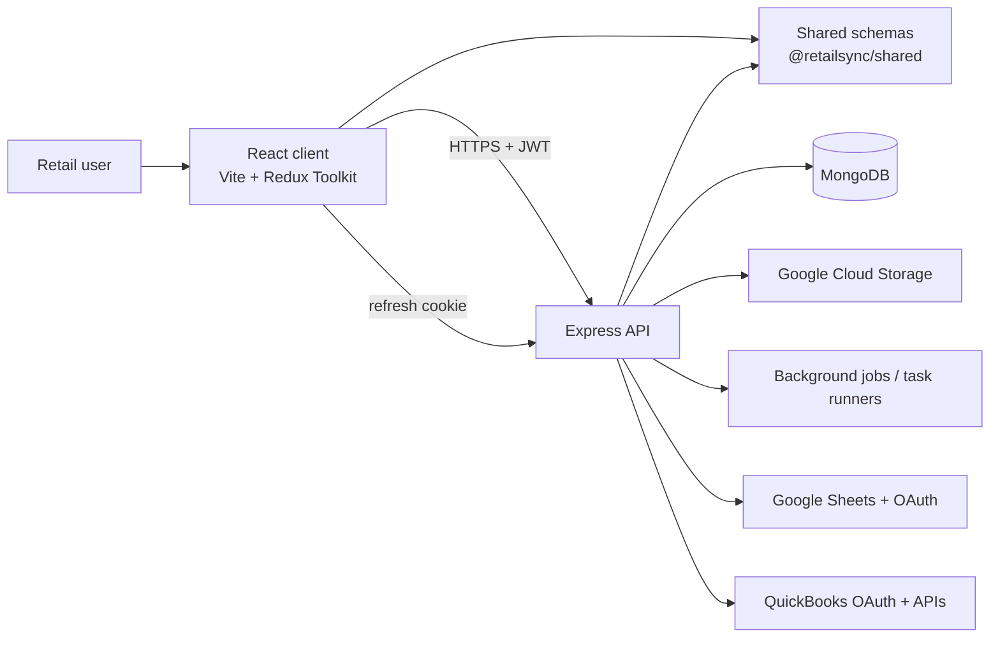
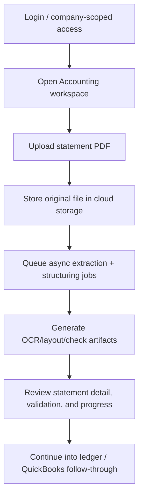
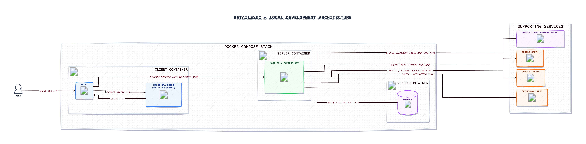
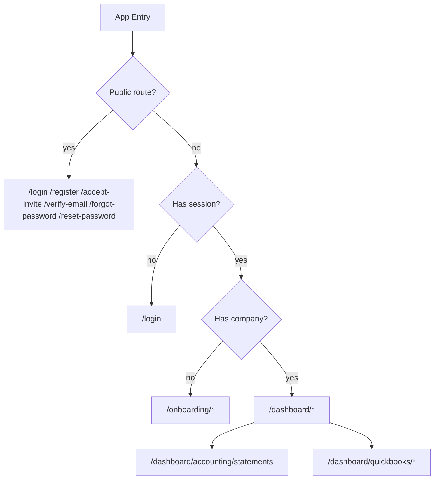

<p align="center">
  
</p>

[](https://www.typescriptlang.org/)
[](https://nodejs.org/)
[](https://pnpm.io/)
[](https://react.dev/)
[](https://vitejs.dev/)
[](https://mui.com/)
[](https://expressjs.com/)
[](https://www.mongodb.com/)

# RetailSync

RetailSync is a multi-tenant retail operations platform that brings authentication, permissions, POS data, accounting workflows, and third-party integrations into one reviewable system.

## Problem Statement

Retail businesses often have operational data split across multiple tools: POS exports, bank statements, accounting review workflows, user/role management, and external systems like QuickBooks and Google Sheets. That fragmentation makes reconciliation slower, increases manual errors, and makes it harder to explain or audit how financial records were produced.

RetailSync addresses that problem by giving one company-scoped application a consistent place to handle access control, operational data, accounting workflows, and integration boundaries.

## High-Level Project Description

RetailSync is a TypeScript monorepo for a retail operations SaaS with:
- auth and onboarding
- role-based company access
- POS imports and summaries
- bank statement processing and review
- QuickBooks operational workflows
- Google Sheets and QuickBooks integration management

The current active product surface is intentionally focused on `Dashboard`, `POS`, `Accounting`, `QuickBooks`, `Settings`, and `Access`.

## Current Product Shape

### Authentication and Onboarding
- Email/password register and login
- Google OAuth sign-in
- Email verification
- Forgot/reset password
- Invite acceptance
- Create company
- Join company
- QuickBooks-assisted company onboarding

### Dashboard Workspaces
- `Dashboard`: company and account context
- `POS`: import, table, analytics, AI view
- `Accounting`: statements list and statement detail
- `QuickBooks`: hub, accounts, contacts, sales, money, operations, reports, tax
- `Settings`: Google Sheets and QuickBooks integration management
- `Access`: users and roles

### Important Notes
- Accounting is intentionally narrowed to statements in the visible app shell.
- QuickBooks is a separate workspace, not an accounting tab.
- Procurement remains hidden/not release-ready.

## What The System Does End-To-End

1. A user authenticates with email/password or Google OAuth.
2. The server resolves company membership and enforces tenant-scoped RBAC.
3. The user navigates across focused workspaces for POS, accounting, QuickBooks, settings, and access.
4. In accounting, the user uploads a bank statement PDF, which is stored in company-scoped cloud storage.
5. Background jobs render pages, extract text/layout, build structured artifacts, and update statement/check progress.
6. The user reviews the statement detail workspace, inspects artifacts and validation signals, and follows the workflow downstream into ledger and QuickBooks-related operations.

## Architecture At A Glance

### System Overview


```mermaid
flowchart LR
  User["Retail user"] --> Client["React client\nVite + Redux Toolkit"]
  Client -->|"HTTPS + JWT"| API["Express API"]
  Client -->|"refresh cookie"| API
  Client --> Shared["Shared schemas\n@retailsync/shared"]
  API --> Shared
  API --> Mongo[("MongoDB")]
  API --> Storage["Google Cloud Storage"]
  API --> Queue["Background jobs / task runners"]
  API --> Sheets["Google Sheets + OAuth"]
  API --> QuickBooks["QuickBooks OAuth + APIs"]
```

### Strongest Demo Workflow


```mermaid
flowchart TD
  A["Login / company-scoped access"] --> B["Open Accounting workspace"]
  B --> C["Upload statement PDF"]
  C --> D["Store original file in cloud storage"]
  D --> E["Queue async extraction + structuring jobs"]
  E --> F["Generate OCR/layout/check artifacts"]
  F --> G["Review statement detail, validation, and progress"]
  G --> H["Continue into ledger / QuickBooks follow-through"]
```

### Visual Docs To Review First

- System overview and runtime model: [docs/architecture/system-overview.md](docs/architecture/system-overview.md)
- Statement pipeline deep dive: [docs/architecture/statement-pdf-processing-workflow.md](docs/architecture/statement-pdf-processing-workflow.md)
- App shell wireframe: [docs/wireframes/app-shell.md](docs/wireframes/app-shell.md)
- Accounting workspace wireframe: [docs/wireframes/accounting-module.md](docs/wireframes/accounting-module.md)
- QuickBooks workspace wireframe: [docs/wireframes/quickbooks-module.md](docs/wireframes/quickbooks-module.md)

## Why The Architecture Looks This Way

- Multi-tenant isolation keeps company data scoped and queryable by tenant boundary instead of relying on client-side trust.
- Server-authoritative RBAC keeps permissions enforceable at the API boundary and consistent across the UI.
- The monorepo plus shared schemas reduce drift between frontend state, backend validation, and domain types.
- Async statement processing separates long-running PDF/OCR/check work from the interactive request path.
- External integrations are isolated behind service layers so Google and QuickBooks behavior can fail independently without collapsing the whole app.

## Recommended Final Demo Flow

1. Start with login and company-scoped navigation.
2. Briefly show the platform surface: Dashboard, POS, Accounting, QuickBooks, Settings, and Access.
3. Enter Accounting and show the statements-first workflow.
4. Upload or open a statement and show processing status, artifacts, validation, and review controls.
5. Transition into the downstream QuickBooks workspace to show how accounting review connects to operational actions.
6. Use POS, settings, or access pages only as short supporting proof points, not the main storyline.

## Grading-Focused Documentation Map

- System overview: [docs/architecture/system-overview.md](docs/architecture/system-overview.md)
- Workflow reference: [docs/architecture/workflows-and-usage.md](docs/architecture/workflows-and-usage.md)
- Statement pipeline: [docs/architecture/statement-pdf-processing-workflow.md](docs/architecture/statement-pdf-processing-workflow.md)
- Testing strategy: [docs/testing/testing-strategy.md](docs/testing/testing-strategy.md)
- Execution status: [docs/status.md](docs/status.md)

For presentation prep, use the aligned slide/story outline in [docs/presentation/final-presentation-outline.md](docs/presentation/final-presentation-outline.md).

## Tech Stack

- Frontend: React, Vite, Redux Toolkit, Material UI
- Backend: Express, Mongoose, Zod, JWT
- Shared contracts: shared TypeScript + Zod package
- Testing: Vitest, Supertest, mongodb-memory-server
- Integrations: Google Sheets, Google OAuth, QuickBooks OAuth/API
- Tooling: pnpm workspaces, Docker Compose, GitHub Actions

## Monorepo Structure

```text
RetailSync/
  client/        # React + Vite application
  server/        # Express API
  shared/        # Shared types, schemas, constants
  docs/          # Status, architecture, wireframes, testing docs
```

## Official Architecture Diagram

The official architecture diagram for this repo is the local-development Docker topology used in the app and supporting docs.

- **D2 Architectural Definition**: [docs/retailsync-architecture.d2](docs/retailsync-architecture.d2)
- **Rendered official diagram asset**: [client/public/architecture-diagram.png](client/public/architecture-diagram.png)

<p align="center">
  
</p>

This keeps the architecture story consistent across the README, the public architecture page, and the detailed architecture docs.

## Routing Summary


```mermaid
flowchart TD
  Start["App Entry"] --> Public{Public route?}
  Public -- "yes" --> Auth["/login /register /accept-invite /verify-email /forgot-password /reset-password"]
  Public -- "no" --> Protected{Has session?}
  Protected -- "no" --> Login["/login"]
  Protected -- "yes" --> Company{Has company?}
  Company -- "no" --> Onboarding["/onboarding/*"]
  Company -- "yes" --> Dashboard["/dashboard/*"]
  Dashboard --> Accounting["/dashboard/accounting/statements"]
  Dashboard --> QuickBooks["/dashboard/quickbooks/*"]
```

## QuickBooks Workspace

The QuickBooks workspace is organized as a hub plus focused pages:
- Accounts
- Contacts
- Sales
- Money
- Operations
- Reports
- Tax

Implemented operational flows include:
- customer CRUD
- vendor CRUD
- invoice CRUD
- payment CRUD
- deposit CRUD
- check CRUD
- expense CRUD
- transfer CRUD

## Local Development

### Prerequisites

- Node.js 20+
- pnpm 10+
- MongoDB or Docker Desktop

### Install

```bash
pnpm install
```

### Start

```bash
pnpm dev
```

Default local endpoints:
- client: `http://localhost:4630`
- server: `http://localhost:4000`
- health: `http://localhost:4000/health`

### Recommended Validation

```bash
pnpm -r typecheck
pnpm -r build
pnpm -r test
```

## Environment

Important server env:
- `PORT`
- `MONGO_URI`
- `CLIENT_URL`
- `ENCRYPTION_KEY`
- `GOOGLE_OAUTH_CLIENT_ID`
- `GOOGLE_OAUTH_CLIENT_SECRET`
- `GOOGLE_AUTH_REDIRECT_URI`
- `QUICKBOOKS_CLIENT_ID`
- `QUICKBOOKS_CLIENT_SECRET`
- `QUICKBOOKS_INTEGRATION_REDIRECT_URI`
- `SMTP_HOST`
- `SMTP_PORT`
- `SMTP_SECURE`
- `SMTP_USER`
- `SMTP_PASS`
- `SMTP_FROM`

## Extended Engineering Docs

- Backend API: [docs/backend/api-reference.md](docs/backend/api-reference.md)
- Frontend routing: [docs/frontend/routing-and-permission-gates.md](docs/frontend/routing-and-permission-gates.md)
- Testing matrix: [docs/testing/module-test-matrix.md](docs/testing/module-test-matrix.md)
- Wireframes: [docs/wireframes](docs/wireframes)

## Project Policies

- Code of conduct: [CODE_OF_CONDUCT.md](CODE_OF_CONDUCT.md)
- Security policy: [SECURITY.md](SECURITY.md)

## Agent And Skill System

RetailSync includes a repo-level multi-agent operating system for Codex, Cursor, and orchestrated agent workflows.

### Main entrypoint

- Agent system map: [.agents/README.md](.agents/README.md)

### Layer agents

- Manager: [.agents/manager/AGENTS.md](.agents/manager/AGENTS.md)
- Database: [.agents/database/AGENTS.md](.agents/database/AGENTS.md)
- Backend: [.agents/backend/AGENTS.md](.agents/backend/AGENTS.md)
- Integrations: [.agents/integrations/AGENTS.md](.agents/integrations/AGENTS.md)
- Frontend: [.agents/frontend/AGENTS.md](.agents/frontend/AGENTS.md)
- Tester: [.agents/tester/AGENTS.md](.agents/tester/AGENTS.md)

### Domain specialists

- Auth & Onboarding: [.agents/auth-onboarding/AGENTS.md](.agents/auth-onboarding/AGENTS.md)
- Access & RBAC: [.agents/access-rbac/AGENTS.md](.agents/access-rbac/AGENTS.md)
- POS & Sheets: [.agents/pos-sheets/AGENTS.md](.agents/pos-sheets/AGENTS.md)
- Accounting Statements: [.agents/accounting-statements/AGENTS.md](.agents/accounting-statements/AGENTS.md)
- QuickBooks: [.agents/quickbooks/AGENTS.md](.agents/quickbooks/AGENTS.md)
- Release & Docs: [.agents/release-docs/AGENTS.md](.agents/release-docs/AGENTS.md)

### Workflow skills

- Skill index: [.agents/skills/README.md](.agents/skills/README.md)
- Auth workflow: [.agents/skills/auth-onboarding-workflow.md](.agents/skills/auth-onboarding-workflow.md)
- RBAC alignment: [.agents/skills/rbac-and-route-alignment.md](.agents/skills/rbac-and-route-alignment.md)
- POS + Sheets mapping: [.agents/skills/pos-sheets-mapping-workflow.md](.agents/skills/pos-sheets-mapping-workflow.md)
- Statement processing: [.agents/skills/statement-processing-workflow.md](.agents/skills/statement-processing-workflow.md)
- QuickBooks workspace: [.agents/skills/quickbooks-workspace-workflow.md](.agents/skills/quickbooks-workspace-workflow.md)
- Release readiness: [.agents/skills/release-readiness-workflow.md](.agents/skills/release-readiness-workflow.md)

### Cursor support

Cursor-specific rules live in:

- [.cursor/rules](.cursor/rules)

These mirror the same project boundaries so Cursor prompts can reference the same agents and skills directly.

### Recommended usage pattern

1. Pick a domain specialist first.
2. Pick one or more layer agents second.
3. Add the matching workflow skill if the task is complex or repeated.
4. Use Manager for cross-cutting or multi-phase work.

Example prompt:

```text
Use .agents/quickbooks/AGENTS.md, .agents/frontend/AGENTS.md, and .agents/skills/quickbooks-workspace-workflow.md.

Improve the QuickBooks Money workspace without changing provider contracts.
```

## Release Flow

- active branch: `development`
- release target: `production`
- release guide: [RELEASE.md](RELEASE.md)
