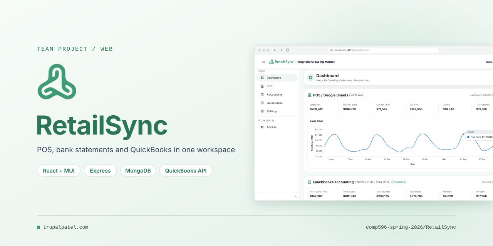
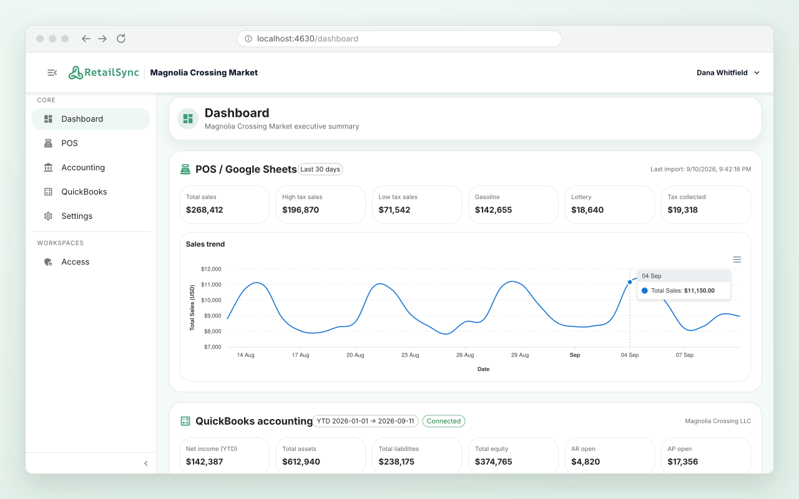
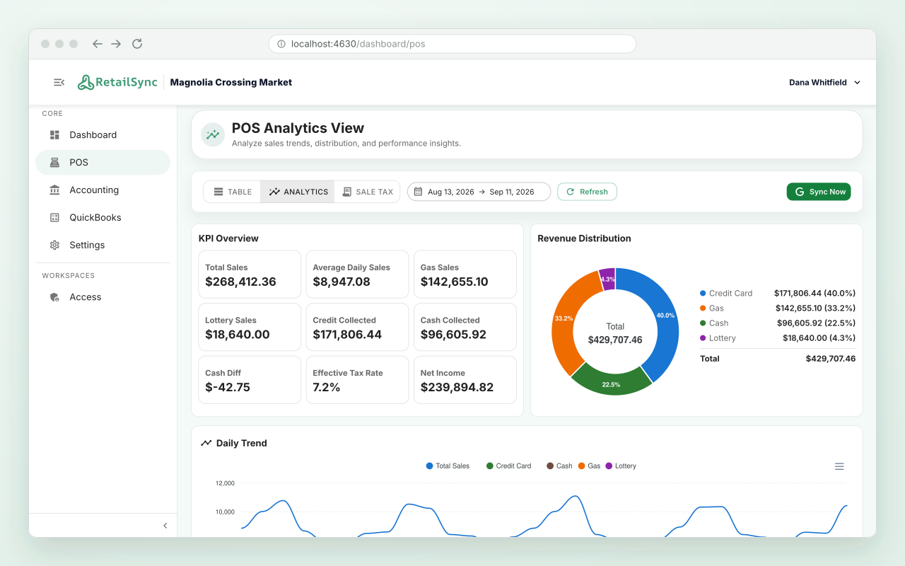
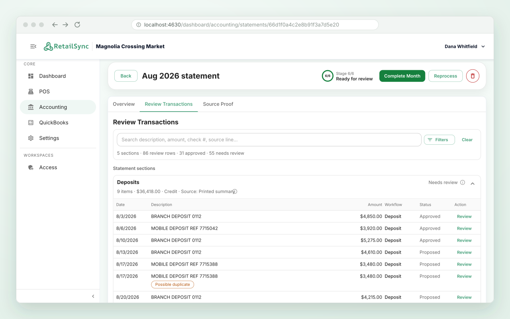
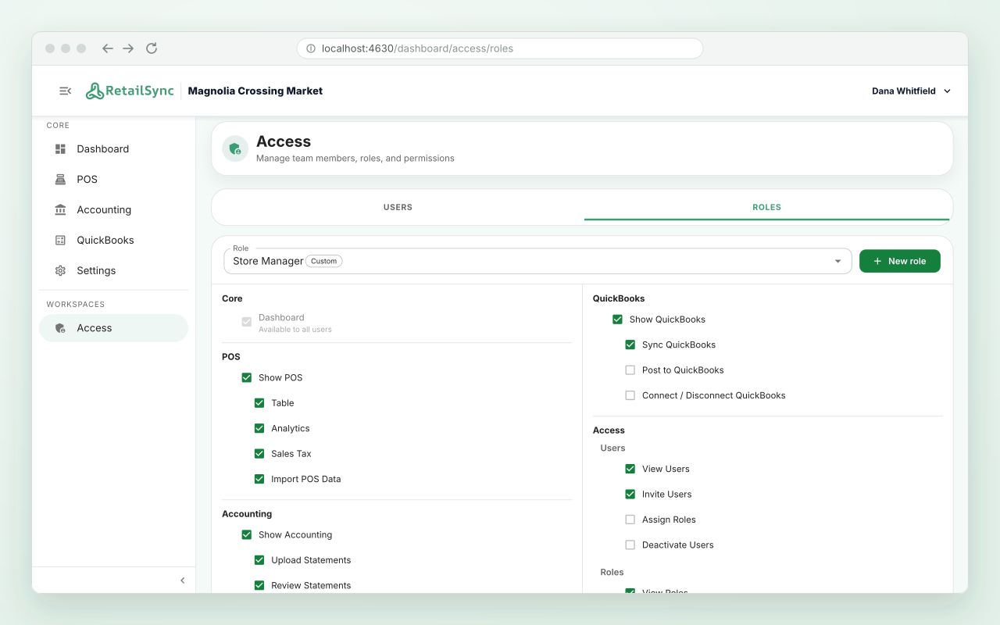
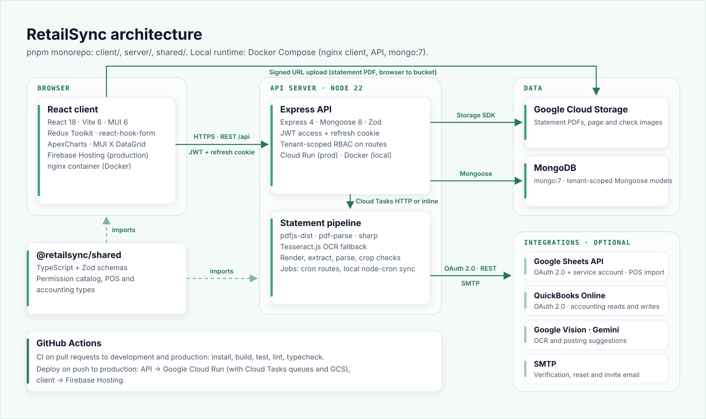

<p align="center">
  
</p>

<p align="center"><strong>A multi-tenant retail operations app that puts POS sales, bank statement review and QuickBooks bookkeeping in one company workspace.</strong></p>

<p align="center">
  <a href="https://trupalpatel.com/projects/retailsync"></a>
  
  
  
  
  
  
</p>

<p align="center">
  <a href="https://trupalpatel.com/projects/retailsync"><strong>Case study</strong></a> ·
  <a href="https://trupalpatel.com"><strong>Portfolio</strong></a>
</p>

---

## Overview

Small retailers keep their numbers in separate places: POS exports, bank statements, spreadsheets and QuickBooks. RetailSync gives each company one workspace for all of them. It imports daily POS data, turns uploaded bank statement PDFs into transactions you can review, and reads and writes QuickBooks records directly. Every request is scoped to the user's company and checked against their role on the server.

> Built as a team project for COMP 596 (Spring 2026) in the [comp596-spring-2026](https://github.com/comp596-spring-2026) organization. Trupal's role: full-stack development of the client, API, integrations and deployment; he authored the commit history in this repository.

## Features

- **Company workspaces**: email/password and Google sign-in, email verification and password reset, invites, and create-or-join company onboarding (including a QuickBooks-assisted path).
- **Server-side access control**: tenant-scoped data and role-based permissions, with a roles editor built on product capabilities (show POS, upload statements, post to QuickBooks and so on).
- **Dashboard**: 30-day POS KPIs and sales trend next to a year-to-date QuickBooks summary.
- **POS workspace**: CSV or Google Sheets import with a column-matching wizard, a daily table, an analytics view, and a Georgia / Troup County monthly sales tax review.
- **Bank statement processing**: statement PDFs upload straight to Cloud Storage. Background jobs render pages, extract text and layout, run OCR (Google Vision or Gemini when configured, Tesseract otherwise), crop check images and validate totals. The review workspace has Overview, Review Transactions and Source Proof tabs.
- **QuickBooks workspace**: OAuth connection and create/read/update/delete for customers, vendors, invoices, payments, deposits, checks, expenses and transfers, plus accounts, registers, reports and tax.
- **Integration settings**: Google Sheets and QuickBooks cards with connection and token health, mapping summary, sync, and soft or hard reset.

## Screenshots

<table>
  <tr>
    <td align="center" width="50%">
      
      <br /><sub><b>Dashboard</b>: POS KPIs, sales trend and QuickBooks summary</sub>
    </td>
    <td align="center" width="50%">
      
      <br /><sub><b>POS analytics</b>: KPI overview, revenue distribution and daily trend</sub>
    </td>
  </tr>
  <tr>
    <td align="center" width="50%">
      
      <br /><sub><b>Statement review</b>: parsed deposits with proposed and approved rows</sub>
    </td>
    <td align="center" width="50%">
      
      <br /><sub><b>Roles and permissions</b>: capability editor for a custom role</sub>
    </td>
  </tr>
</table>

<sub>Screens are recreated from the app's real UI in SVG, filled with fictional demo data (Magnolia Crossing Market is not a real store).</sub>

## Architecture

<p align="center">
  
</p>

The React client calls the Express API over HTTPS with a JWT access token and a refresh cookie. Statement PDFs go from the browser straight to Google Cloud Storage through a signed URL. The API then runs the statement pipeline, inline in local development and through Cloud Tasks in production, and stores the results in MongoDB. Google Sheets, QuickBooks, Vision/Gemini and SMTP sit behind their own service layers, so each can fail without taking down the rest of the app.

More detail: [system overview](docs/architecture/system-overview.md), [statement PDF pipeline](docs/architecture/statement-pdf-processing-workflow.md), [API reference](docs/backend/api-reference.md), [routing and permission gates](docs/frontend/routing-and-permission-gates.md) and the D2 source for the local Docker topology ([docs/diagrams/retailsync-local-architecture.d2](docs/diagrams/retailsync-local-architecture.d2), rendered with `pnpm diagram:architecture` when [d2](https://d2lang.com) is installed).

## Tech stack

| Layer | Technology |
|---|---|
| Client | React 18, Vite 6, TypeScript, Material UI 6 + MUI X, Redux Toolkit + redux-persist, react-hook-form + Zod, ApexCharts |
| API | Node.js 22, Express 4, Mongoose 8, Zod, JWT, node-cron |
| Statement processing | pdfjs-dist, pdf-parse, @napi-rs/canvas, sharp, Tesseract.js; optional Google Vision / Gemini |
| Data | MongoDB 7, Google Cloud Storage |
| Integrations | Google OAuth + Sheets API, QuickBooks Online OAuth + API, SMTP |
| Tooling | pnpm workspaces, Vitest, Supertest, mongodb-memory-server, Docker Compose + nginx, GitHub Actions (Cloud Run + Firebase Hosting deploys) |

## Getting started

### Prerequisites

- Node.js 22 (see `.nvmrc`; run `nvm use`)
- pnpm 10
- MongoDB 7, or Docker Desktop (`make dev` starts the `mongo` service if nothing is listening on port 27017)
- For the integrations only: a Google Cloud project with a Cloud Storage bucket (statement uploads), a Google OAuth client, a QuickBooks developer app and an SMTP account

### Install

```bash
git clone https://github.com/comp596-spring-2026/RetailSync.git
cd RetailSync
nvm use
pnpm install        # if pnpm blocks build scripts: make approve-builds
```

### Environment variables

```bash
cp server/.env.example server/.env
cp client/.env.example client/.env
openssl rand -base64 32   # paste the output into ENCRYPTION_KEY in server/.env
```

The server refuses to start without a valid `ENCRYPTION_KEY` (a base64-encoded 32-byte key). The JWT signing secrets and the internal task secret are derived from it.

| Variable | Required | Description |
|---|---|---|
| `PORT` | Yes | API port (`4000` locally) |
| `MONGO_URI` | Yes | MongoDB connection string |
| `CLIENT_URL` | Yes | Client origin, used for CORS and the redirect back after QuickBooks OAuth |
| `ENCRYPTION_KEY` | Yes | Base64 32-byte key; also derives the JWT and task secrets |
| `NODE_ENV` | No | `development` or `production` |
| `GOOGLE_OAUTH_CLIENT_ID`, `GOOGLE_OAUTH_CLIENT_SECRET` | No | Google sign-in and Sheets OAuth |
| `GOOGLE_AUTH_REDIRECT_URI`, `GOOGLE_INTEGRATION_REDIRECT_URI` | No | OAuth callback URLs for sign-in and the Sheets integration |
| `QUICKBOOKS_CLIENT_ID`, `QUICKBOOKS_CLIENT_SECRET`, `QUICKBOOKS_INTEGRATION_REDIRECT_URI` | No | QuickBooks Online OAuth app |
| `GCS_BUCKET_NAME` | No | Cloud Storage bucket for statement PDFs and artifacts (needed for statement upload) |
| `TASKS_MODE` | No | `inline` (default) or `cloud`; cloud mode also reads `GCP_PROJECT_ID`, `GCP_REGION`, `TASKS_QUEUE_PIPELINE`, `TASKS_QUEUE_SYNC`, `TASKS_OIDC_SERVICE_ACCOUNT_EMAIL`, `INTERNAL_TASKS_ENDPOINT` |
| `SMTP_HOST`, `SMTP_PORT`, `SMTP_SECURE`, `SMTP_USER`, `SMTP_PASS`, `SMTP_FROM`, `SMTP_FROM_NAME` | No | Outgoing email for verification, resets and invites |
| `STATEMENT_OCR_PROVIDER`, `STATEMENT_GEMINI_API_KEY` | No | Statement OCR provider and Gemini key |
| `API_SERVICE_NAME`, `DEBUG_VERBOSE_API` | No | Log labelling and verbose request tracing |
| `ENABLE_LOCAL_CRON`, `LOCAL_CRON_EXPR` | No | Outside production, run the Google Sheets POS sync on a node-cron schedule (default `0 2 * * *`) |
| `VITE_API_URL` (client) | No | API base URL for the client, e.g. `http://localhost:4000/api` |

Direct browser uploads to the statement bucket also need a CORS policy on it: `pnpm --filter @retailsync/server run storage:cors:accounting -- --apply`.

### Run

```bash
pnpm dev        # or: make dev (also starts MongoDB in Docker if needed)
```

The client runs on http://localhost:4630 and the API on http://localhost:4000 (health check at `/health`).

Full stack in Docker: `make start` serves the client on http://localhost:8080 and the API on port 4000. `docker-compose.yml` falls back to a placeholder `ENCRYPTION_KEY` that is only meant for a local demo; export your own `ENCRYPTION_KEY` before running it anywhere else. `make help` lists every shortcut. For sample data, see [docs/operations/seeding-and-sample-data.md](docs/operations/seeding-and-sample-data.md).

Checks and tests:

```bash
pnpm typecheck
pnpm test                                           # unit tests in every package
pnpm --filter @retailsync/server test:integration   # API integration tests (mongodb-memory-server)
pnpm build
```

The statement-extraction fixture tests run only when a local statement PDF exists at `shared/src/accounting/testStatmentPDF.pdf`. That path is gitignored and no statement ships with the repo, so those tests skip by default.

### Contributing

See [CONTRIBUTING](.github/CONTRIBUTING.md), the [code of conduct](CODE_OF_CONDUCT.md), the [security policy](SECURITY.md) and the [release flow](RELEASE.md). Work lands on `development` and is released to `production`.

## Project structure

```text
RetailSync/
├── client/              # React + Vite app (modules: auth, pos, accounting, quickbooks, settings, users, rbac)
├── server/              # Express API: routes, controllers, Mongoose models, jobs, integrations, scripts
├── shared/              # @retailsync/shared: Zod schemas, permission catalog, POS and accounting types
├── docs/                # architecture, operations, testing, wireframes and course reports
│   └── assets/          # README banner, logo, icon, screenshots and architecture diagram
├── .agents/, .cursor/   # agent and Cursor rules used while developing the project
├── .github/workflows/   # CI on pull requests, deploy on push to production
├── docker-compose.yml   # MongoDB, API and nginx client for local runs
├── Makefile             # dev, start, test and reset shortcuts (make help)
└── firebase.json        # Firebase Hosting config for the client
```

## Roadmap

- [ ] Procurement, invoice OCR and wider reconciliation <sub>(Phase 4, `PLANNED` in [docs/status.md](docs/status.md); `/dashboard/procurement` is a hidden prototype with sample rows)</sub>
- [ ] Release hardening: broader tests and a fully green release gate <sub>(validation posture `PARTIAL` in [docs/status.md](docs/status.md))</sub>

## Authors

Built by the COMP 596 (Spring 2026) team in the [comp596-spring-2026](https://github.com/comp596-spring-2026) organization.

**Trupal Patel**

<p>
  <a href="https://trupalpatel.com">Portfolio</a> ·
  <a href="mailto:trupal.work@gmail.com">trupal.work@gmail.com</a> ·
  <a href="https://www.linkedin.com/in/trupalix">LinkedIn</a> ·
  <a href="https://github.com/TRUPALIX9">GitHub</a>
</p>

## License

Released under the MIT License (Copyright (c) 2026 comp596-spring-2026). See [LICENSE](LICENSE).
