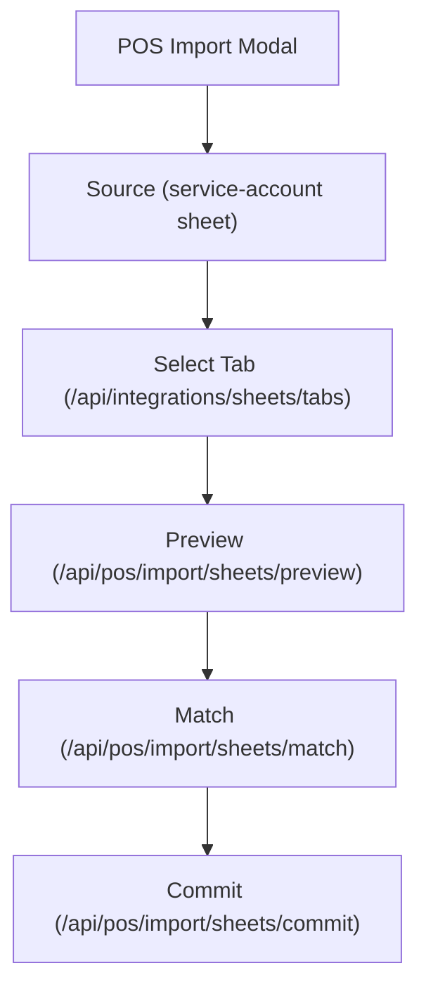

<p align="center">
  
</p>

[](https://www.typescriptlang.org/)
[](https://nodejs.org/)
[](https://pnpm.io/)
[](https://vitejs.dev/)
[](https://react.dev/)
[](https://redux-toolkit.js.org/)
[](https://mui.com/)
[](https://expressjs.com/)
[](https://www.mongodb.com/)
[](https://mongoosejs.com/)
[](https://zod.dev/)
[](https://jwt.io/)
[](https://vitest.dev/)
[](https://www.docker.com/)
[](https://developers.google.com/sheets/api)

## Overview

RetailSync centralizes sales, inventory, permissions, and operational workflows with strict tenant scoping and role enforcement.

It solves:

- fragmented POS and stock workflows
- inconsistent permission enforcement
- weak traceability for inventory changes
- need for integrations (Google Sheets)

## Tech Stack

RetailSync is a TypeScript monorepo with React/Vite on the client and Express/MongoDB on the server, with shared schema contracts and integration adapters.

- Frontend: React, Vite, Redux Toolkit, Material UI
- Backend: Express, Mongoose, Zod, JWT
- Data: MongoDB
- Testing: Vitest, Supertest, mongodb-memory-server
- Integrations: Google APIs (Sheets + OAuth)
- DevOps/Tooling: pnpm workspaces, Docker Compose, Makefile

## Major Features

| Area | Capabilities |
|---|---|
| Frontend access | Login + Google login, onboarding (create/join company), protected dashboard |
| Auth API (server) | Google OAuth start/callback, refresh/logout, current-user context (`me`) |
| Tenant and RBAC | `companyId`-scoped data, server-side permission checks |
| POS | CSV import, daily views, monthly reporting |
| Inventory | Items, locations, immutable `InventoryLedger` movements |
| Integrations | Google Sheets (service account + OAuth connect), QuickBooks settings UI |
| Quality | Vitest test suites, Docker workflows, CI quality gates |

## Frontend UX System Updates

Recent UI foundation upgrades now ship in the client:

- Onboarding company setup:
  - `Timezone` uses searchable `Autocomplete`.
  - `Currency` uses searchable `Autocomplete` with `CODE (SYMBOL) - Name` labels.
- Reusable CRUD building blocks for module shells:
  - `SearchableCrudTable`
  - `CrudEntityDialog` (create/edit)
  - `ConfirmDeleteDialog`
- Consistent feedback pattern for async flows:
  - `useAsyncAction` for loading + success/error toast dispatch
  - centralized API error-code mapping in `client/src/shared/constants/errorCodes.ts`
- Shared utility layer expanded:
  - table pagination hook + helpers
  - date formatter (`moment`-based) in `client/src/shared/utils/date.ts`

## External Product Dependencies

| Product | Used For | Required Env |
|---|---|---|
| Google APIs (`googleapis`) | Sheets read and OAuth connect/callback flow | `GOOGLE_OAUTH_CLIENT_ID`, `GOOGLE_OAUTH_CLIENT_SECRET`, `GOOGLE_AUTH_REDIRECT_URI` |

## Brand Assets

Client brand assets are served from `/client/public/brand` and used across auth UI.

| Asset | Purpose |
|---|---|
| `icon.svg` / `icon.png` / `icon.ico` | icon-only mark, favicon, compact UI |
| `BigLogo.png` | large auth/onboarding logo (icon + wordmark) |
| `logo-horizontal-removebg.png` | horizontal logo in dashboard header |

### Brand Preview

| Asset | Preview |
|---|---|
| `icon.svg` |  |
| `icon.png` |  |
| `icon.ico` |  |
| `BigLogo.png` |  |
| `logo-horizontal-removebg.png` |  |

## Architecture


## Current Frontend Routing


Notes:
- Login and onboarding pages are active.
- Email/password recovery and verification flows are removed.

## Integration Workflow (POS Sources)



## Monorepo Structure

```text
RetailSync/
  client/        # Vite + React + TypeScript + Redux Toolkit + MUI
  server/        # Express + TypeScript + MongoDB + Mongoose + Zod + JWT
  shared/        # Shared types and Zod schemas
  docs/          # Architecture, backend, frontend, operations, testing
  docker-compose.yml
  pnpm-workspace.yaml
```

## Local Development

### Prerequisites

- Node.js 20+
- pnpm 10+
- Docker Desktop (recommended for Mongo)

### Install

```bash
make install
```

### Start

```bash
make dev
```

Default local endpoints:

- Client: `http://localhost:4630`
- Server: `http://localhost:4000`
- Health: `http://localhost:4000/health`

### Quality Gate

```bash
make typecheck
make lint
make test
make build
make check
```

### Local ADC for Sheets

Cloud Run uses ADC automatically. For local Sheets calls, run:

```bash
gcloud auth application-default login
```

Local fallback is also supported in non-production:

- if `/Users/trupal/Projects/RetailSync/credentials/gcp-service-account-retailsync-run-sa.json` exists, Sheets client auth uses it automatically.

## Environment Variables

### Server (`/server/.env`)

| Variable | Required | Notes |
|---|---|---|
| `PORT` | Yes | API port (`4000`) |
| `MONGO_URI` | Yes | Mongo connection string |
| `JWT_ACCESS_SECRET` | Yes | Access token signing secret |
| `JWT_REFRESH_SECRET` | Yes | Refresh token signing secret |
| `CLIENT_URL` | Yes | Allowed CORS origin |
| `NODE_ENV` | Yes | `development` / `test` / `production` |
| `GOOGLE_OAUTH_CLIENT_ID` | No | Google OAuth |
| `GOOGLE_OAUTH_CLIENT_SECRET` | No | Google OAuth |
| `GOOGLE_AUTH_REDIRECT_URI` | No | Google OAuth callback |

### Client (`/client/.env`)

| Variable | Required | Notes |
|---|---|---|
| `VITE_API_URL` | Yes | API base URL (local: `http://localhost:4000/api`, deployed: `https://retailsync-api-qbdqiyjkbq-uw.a.run.app/api`) |

## Deployment Snapshot

- Current deployed API URL: `https://retailsync-api-qbdqiyjkbq-uw.a.run.app`
- Current client build expects: `VITE_API_URL=https://retailsync-api-qbdqiyjkbq-uw.a.run.app/api`
- Docker Compose build arg for client: `VITE_API_URL=/api` (when reverse-proxying API from same host)

## Branching and Release

- `development`: active feature branch target.
- `production`: protected release branch.
- PR flow: feature -> `development`, then `development` -> `production`.
- GitHub Actions:
  - `.github/workflows/ci.yml` runs on PRs to `development` and `production`.
  - `.github/workflows/deploy.yml` runs on pushes to `production`.

## Testing

| Layer | Tooling | Notes |
|---|---|---|
| Unit | Vitest | utility and schema tests |
| Integration | Vitest + mongodb-memory-server | DB-backed auth and domain tests |
| UI | Vitest + RTL | component-level behavior |
| E2E | Planned | Playwright roadmap |

## API and Docs

- API reference: `/Users/trupal/Projects/RetailSync/docs/backend/api-reference.md`
- System architecture: `/Users/trupal/Projects/RetailSync/docs/architecture/system-overview.md`
- Local runbook: `/Users/trupal/Projects/RetailSync/docs/operations/local-development.md`
- Testing strategy: `/Users/trupal/Projects/RetailSync/docs/testing/testing-strategy.md`

### Daily Google Sheets → POS Sync

- **Cloud Scheduler (production)**: configure a daily HTTP POST job to  
  `https://<cloud-run-url>/api/cron/sync-sheets` with header `x-cron-secret: $CRON_SECRET`.  
  The secret comes from the `CRON_SECRET` secret wired in the Cloud Run deploy step.
- **Local dev cron (optional)**: set `ENABLE_LOCAL_CRON=true` and optionally override  
  `LOCAL_CRON_EXPR` (default: `0 2 * * *`) in `server/.env` to run the sync on a schedule.
- **Manual / dry run**: you can test without writing to the DB via:  
  `curl -X POST 'http://localhost:4000/api/cron/sync-sheets?dryRun=true' -H 'x-cron-secret: <value-or-empty>'`

## Docker

```bash
make start
make stop
make logs
make reset
```

Services:

- `mongo` -> `27017`
- `server` -> `4000`
- `client` -> `8080`

Notes:

- No Dockerfile changes are required for the new timezone/currency UI and CRUD component system.
- The existing Docker builds already install workspace dependencies from `pnpm-lock.yaml`, including new frontend packages like `moment`.

## Security Notes

- Tenant isolation is enforced with `companyId` on protected domains.
- Role permission checks are server-authoritative.
- Inventory is append-only ledger based.
- Refresh token rotation and revocation are implemented.

## License

License: TBD
