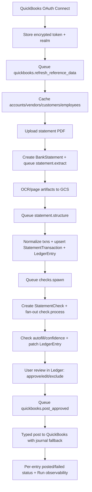

# Accounting Documentation (E2E, Concrete)

Last updated: 2026-03-10

This documentation set describes the current accounting implementation in this repository, from QuickBooks connect to approval-only posting.

## 1) Module map (tab-by-tab)

| Module | UI Tab | Primary Routes | Core Collections | Async Jobs |
| --- | --- | --- | --- | --- |
| Statements | `Statements` + `Statement Detail` | `/api/accounting/statements/*` | `BankStatement`, `StatementTransaction`, `StatementCheck` | `statement.extract`, `statement.structure`, `checks.spawn`, `check.process` |
| Ledger | `Ledger` | `/api/accounting/ledger/*` | `LedgerEntry`, `StatementTransaction` | `matching.refresh`, `quickbooks.post_approved` trigger |
| QuickBooks Sync | `QuickBooks Sync` | `/api/integrations/quickbooks/*` | `IntegrationSettings.quickbooks`, `ChartOfAccount`, `QuickBooksReference`, `LedgerEntry` | `quickbooks.refresh_reference_data`, `quickbooks.post_approved` |
| Observability | `Observability` | `/api/accounting/observability/*` | `Run`, `BankStatement`, `IntegrationSettings` | reads run outputs from all jobs |

## 2) E2E flow at a glance

## 3) Documentation structure

1. [End-to-End Workflow](/Users/trupal/Projects/RetailSync/docs/accounting/end-to-end-workflow.md)
2. [Data Model and Storage](/Users/trupal/Projects/RetailSync/docs/accounting/data-model-and-storage.md)
3. [Module: Statements](/Users/trupal/Projects/RetailSync/docs/accounting/module-statements.md)
4. [Module: Ledger](/Users/trupal/Projects/RetailSync/docs/accounting/module-ledger.md)
5. [Module: QuickBooks Sync](/Users/trupal/Projects/RetailSync/docs/accounting/module-quickbooks-sync.md)
6. [Module: Observability](/Users/trupal/Projects/RetailSync/docs/accounting/module-observability.md)
7. [Validation and Error Handling](/Users/trupal/Projects/RetailSync/docs/accounting/validation-and-error-handling.md)
8. [Epic and Ticket Structure](/Users/trupal/Projects/RetailSync/docs/accounting/epics-and-tickets.md)
9. [Test Plan and Quality Gates](/Users/trupal/Projects/RetailSync/docs/accounting/test-plan.md)
10. [Scheduling and Operations](/Users/trupal/Projects/RetailSync/docs/accounting/scheduling-and-operations.md)

## 4) Runtime guardrails

1. No QuickBooks posting happens without `LedgerEntry.reviewStatus = approved`.
2. All files and derived artifacts are persisted in GCS under deterministic statement prefixes.
3. Mongo stores references, structured records, state transitions, and audit metadata.
4. Pipeline jobs are async and check-level processing is independent.
5. Every proposal and posting decision has confidence and reasons.
