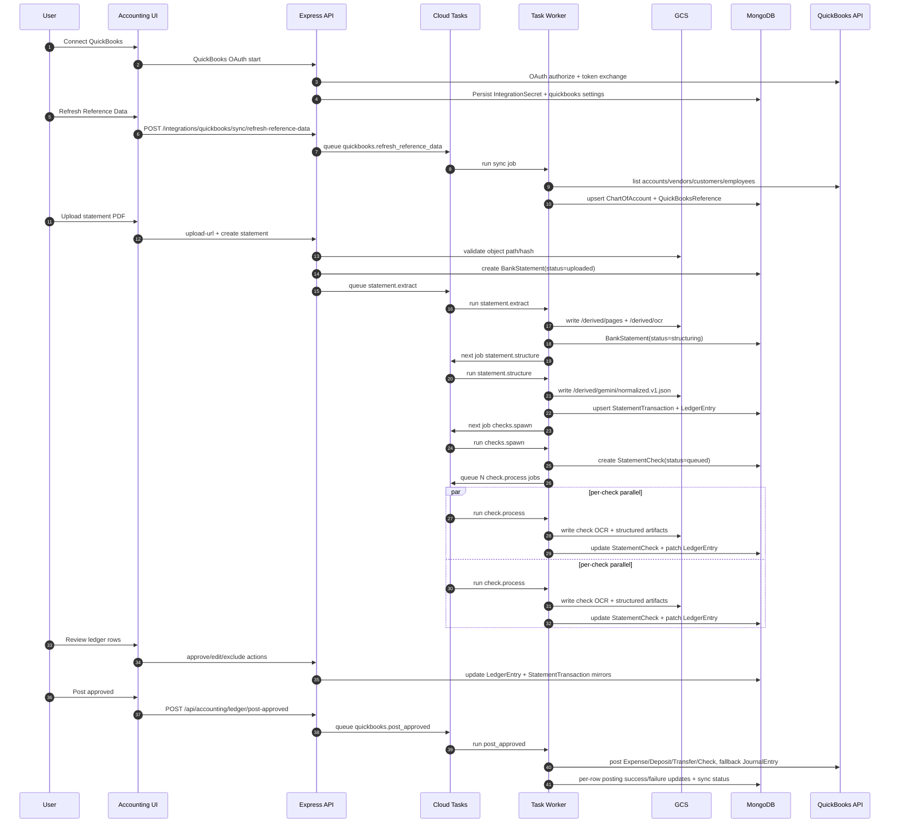
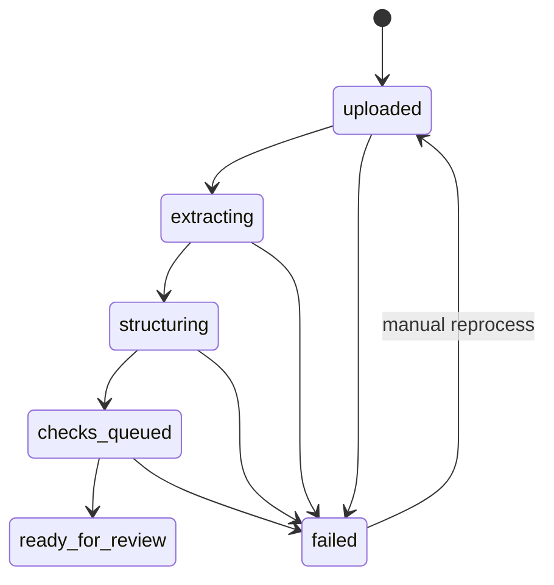
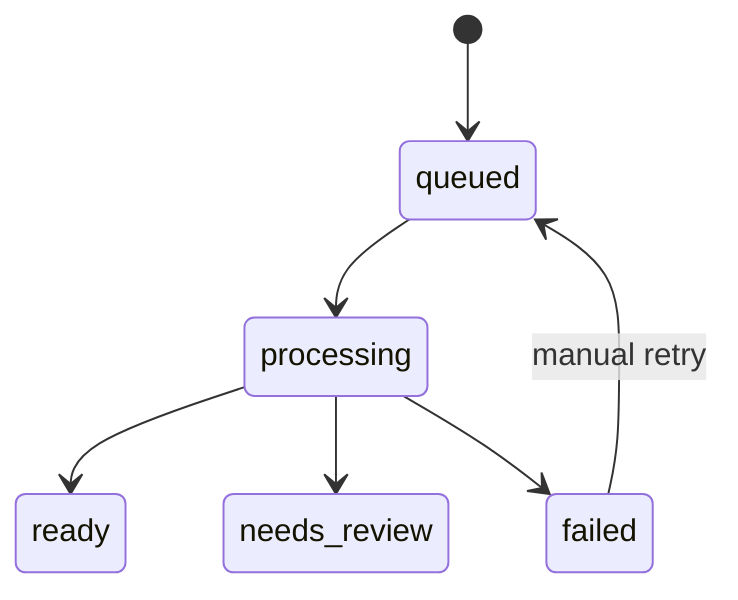
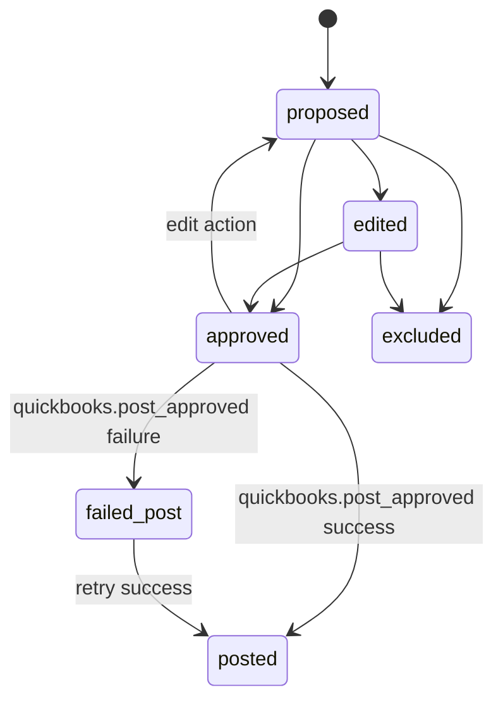

# End-to-End Workflow (Concrete Runtime Lifecycle)

This document is the concrete lifecycle reference for accounting as implemented in the current codebase.

## 1) Prerequisite: QuickBooks connection

1. User opens `QuickBooks Sync` tab.
2. User selects environment (`sandbox` or `production`).
3. User clicks connect (`/api/integrations/quickbooks/start-url` or `/start`).
4. OAuth callback stores encrypted secret and realm/company metadata.
5. User runs `Refresh Reference Data` to hydrate account and entity caches.

Without this stage, posting will fail at sync time due to missing OAuth/access context.

## 2) End-to-end lifecycle sequence

## 3) Pipeline stage contract

| Stage | Entry Condition | Main Actions | Output | Next Stage |
| --- | --- | --- | --- | --- |
| `statement.extract` | Statement exists, GCS PDF path valid | PDF fallback OCR + page placeholders written to GCS | `/derived/ocr/docai.json`, `/derived/ocr/text.txt`, `/derived/pages/page-*.png` | `statement.structure` |
| `statement.structure` | OCR text exists | Parse/normalize transactions, generate proposal seeds, create ledger rows | `StatementTransaction[]`, `LedgerEntry[]`, `/derived/gemini/normalized.v1.json` | `checks.spawn` |
| `checks.spawn` | Transactions structured | Detect check candidates, create `StatementCheck`, enqueue per-check jobs | `StatementCheck[]` with `queued` status | `check.process` (fan-out) |
| `check.process` | checkId + statementId | Check OCR/structured artifacts, autofill fields/confidence, link and patch ledger | updated `StatementCheck`, enriched `LedgerEntry` | none |
| `matching.refresh` | optional manual/automated trigger | recompute proposal confidence/reasons | refreshed proposals in transaction/ledger | none |
| `quickbooks.refresh_reference_data` | QB connected | pull accounts + entities, cache and map | `ChartOfAccount`, `QuickBooksReference`, quickbooks pull status | none |
| `quickbooks.post_approved` | approved entries exist | preflight and typed posting with fallback | per-entry posting status + quickbooks push status | none |

## 4) State machines

### 4.1 Statement state machine

### 4.2 Check state machine

### 4.3 Ledger review/posting state machine

## 5) Progressive unlock behavior

1. Statement row appears immediately after create.
2. Check cards are visible once spawned; each card independently transitions to `ready`, `needs_review`, or `failed`.
3. Ledger is available as soon as transactions are structured; check evidence gets patched in progressively.
4. UI refresh strategy:
   - statements and statement detail: polling every 3 seconds while active
   - SSE endpoint available at `/api/accounting/statements/:id/stream`

## 6) Retry and idempotency lifecycle

1. Statement retry: `/api/accounting/statements/:id/reprocess` resets status/progress/checks and requeues from selected job.
2. Check retry: `/api/accounting/statements/:id/checks/:checkId/retry` resets check to queued and requeues `check.process`.
3. Posting idempotency: rows with existing `posting.qbTxnId` are skipped from post-approved selection.
4. Sync reruns are safe: each entry is updated independently and failures do not abort whole batch.

## 7) Daily scheduled sync lifecycle

1. Cloud Scheduler calls `POST /api/cron/accounting-sync` with `x-cron-secret`.
2. Route can run both domains together or independently:
   - `includeSheets=true|false`
   - `includeQuickBooks=true|false`
   - `dryRun=true|false`
3. Google Sheets path executes `runSheetsSync`.
4. QuickBooks path discovers all connected companies and queues:
   - `quickbooks.refresh_reference_data`
   - `quickbooks.post_approved` (delayed, default 120s).
5. Result summary is returned immediately; per-company outcomes are visible in QuickBooks tab and observability runs.

## 8) Audit trail lifecycle

1. Every task creates a `Run` record with `runType`, `job`, `status`, `traceId`, `errors`, `metrics`, and artifacts.
2. Statement-level issues are accumulated on `BankStatement.issues`.
3. Posting outcomes are written to both `LedgerEntry.posting` and `StatementTransaction.posting`.
4. Observability tab reads failed runs and debug readiness from persisted state.
