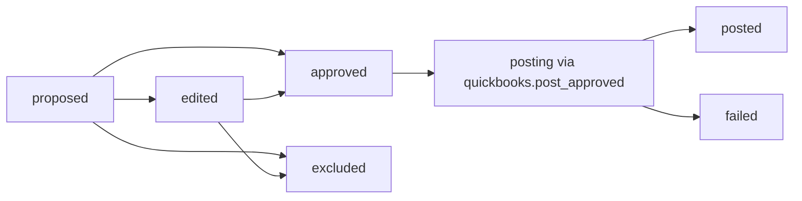

# Module: Ledger (Canonical Review)

## 1) Scope and responsibility

Ledger is the canonical review and action surface for statement-derived entries:

1. Unified list of transactions with check evidence and confidence.
2. Proposal review/edit/approve/exclude lifecycle.
3. Bulk approve.
4. Approval-only trigger for QuickBooks posting.

## 2) UI ownership

Primary page:
- `client/src/modules/accounting/pages/LedgerPage.tsx`

Tab label: `Ledger`

## 3) API surface

| Method | Route | Purpose |
| --- | --- | --- |
| `GET` | `/api/accounting/ledger/entries` | list with filters |
| `GET` | `/api/accounting/ledger/entries/:id` | entry detail |
| `PATCH` | `/api/accounting/ledger/entries/:id` | proposal edit / review status update |
| `POST` | `/api/accounting/ledger/entries/:id/approve` | set approved |
| `POST` | `/api/accounting/ledger/entries/:id/exclude` | set excluded |
| `POST` | `/api/accounting/ledger/entries/bulk-approve` | batch approve |
| `POST` | `/api/accounting/ledger/post-approved` | queue sync job |

## 4) Review lifecycle



Posting status is independent from review status and tracked in `posting.status`.

## 5) Ledger wireframe (implemented behavior)

```text
[Ledger]
KPI chips: Total | Needs review | Approved | Posted

Filters:
- review status
- posting status
- has check
- search

Rows:
- date, description, amount
- review chip
- posting chip (+ error/postedAt)
- confidence
- evidence links (PDF/check)
- proposal summary (txnType/category/payee/memo/reasons)

Actions per row:
- approve
- exclude

Bulk actions:
- bulk approve selected
- post approved
```

## 6) Preflight and posting gate

`POST /api/accounting/ledger/post-approved` does not post directly from controller.

1. Controller only enqueues `quickbooks.post_approved`.
2. Worker loads entries with:
   - `reviewStatus=approved`
   - `posting.status in [not_posted, failed]`
   - `posting.qbTxnId` missing
3. Each row is posted independently.

This enforces explicit approval before posting and prevents duplicates via `qbTxnId` checks.

## 7) Validation and transition rules

1. Posted rows cannot be edited.
2. Posted rows cannot be excluded.
3. Excluded rows cannot be approved until changed via edit path.
4. Bulk approve skips excluded/posted rows.
5. Proposal edits set `proposal.status=edited` and `reviewStatus=edited`.
6. Transaction mirror is updated whenever ledger review/proposal changes.

## 8) Error handling

| Operation | Error | Behavior |
| --- | --- | --- |
| update proposal | invalid payload | `422` validation error |
| approve/exclude | row missing | `404` |
| approve excluded row | invalid transition | `409` |
| edit posted row | forbidden transition | `409` |
| post approved queue | queue dispatch fail | `500` with reason |

## 9) Permissions

Server checks:
- view: `ledger:view`
- edit/exclude: `ledger:edit`
- approve/bulk/post-approved: `ledger:post`

## 10) Module test expectations

1. Query filters return deterministic subsets.
2. Transition guards enforce 409 rules.
3. Mirror writes update `StatementTransaction` on review/proposal changes.
4. Post-approved enqueues the correct sync job.
