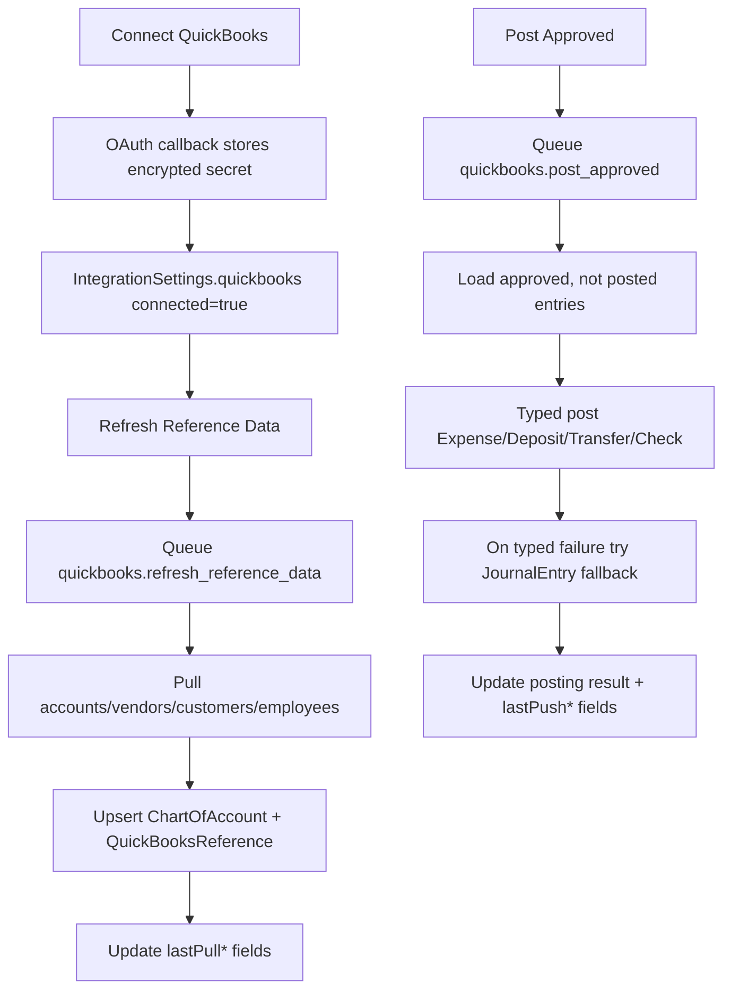

# Module: QuickBooks Sync

## 1) Scope and responsibility

QuickBooks Sync manages connection, reference data hydration, and approval-only posting orchestration.

## 2) UI ownership

Primary page:
- `client/src/modules/accounting/pages/QuickBooksSyncPage.tsx`

Tab label: `QuickBooks Sync`

## 3) API surface

### OAuth + settings

| Method | Route | Purpose |
| --- | --- | --- |
| `GET` | `/api/integrations/quickbooks/oauth-status` | token validity + reason |
| `GET` | `/api/integrations/quickbooks/settings` | quickbooks sync settings |
| `PUT` | `/api/integrations/quickbooks/settings` | update environment |
| `GET` | `/api/integrations/quickbooks/start-url` | get OAuth connect URL |
| `GET` | `/api/integrations/quickbooks/start` | redirect to OAuth |
| `GET` | `/api/integrations/quickbooks/callback` | OAuth callback |
| `POST` | `/api/integrations/quickbooks/disconnect` | disconnect integration |

### Sync jobs

| Method | Route | Job queued |
| --- | --- | --- |
| `POST` | `/api/integrations/quickbooks/sync/refresh-reference-data` | `quickbooks.refresh_reference_data` |
| `POST` | `/api/integrations/quickbooks/sync/post-approved` | `quickbooks.post_approved` |

### Scheduled sync trigger

| Method | Route | Purpose |
| --- | --- | --- |
| `POST` | `/api/cron/accounting-sync` | for all connected companies: run sheets sync + queue QuickBooks refresh/post-approved |

## 4) Runtime flow

## 5) Typed posting and fallback contract

Priority order per approved entry:

1. Try typed transaction by `proposal.qbTxnType`:
   - `Expense`: requires `bankAccountId`, `categoryAccountId`
   - `Deposit`: requires `bankAccountId`, `categoryAccountId`
   - `Transfer`: requires `bankAccountId`, `transferTargetAccountId`
   - `Check`: requires `bankAccountId`, `categoryAccountId`
2. If typed mapping fails, attempt `JournalEntry` fallback with configured or derived lines.
3. If fallback fails, mark entry failed and continue with next row.

## 6) Idempotency and safety

1. Only approved rows are selected for posting.
2. Rows with existing `posting.qbTxnId` are excluded from posting selection.
3. Success/failure is per-entry; batch continues through partial errors.
4. Posting result is mirrored to linked `StatementTransaction`.

## 7) QuickBooks settings status fields

Stored on `IntegrationSettings.quickbooks`:

- `connected`, `environment`, `realmId`, `companyName`
- pull status: `lastPullStatus/At/Count/Error`
- push status: `lastPushStatus/At/Count/Error`

## 8) Error handling

| Operation | Common error | Behavior |
| --- | --- | --- |
| OAuth callback | state mismatch / invalid grant / missing realm | redirect with reason code |
| refresh references | OAuth/token/API failure | mark `lastPullStatus=error`, keep prior data |
| post approved | missing proposal fields | mark per-row `posting.failed` |
| post approved | typed post error | journal fallback attempted |
| post approved | fallback error | row remains failed with combined error message |

## 9) Permissions

Server checks:
- view status/settings: `quickbooks:view`
- connect/disconnect/environment change: `quickbooks:connect`
- queue sync jobs: `quickbooks:sync`

## 10) Module test expectations

1. OAuth connect/disconnect keeps settings consistent.
2. Refresh job upserts accounts and entities.
3. Post-approved enforces approved-only behavior.
4. Typed failure still succeeds via journal fallback when possible.
5. Already posted rows are skipped on rerun.
