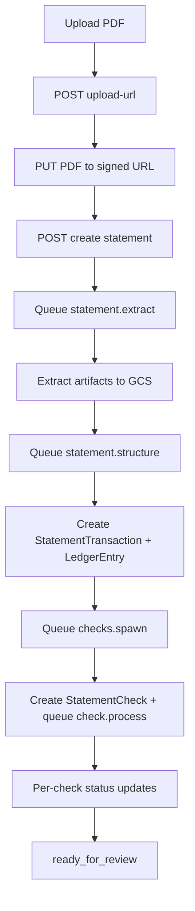

# Module: Statements

## 1) Scope and responsibility

Statements module is responsible for intake and processing orchestration up to review readiness:

1. Upload statement PDF to deterministic GCS path.
2. Create `BankStatement` record and queue pipeline.
3. Show lifecycle/progress in real time.
4. Show check card states and retry failed checks.
5. Hand off to Ledger for canonical approve/edit/exclude actions.

## 2) UI ownership

Primary pages/components:
- `client/src/modules/accounting/pages/StatementsPage.tsx`
- `client/src/modules/accounting/pages/StatementDetailPage.tsx`
- `client/src/modules/accounting/components/UploadStatementDialog.tsx`

Tab label: `Statements`

## 3) API surface

| Method | Route | Purpose |
| --- | --- | --- |
| `POST` | `/api/accounting/statements/upload-url` | signed URL for PDF upload |
| `POST` | `/api/accounting/statements` | create statement + queue extract |
| `GET` | `/api/accounting/statements` | list statements with filters |
| `GET` | `/api/accounting/statements/:id` | statement detail + checks |
| `GET` | `/api/accounting/statements/:id/status` | status/progress for polling |
| `GET` | `/api/accounting/statements/:id/checks` | list checks (optional status filter) |
| `GET` | `/api/accounting/statements/:id/stream` | SSE events (`progressUpdated`, `checkUpdated`) |
| `POST` | `/api/accounting/statements/:id/reprocess` | restart from chosen job |
| `POST` | `/api/accounting/statements/:id/checks/:checkId/retry` | retry failed check |

## 4) Processing flow inside the module



## 5) Statement detail wireframe (implemented behavior)

```text
[Statement Processing • 2026-03]
Status: checks_queued / ready_for_review / failed
Progress: total | queued | processing | ready | failed

Check cards:
- card header: check id + chip status
- body: confidence, autofill fields, GCS paths, reasons
- action: Retry (only when failed and user has edit permission)

Actions:
- Back to Statements
- Open Ledger Review (enabled only when status == ready_for_review)
```

## 6) Validation and guards

1. Upload URL request validates file name and MIME (`application/pdf`).
2. Create statement validates `statementId`, company/path prefix, expected deterministic GCS path.
3. SHA-256 hash dedupe warning is stored in `issues[]`.
4. Reprocess validates allowed job type.
5. Retry requires statement and check ownership in the same company.

## 7) Error handling

| Stage | Error | Behavior | User impact |
| --- | --- | --- | --- |
| upload-url | signed URL failure | return `500` | upload dialog error |
| create statement | hash/read enqueue failure | mark statement `failed`, persist issue | statement row shows failed |
| extract/structure/spawn | task exception | run marked failed, statement `failed` + issue | statement detail warning + reprocess |
| check.process | task exception | check `failed`, statement progress recomputed | retry button enabled |

## 8) Permissions

Server checks:
- list/view: `bankStatements:view`
- create/upload: `bankStatements:create`
- reprocess/retry: `bankStatements:edit`

## 9) Module test expectations

1. Upload URL + create statement should queue extract job.
2. Active statements should poll and update counters every ~3 seconds.
3. Failed check retry should requeue `check.process` and update state.
4. Reprocess should reset statement/check progress and restart pipeline.
