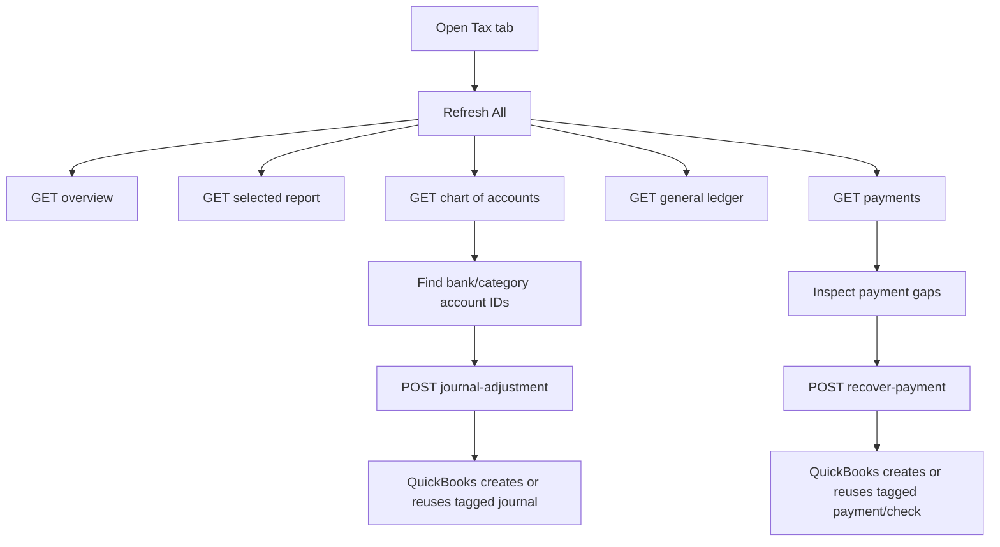

# Module: Tax Dashboard

## 1) Scope and responsibility

Tax Dashboard is the live QuickBooks reporting and correction surface inside Accounting.

It is responsible for:

1. loading QuickBooks tax overview cards
2. loading one selected QuickBooks report
3. loading live chart of accounts, general ledger, and payments
4. recovering missing customer/vendor payments
5. posting manual journal adjustments with idempotency

Unlike the statement pipeline, this module reads and writes QuickBooks directly and does not use the async accounting worker queue.

## 2) UI ownership

Primary page:

- `client/src/modules/accounting/pages/TaxDashboardPage.tsx`

Tab label:

- `Tax`

## 3) API surface

### Read endpoints

| Method | Route | Purpose |
| --- | --- | --- |
| `GET` | `/api/integrations/quickbooks/tax/overview` | summary cards for the selected window |
| `GET` | `/api/integrations/quickbooks/tax/reports/:reportKey` | live report rows |
| `GET` | `/api/integrations/quickbooks/tax/chart-of-accounts` | live QuickBooks chart of accounts |
| `GET` | `/api/integrations/quickbooks/tax/ledger` | paged QuickBooks general ledger |
| `GET` | `/api/integrations/quickbooks/tax/payments` | customer/vendor payment list |

### Write endpoints

| Method | Route | Purpose |
| --- | --- | --- |
| `POST` | `/api/integrations/quickbooks/tax/recover-payment` | create missing payment/check with idempotency |
| `POST` | `/api/integrations/quickbooks/tax/journal-adjustment` | create balanced journal entry with idempotency |

## 4) Runtime flow



## 5) Page wireframe

```text
[Tax Dashboard]
[AccountingTabs]

[Filter Bar]
  From | To | Basis | Report | Payments | Refresh All

[Summary Cards]
  Net Income | Total Assets | Total Liabilities | Total Equity | AR Open | AP Open

[Report Viewer]
  report chip | row count chip
  Label | Path | Amount

[Split row]
  [Chart of Accounts]
  [General Ledger]

[Payments]
  Date | Type | Entity | Memo | Amount

[Split row]
  [Recover Payment form]
  [Journal Adjustment form]
```

## 6) Data and behavior notes

1. Reads are live QuickBooks API reads using the connected OAuth context.
2. Default date window is current UTC fiscal year start through today.
3. `Refresh All` runs overview, report, chart of accounts, ledger, and payments in parallel on the client.
4. Recover payment form changes required fields based on payment type:
   - customer payment requires `customerId`
   - vendor recovery requires `vendorId` and `categoryAccountId`
5. Journal adjustment requires at least two lines and must balance total debits and credits.

## 7) Idempotency contract

Both write flows use `clientRequestId`.

1. Recover payment tags the created QuickBooks transaction and first searches for an existing tagged row.
2. Journal adjustment tags `PrivateNote` and first searches for an existing tagged journal.
3. If an existing row is found, the API returns `created: false` instead of creating a duplicate.

## 8) Error handling

| Operation | Common error | Behavior |
| --- | --- | --- |
| any tax read | QuickBooks not connected | `409` |
| recover payment | missing customer/vendor/account fields | `422` |
| journal adjustment | invalid line or unbalanced journal | `422` |
| QuickBooks API call | upstream API failure/fault | `502` |

## 9) Permissions

Server checks:

- read operations: `quickbooks:view`
- write operations: `quickbooks:post`

## 10) Test expectations

1. Tax dashboard loads all five read sections for a valid QuickBooks connection.
2. Recover payment is idempotent on the same `clientRequestId`.
3. Journal adjustment rejects unbalanced lines.
4. Permission-denied users can read-only or no-access according to `quickbooks:view` and `quickbooks:post`.
