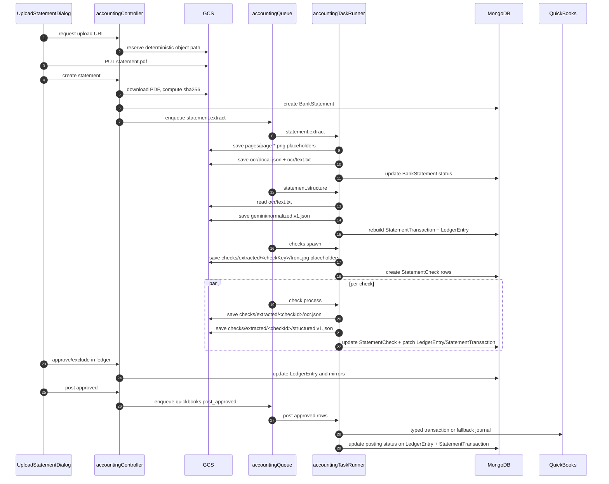

# OCR Pipeline and Storage (Current Implementation)

Last updated: 2026-03-16

This document explains how statement upload, extraction, parsing, check processing, saving, review, and posting work in the current codebase.

## 1) Important implementation note

The current statement OCR path is a fallback pipeline implemented inside `server/src/jobs/accountingTaskRunner.ts`.

What that means in practice:

1. `statement.extract` does not call a live external OCR provider today.
2. It downloads the uploaded PDF from GCS, counts pages from PDF markers, extracts printable text from the PDF bytes, and saves placeholder page images.
3. Artifact names such as `ocr/docai.json` and `gemini/normalized.v1.json` are storage conventions only; they do not mean Document AI or Gemini is running in the current worker path.

## 2) Upload and deterministic object paths

The upload flow starts in `UploadStatementDialog.tsx`:

1. `POST /api/accounting/statements/upload-url`
2. API allocates a new `statementId`
3. API builds deterministic paths with `buildStatementRootPrefix` and `buildStatementPdfPath`
4. API returns a signed V4 upload URL and the expected GCS path
5. Client uploads the PDF directly to GCS with `axios.put`
6. Client calls `POST /api/accounting/statements`

Path builder source:

- `server/src/services/accountingStorageService.ts`

Root prefix pattern:

`companies/<companyId>/statements/<yyyy>/<mm>/<statementId>/`

## 3) End-to-end save sequence



## 4) What gets saved where

### 4.1 GCS object storage

```text
companies/<companyId>/statements/<yyyy>/<mm>/<statementId>/
  original/
    statement.pdf
  derived/
    pages/
      page-001.png
      page-002.png
    ocr/
      docai.json
      text.txt
    gemini/
      normalized.v1.json
    checks/
      extracted/
        <checkKey>/
          front.jpg
        <checkId>/
          ocr.json
          structured.v1.json
```

What each file means:

| Path | Written by | Meaning |
| --- | --- | --- |
| `original/statement.pdf` | client direct upload | source document |
| `derived/pages/page-*.png` | `statement.extract` | placeholder page images so downstream artifacts have stable references |
| `derived/ocr/docai.json` | `statement.extract` | fallback extraction metadata and text preview |
| `derived/ocr/text.txt` | `statement.extract` | extracted printable text used by structuring |
| `derived/gemini/normalized.v1.json` | `statement.structure` | normalized transaction array generated from regex parsing |
| `derived/checks/extracted/<checkKey>/front.jpg` | `checks.spawn` | placeholder image path for seeded check candidates |
| `derived/checks/extracted/<checkId>/ocr.json` | `check.process` | check autofill and confidence payload |
| `derived/checks/extracted/<checkId>/structured.v1.json` | `check.process` | structured check result payload |

### 4.2 MongoDB collections

| Collection | Created/updated at | Stores |
| --- | --- | --- |
| `BankStatement` | create statement, stage transitions, reprocess | lifecycle status, progress, GCS root/pdf pointers, dedupe hash, issues |
| `StatementTransaction` | `statement.structure`, check patching, ledger mirrors, posting mirrors | normalized statement rows and mirrored review/posting state |
| `StatementCheck` | `checks.spawn`, `check.process`, retry | independent check work units, autofill, confidence, artifact paths, match reasons |
| `LedgerEntry` | `statement.structure`, check patching, ledger review, QuickBooks posting | review surface, confidence, attachments, proposal, posting status |
| `Run` | every async accounting job | run status, errors, artifacts, metrics, trace ids |

## 5) Detailed stage behavior

### 5.1 `createStatement`

Controller:

- `server/src/controllers/accountingController.ts`

Actions:

1. validates `statementId` and exact expected `gcsPath`
2. downloads the uploaded PDF from GCS
3. computes SHA-256 hash
4. checks for existing statement hash duplicates in the same company
5. creates `BankStatement`
6. enqueues `statement.extract`
7. moves statement to `extracting`

If queue dispatch fails:

- statement is marked `failed`
- an issue is appended to `BankStatement.issues`

### 5.2 `statement.extract`

Worker logic:

1. load statement by `statementId`
2. mark statement `extracting`
3. download `original/statement.pdf`
4. count pages with `parsePdfPageCount`
5. extract printable text with `extractOcrFallbackText`
6. write placeholder page PNGs with `savePngPlaceholderIfMissing`
7. write `ocr/docai.json`
8. write `ocr/text.txt`
9. move statement to `structuring`

Important current limitation:

- page images are transparent placeholders
- extraction is text-only fallback logic from the PDF buffer

### 5.3 `statement.structure`

Worker logic:

1. read `ocr/text.txt`
2. parse candidate transactions with `parseTransactions`
3. save normalized output to `gemini/normalized.v1.json`
4. delete prior `StatementTransaction` rows for the statement
5. delete prior `LedgerEntry` rows for the statement
6. create new `StatementTransaction` rows
7. create matching `LedgerEntry` rows
8. seed proposal/confidence with `buildMatchingProposal`
9. move statement to `checks_queued`

Current parser characteristics:

- regex-driven
- capped to the first 500 non-empty lines
- detects dates, signed amounts, and optional `check #1234`
- infers `debit` vs `credit` from sign

### 5.4 `checks.spawn`

Worker logic:

1. delete prior `StatementCheck` rows for the statement
2. load statement transactions ordered by date
3. classify check candidates when either:
   - `checkNumber` exists, or
   - text contains `check`, `pay to the order`, `micr`, `cheque`, or `payroll`
4. create `StatementCheck` rows with initial `queued` status
5. save placeholder `front.jpg` paths
6. update statement progress counts
7. enqueue one `check.process` job per check

If no candidates are found:

- statement moves directly to `ready_for_review`

### 5.5 `check.process`

Worker logic:

1. set check status to `processing`
2. update statement progress counters
3. load the matched `StatementTransaction` if one is already linked
4. derive autofill from the statement transaction:
   - check number
   - date
   - payee name
   - amount
   - memo
5. generate confidence block
6. save `ocr.json`
7. save `structured.v1.json`
8. update `StatementCheck`
9. re-run `buildMatchingProposal` using the check payee/amount as extra signal
10. patch the linked `StatementTransaction`
11. patch the linked `LedgerEntry`
12. recompute statement progress and final readiness

Status rule:

- `overall >= 0.75` -> `ready`
- otherwise -> `needs_review`

## 6) Proposal generation and review state

Matching source:

- `server/src/services/matchingEngine.ts`

Signal order:

1. hard-coded pattern rules such as Amazon, transfer, payroll
2. QuickBooks entity similarity against cached vendor/customer/employee references
3. historical approved ledger entries with similar description/amount
4. debit + check evidence forcing `Check` proposal when applicable
5. low-signal debit/credit fallback

Review state lives primarily in `LedgerEntry`:

- `proposed`
- `edited`
- `approved`
- `excluded`

Single-entry actions mirror back to `StatementTransaction`.

## 7) Posting and final save behavior

Posting source:

- `server/src/services/quickbooksSyncService.ts`

Selection gate:

1. `reviewStatus = approved`
2. `posting.status in [not_posted, failed]`
3. `posting.qbTxnId` missing

Posting order:

1. try typed transaction from `proposal.qbTxnType`
2. if typed post fails, build or reuse fallback journal lines
3. try `JournalEntry`
4. save success or failure per row

Saved on success:

- `LedgerEntry.posting.status = posted`
- `LedgerEntry.posting.qbTxnId`
- `LedgerEntry.posting.postedAt`
- mirrored `StatementTransaction.posting`

Saved on failure:

- `LedgerEntry.posting.status = failed`
- `LedgerEntry.posting.error`
- mirrored `StatementTransaction.posting.error`

## 8) Retry, reset, and idempotency

### 8.1 Statement reprocess

`POST /api/accounting/statements/:id/reprocess`

Effects:

1. reset `BankStatement.status` to `uploaded`
2. zero progress counters
3. clear statement issues
4. delete statement checks
5. enqueue from the selected stage, default `statement.extract`

### 8.2 Check retry

`POST /api/accounting/statements/:id/checks/:checkId/retry`

Effects:

1. set check back to `queued`
2. clear check errors
3. enqueue `check.process`

### 8.3 QuickBooks and tax idempotency

1. ledger posting skips rows that already have `posting.qbTxnId`
2. tax `Recover Payment` uses `clientRequestId` tags and checks for an existing QuickBooks transaction before creating a new one
3. tax `Journal Adjustment` does the same for `JournalEntry`

## 9) Failure and observability

Every async accounting job creates a `Run` row.

Saved observability fields:

- `runType`: `pipeline` or `sync`
- `job`
- `status`
- `traceId`
- `errors[]`
- `artifacts`
- `metrics`

When jobs fail:

1. statement-stage failures mark the `BankStatement` as `failed` and append the error to `issues[]`
2. `check.process` failures also mark the individual `StatementCheck` as `failed`
3. sync failures update QuickBooks pull/push status fields on `IntegrationSettings.quickbooks`

Observability readers:

- `GET /api/accounting/observability/summary`
- `GET /api/accounting/observability/debug`

## 10) Code entry points

If you need to trace the runtime from code, read these files in order:

1. `client/src/modules/accounting/components/UploadStatementDialog.tsx`
2. `server/src/controllers/accountingController.ts`
3. `server/src/jobs/accountingQueue.ts`
4. `server/src/jobs/accountingTaskRunner.ts`
5. `server/src/services/matchingEngine.ts`
6. `server/src/controllers/ledgerController.ts`
7. `server/src/services/quickbooksSyncService.ts`
