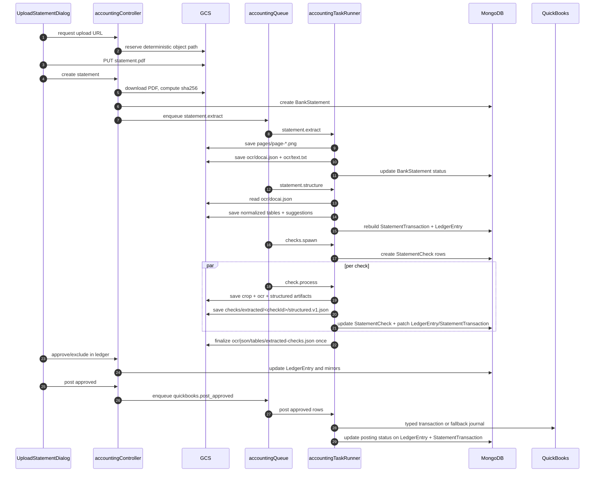

# OCR Pipeline and Storage (Current Implementation)

Last updated: 2026-04-29

This document explains how statement upload, extraction, parsing, check processing, saving, review, and posting work in the current codebase.

## 1) Important implementation note

The current statement OCR path is a local PDF-first pipeline implemented inside `server/src/jobs/accountingTaskRunner.ts`.

What that means in practice:

1. `statement.extract` downloads the uploaded PDF from GCS, renders real page PNGs with the configured PDF renderer, extracts PDF text, and saves OCR artifacts.
2. `statement.structure` reads the saved OCR JSON, runs regex and coordinate-aware parsing, saves normalized tables, writes ledger/transaction rows, and creates suggestion artifacts.
3. `check.process` renders each check crop from the original PDF, saves crop/ocr/structured files, then enriches `StatementCheck`, `StatementTransaction`, and `LedgerEntry`.
4. Artifact names such as `ocr/docai.json` and `gemini/normalized.v1.json` are storage conventions. They preserve a future provider boundary even when the current worker uses local PDF text and deterministic parsing.
5. Gemini-assisted matching is optional. If the API key is missing or Gemini is rate limited, the worker persists fallback proposal artifacts and keeps the statement usable.

## 1A) Month-close API additions

The statement detail workspace now exposes month-close operations without introducing a separate route tree:

- `GET /api/accounting/statements/:id/entries`
- `PATCH /api/accounting/statements/:id/entries/:entryId/review`
- `PATCH /api/accounting/statements/:id/suggestions/:suggestionId/review`
- `POST /api/accounting/statements/:id/complete-month`

Completion is blocked until all server-side gates pass.

## 2) Upload and deterministic object paths

The upload flow starts in `UploadStatementDialog.tsx`:

1. `POST /api/accounting/statements/upload-url`
2. API allocates a new `statementId`
3. API builds deterministic paths with `buildStatementRootPrefix` and `buildStatementPdfPath`
4. API returns a signed V4 upload URL and the expected GCS path
5. Client uploads the PDF directly to GCS with `axios.put`
6. Client calls `POST /api/accounting/statements`

Path builder source:

- `server/src/services/accountingStorageService.ts`

Root prefix pattern:

`companies/<companyId>/statements/<yyyy>/<mm>/<statementId>/`

## 3) End-to-end save sequence



## 4) What gets saved where

### 4.1 GCS object storage

```text
companies/<companyId>/statements/<yyyy>/<mm>/<statementId>/
  original/
    statement.pdf
  derived/
    pages/
      page-001.png
      page-002.png
    ocr/
      docai.json
      text.txt
      json/
        tables/
          transactions.json
          checks-cleared.json
          transaction-sections.json
          extracted-checks.json
          classification-output.json
          suggestions-output.json
          processing-summary.json
          structured-statement.v1.json
          evidence.v1.json
          validation-report.v1.json
          pdf-layout.v1.json
    gemini/
      normalized.v1.json
    checks/
      extracted/
        <checkKey>/
          front.png
          ocr.txt
          ocr.json
          structured.v1.json
          proposal.prompt.v1.txt
          proposal.raw.v1.json
          proposal.normalized.v1.json
    suggestions/
      <transaction-or-check-id>.json
```

What each file means:

| Path | Written by | Meaning |
| --- | --- | --- |
| `original/statement.pdf` | client direct upload | source document |
| `derived/pages/page-*.png` | `statement.extract` | rendered statement page images from the uploaded PDF |
| `derived/ocr/docai.json` | `statement.extract` | page text, page regions, combined text, and statement-month detection evidence |
| `derived/ocr/text.txt` | `statement.extract` | extracted printable text used by structuring |
| `derived/ocr/json/tables/*.json` | `statement.structure` | normalized tables, sections, suggestions, validation, evidence, and layout data |
| `derived/gemini/normalized.v1.json` | `statement.structure` | normalized transaction model retained for compatibility |
| `derived/checks/extracted/<checkKey>/front.png` | `check.process` | rendered crop from the original statement PDF |
| `derived/checks/extracted/<checkKey>/ocr.txt` | `check.process` | page/crop text used to autofill check fields |
| `derived/checks/extracted/<checkId>/ocr.json` | `check.process` | check autofill and confidence payload |
| `derived/checks/extracted/<checkId>/structured.v1.json` | `check.process` | structured check result payload |
| `derived/checks/extracted/<checkId>/proposal.*` | `check.process` | Gemini prompt/raw/normalized proposal artifacts or deterministic fallback |
| `derived/ocr/json/tables/extracted-checks.json` | final check progress update | consolidated check result file written once per statement run |

### 4.2 MongoDB collections

| Collection | Created/updated at | Stores |
| --- | --- | --- |
| `BankStatement` | create statement, stage transitions, reprocess | lifecycle status, progress, GCS root/pdf pointers, dedupe hash, issues |
| `StatementTransaction` | `statement.structure`, check patching, ledger mirrors, posting mirrors | normalized statement rows and mirrored review/posting state |
| `StatementCheck` | `checks.spawn`, `check.process`, retry | independent check work units, autofill, confidence, artifact paths, match reasons |
| `LedgerEntry` | `statement.structure`, check patching, ledger review, QuickBooks posting | review surface, confidence, attachments, proposal, posting status |
| `Run` | every async accounting job | run status, errors, artifacts, metrics, trace ids |

## 5) Detailed stage behavior

### 5.1 `createStatement`

Controller:

- `server/src/controllers/accountingController.ts`

Actions:

1. validates `statementId` and exact expected `gcsPath`
2. downloads the uploaded PDF from GCS
3. computes SHA-256 hash
4. checks for existing statement hash duplicates in the same company
5. creates `BankStatement`
6. enqueues `statement.extract`
7. moves statement to `extracting`

If queue dispatch fails:

- statement is marked `failed`
- an issue is appended to `BankStatement.issues`

### 5.2 `statement.extract`

Worker logic:

1. load statement by `statementId`
2. mark statement `extracting`
3. download `original/statement.pdf`
4. render and persist page PNGs via `renderAndPersistStatementPages`
5. extract page text via `extractStatementPagesFromPdfBuffer`
6. detect statement date/month evidence from extracted page text
7. write `ocr/docai.json`
8. write `ocr/text.txt`
9. move statement to `structuring`

Important current limitation:

- extraction is PDF-text first; scanned-only statements need Vision/Document AI fallback work before they can be fully automated
- rendered pages and check crops are real images, but field extraction still relies mostly on saved PDF text and deterministic parsing

### 5.3 `statement.structure`

Worker logic:

1. read `ocr/docai.json`
2. parse candidate transactions with section-aware helpers
3. run PDF layout extraction when available
4. save normalized output to `gemini/normalized.v1.json`
5. save table artifacts under `derived/ocr/json/tables/`
6. delete prior `StatementTransaction` rows for the statement
7. delete prior `LedgerEntry` rows for the statement
8. create new `StatementTransaction` rows
9. create matching `LedgerEntry` rows
10. seed proposal/confidence with `buildMatchingProposal`
11. move statement to `checks_queued` or `needs_parser_review` depending on validation results

Current parser characteristics:

- regex-driven
- uses statement section labels such as electronic credits, electronic debits, checks cleared, daily balances, beginning balance, and ending balance
- coordinate-aware extraction can add check-table rows and daily balance rows when PDF layout is available
- non-posting rows such as balances/totals are marked so they do not become QuickBooks suggestions

### 5.4 `checks.spawn`

Worker logic:

1. delete prior `StatementCheck` rows for the statement
2. load statement transactions ordered by date/check number
3. classify check candidates when either:
   - `checkNumber` exists, or
   - text contains `check`, `pay to the order`, `micr`, `cheque`, or `payroll`
4. create `StatementCheck` rows with initial `queued` status
5. persist the deterministic consolidated extracted-checks path on the statement
6. update statement progress counts
7. enqueue one staggered `check.process` job per check

If no candidates are found:

- statement moves directly to `ready_for_review`

Rate-limit behavior:

- `checks.spawn` no longer writes the consolidated `extracted-checks.json` file.
- `check.process` does not rewrite `extracted-checks.json` per check.
- the consolidated file is finalized once after all checks reach a terminal state.
- check jobs are staggered when dispatched to Cloud Tasks so external APIs and GCS are not hit in one burst.

### 5.5 `check.process`

Worker logic:

1. set check status to `processing`
2. update statement progress counters
3. load the matched `StatementTransaction` if one is already linked
4. derive autofill from the statement transaction:
   - check number
   - date
   - payee name
   - amount
   - memo
5. generate confidence block
6. render and save `front.png`
7. save `ocr.txt`, `ocr.json`, and `structured.v1.json`
8. persist Gemini prompt/raw/normalized proposal artifacts when proposal persistence is enabled
9. update `StatementCheck`
10. re-run `buildMatchingProposal` using the check payee/amount as extra signal
11. patch the linked `StatementTransaction`
12. patch the linked `LedgerEntry`
13. recompute statement progress and final readiness

Status rule:

- `overall >= 0.75` -> `ready`
- otherwise -> `needs_review`

## 6) Proposal generation and review state

Matching source:

- `server/src/services/matchingEngine.ts`

Signal order:

1. hard-coded pattern rules such as Amazon, transfer, payroll
2. QuickBooks entity similarity against cached vendor/customer/employee references
3. historical approved ledger entries with similar description/amount
4. debit + check evidence forcing `Check` proposal when applicable
5. low-signal debit/credit fallback

Review state lives primarily in `LedgerEntry`:

- `proposed`
- `edited`
- `approved`
- `excluded`

Single-entry actions mirror back to `StatementTransaction`.

## 7) Posting and final save behavior

Posting source:

- `server/src/services/quickbooksSyncService.ts`

Selection gate:

1. `reviewStatus = approved`
2. `posting.status in [not_posted, failed]`
3. `posting.qbTxnId` missing

Posting order:

1. try typed transaction from `proposal.qbTxnType`
2. if typed post fails, build or reuse fallback journal lines
3. try `JournalEntry`
4. save success or failure per row

Saved on success:

- `LedgerEntry.posting.status = posted`
- `LedgerEntry.posting.qbTxnId`
- `LedgerEntry.posting.postedAt`
- mirrored `StatementTransaction.posting`

Saved on failure:

- `LedgerEntry.posting.status = failed`
- `LedgerEntry.posting.error`
- mirrored `StatementTransaction.posting.error`

## 8) Retry, reset, and idempotency

### 8.1 Statement reprocess

`POST /api/accounting/statements/:id/reprocess`

Effects:

1. reset `BankStatement.status` to `uploaded`
2. zero progress counters
3. clear statement issues
4. delete statement checks
5. enqueue from the selected stage, default `statement.extract`

### 8.2 Check retry

`POST /api/accounting/statements/:id/checks/:checkId/retry`

Effects:

1. set check back to `queued`
2. clear check errors
3. enqueue `check.process`

### 8.3 QuickBooks and tax idempotency

1. ledger posting skips rows that already have `posting.qbTxnId`
2. tax `Recover Payment` uses `clientRequestId` tags and checks for an existing QuickBooks transaction before creating a new one
3. tax `Journal Adjustment` does the same for `JournalEntry`

### 8.4 429 and quota handling

1. GCS writes to `extracted-checks.json` are consolidated and retried with exponential backoff.
2. GCS 429/error text detection handles `rate limit`, `rateLimitExceeded`, `too many requests`, and quota-exceeded variants.
3. Gemini calls retry transient 429/5xx/network failures before falling back to deterministic proposals.
4. QuickBooks calls retry transient 429/5xx/network failures and honor `Retry-After` when Intuit returns it.
5. A real exhausted quota still degrades gracefully: the saved artifacts explain the provider failure and the deterministic proposal remains available for review.

## 9) Failure and observability

Every async accounting job creates a `Run` row.

Saved observability fields:

- `runType`: `pipeline` or `sync`
- `job`
- `status`
- `traceId`
- `errors[]`
- `artifacts`
- `metrics`

When jobs fail:

1. statement-stage failures mark the `BankStatement` as `failed` and append the error to `issues[]`
2. `check.process` failures also mark the individual `StatementCheck` as `failed`
3. sync failures update QuickBooks pull/push status fields on `IntegrationSettings.quickbooks`

Observability readers:

- `GET /api/accounting/observability/summary`
- `GET /api/accounting/observability/debug`

## 10) Code entry points

If you need to trace the runtime from code, read these files in order:

1. `client/src/modules/accounting/components/UploadStatementDialog.tsx`
2. `server/src/controllers/accountingController.ts`
3. `server/src/jobs/accountingQueue.ts`
4. `server/src/jobs/accountingTaskRunner.ts`
5. `server/src/services/matchingEngine.ts`
6. `server/src/controllers/ledgerController.ts`
7. `server/src/services/quickbooksSyncService.ts`

## 11) Improvement plan

1. Add scanned-PDF fallback: route image-only pages through Vision OCR or Document AI and store provider-specific confidence by page.
2. Add provider selection telemetry: record whether each statement page used PDF text, Vision, Document AI, or manual review fallback.
3. Improve check-table extraction: use coordinate tables first, then OCR text, then transaction-row hints.
4. Add artifact health checks: verify the original PDF, page PNGs, OCR JSON/text, structured tables, check crops, and consolidated checks file before marking a statement ready.
5. Add a manual correction loop: let reviewers edit check number/date/payee/amount and save the corrected fields back to `StatementCheck` plus the consolidated artifact.
