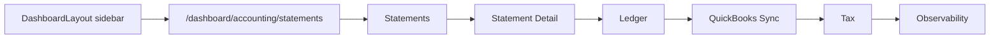
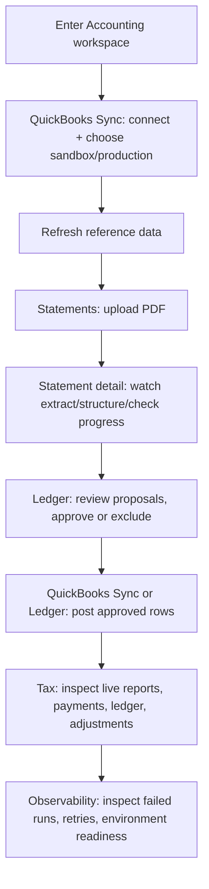
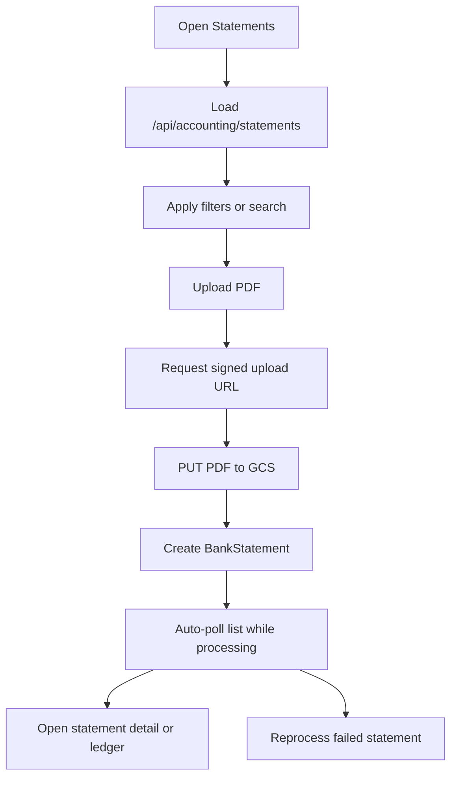
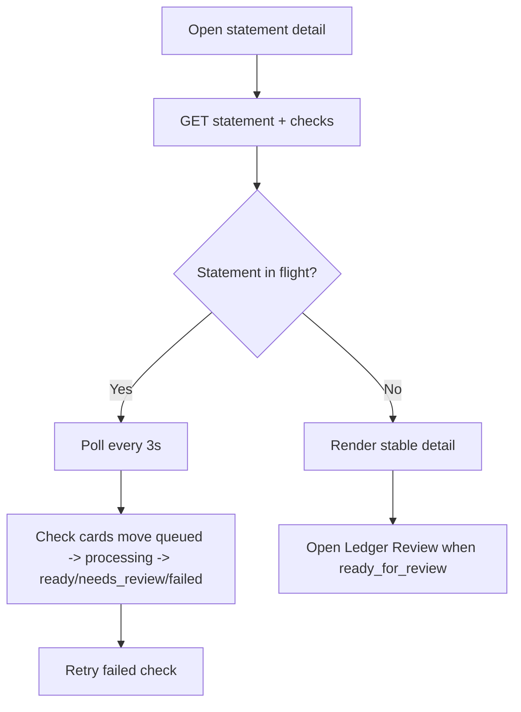
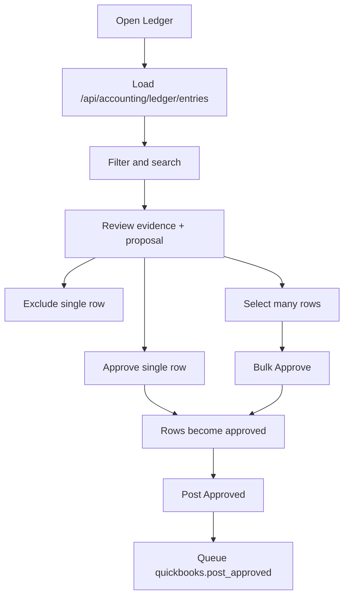
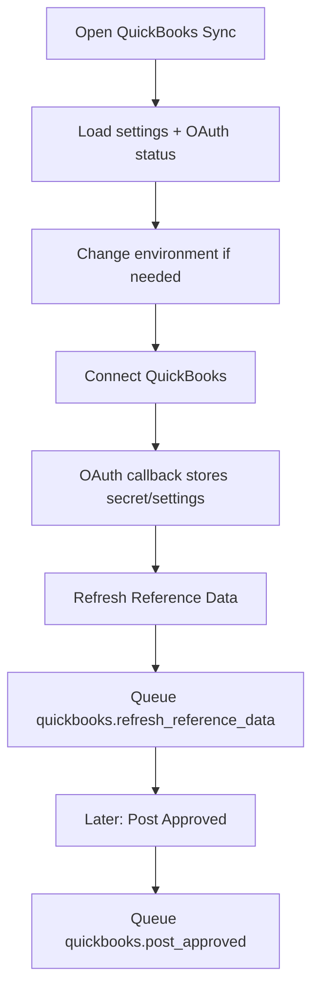
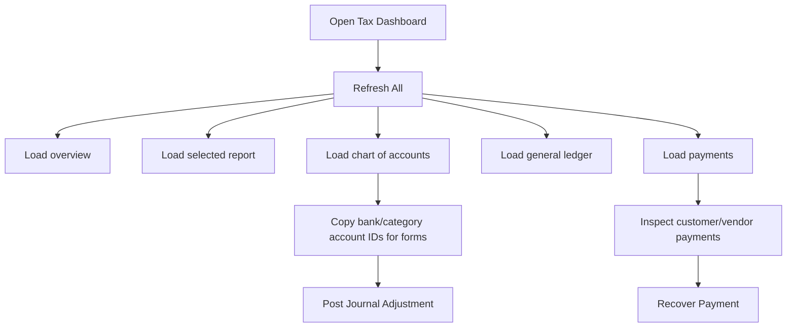
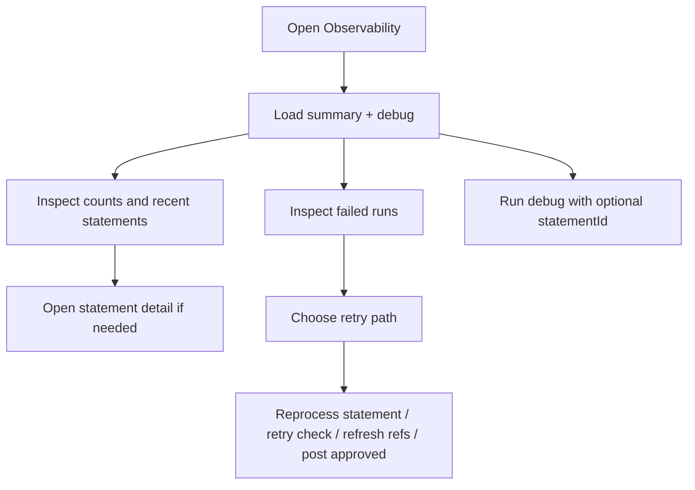

# Accounting Wireframes, Components, and User Lifecycle

Last updated: 2026-03-16

This document maps the implemented accounting UI to the server/runtime flow so product, engineering, and QA can reason about the full accounting workspace from the user point of view.

## 1) Workspace shell

Shared shell:

- Dashboard nav entry: `/dashboard/accounting/statements`
- Shared layout: `client/src/app/layout/DashboardLayout.tsx`
- Shared page chrome: `PageHeader`, `AccountingTabs`
- Shared empty/loading access guards: `LoadingEmptyStateWrapper`, `NoAccess`

Primary routes:

| Route | Page component | Purpose |
| --- | --- | --- |
| `/dashboard/accounting/statements` | `StatementsPage.tsx` | statement intake and processing queue |
| `/dashboard/accounting/statements/:statementId` | `StatementDetailPage.tsx` | per-statement check processing progress |
| `/dashboard/accounting/ledger` | `LedgerPage.tsx` | canonical review and posting surface |
| `/dashboard/accounting/quickbooks` | `QuickBooksSyncPage.tsx` | OAuth connection, reference refresh, post-approved trigger |
| `/dashboard/accounting/tax` | `TaxDashboardPage.tsx` | live QuickBooks tax/reporting tools |
| `/dashboard/accounting/observability` | `ObservabilityPage.tsx` | health, failed runs, debug actions |



```text
[DashboardLayout]
  [Top AppBar: logo | company | user menu]
  [Left Drawer]
    - Core links
    - Workspaces
    - Accounting
  [Main Content]
    [PageHeader]
    [AccountingTabs]
    [Active accounting page body]
```

## 2) Full user lifecycle



## 3) Statements list

Files:

- `client/src/modules/accounting/pages/StatementsPage.tsx`
- `client/src/modules/accounting/components/UploadStatementDialog.tsx`

Main UI pieces:

- filter toolbar: month, status, search, apply
- primary action: `Upload PDF`
- statements table: month, file, status, check progress, updated time, actions
- row actions: `Open`, `Open Ledger`, `Reprocess`
- auto-polling every 3 seconds while rows are in `extracting`, `structuring`, or `checks_queued`

```text
[PageHeader: Bank Statements]
[AccountingTabs]
[Optional error alert]

[Filter Paper]
  Month | Status | Search file | Apply | Upload PDF

[Statements Table]
  Month | File | Status chip | Checks Progress | Updated | Actions
  2026-03 | march.pdf | extracting | total/queued/processing/ready/failed | time | Open | Open Ledger | Reprocess

[UploadStatementDialog]
  Statement Month
  Choose PDF
  Upload progress bar
  Upload & Start
```



## 4) Statement detail

File:

- `client/src/modules/accounting/pages/StatementDetailPage.tsx`

Main UI pieces:

- header card with file name, update time, status, progress counts
- issues alert for statement-level warnings/failures
- check cards sorted roughly by active-first order
- card fields: status chip, confidence, check number, date, payee, amount, front artifact path, match reasons
- action: `Retry` when a check has failed and the user has edit permission

```text
[PageHeader: Statement Processing • YYYY-MM]
[AccountingTabs]
[Optional error alert]

[Statement Summary Paper]
  File name
  Updated at
  Status
  Back | Open Ledger Review
  Checks total | queued | processing | ready | failed

[Optional issues alert]

[Check Card Grid]
  [Check ABC123] [status chip]
    Confidence
    Check No
    Date
    Payee
    Amount
    Front path
    Why matched
    Retry
```



## 5) Ledger

File:

- `client/src/modules/accounting/pages/LedgerPage.tsx`

Main UI pieces:

- KPI chips: total, needs review, approved, posted
- action bar: refresh, bulk approve, post approved
- filters: review status, posting status, has check, search
- review table: selection, date, description, amount, review/posting chips, confidence, evidence, proposal summary, row actions
- row actions currently exposed in UI: `Approve`, `Exclude`

```text
[PageHeader: Ledger Review]
[AccountingTabs]
[Optional error alert]

[KPI + action bar]
  Total | Needs review | Approved | Posted
  Refresh | Bulk Approve (N) | Post Approved

[Filter Paper]
  Review Status | Posting | Has Check | Search | Apply

[Ledger Table]
  [ ] | Date | Description | Amount | Review | Posting | Conf | Evidence | Proposal | Actions
  [ ] | 2026-03-01 | AMAZON ... | -42.18 | proposed | not_posted | 72% | PDF yes / CHK no | Expense / Office Supplies | Approve | Exclude
```



## 6) QuickBooks Sync

File:

- `client/src/modules/accounting/pages/QuickBooksSyncPage.tsx`

Main UI pieces:

- connection status card
- environment toggle: `sandbox` / `production`
- realm/company/token/pull/push status lines
- action buttons: connect or reconnect, disconnect, refresh reference data, post approved, refresh status
- callback query handling for `quickbooks=connected|error`

```text
[PageHeader: QuickBooks Sync]
[AccountingTabs]
[Optional error alert]

[Connection Paper]
  Connection status chip
  Environment toggle
  Realm ID
  Company
  Token status
  Refresh status
  Post status
  Connect/Reconnect | Disconnect | Refresh Reference Data | Post Approved | Refresh Status
```



## 7) Tax dashboard

File:

- `client/src/modules/accounting/pages/TaxDashboardPage.tsx`

Main UI pieces:

- top filter bar: `from`, `to`, `basis`, `report`, `payments`, `Refresh All`
- summary cards: net income, assets, liabilities, equity, AR open, AP open
- report viewer table
- chart of accounts table
- general ledger table
- payments table
- write tools: `Recover Payment`, `Journal Adjustment`

Important runtime behavior:

- read operations are live QuickBooks calls, not queued worker jobs
- write operations are direct QuickBooks posts and use `clientRequestId` idempotency

```text
[PageHeader: Tax Dashboard]
[AccountingTabs]

[Filter Bar]
  From | To | Basis | Report | Payments | Refresh All

[Summary Cards Grid]
  Net Income | Total Assets | Total Liabilities | Total Equity | AR Open | AP Open

[Report Viewer]
  Report chips
  Label | Path | Amount

[Two-column row]
  [Chart of Accounts]
  [General Ledger]

[Payments Table]
  Date | Type | Entity | Memo | Amount

[Two-column forms]
  [Recover Payment]
    Client Request ID
    Payment Type
    Txn Date
    Amount
    Bank Account ID
    Customer/Vendor fields
    Memo
    Recover Payment

  [Journal Adjustment]
    Client Request ID
    Txn Date
    Memo
    Line 1 account/debit/credit
    Line 2 account/debit/credit
    Post Journal Adjustment
```



## 8) Observability

File:

- `client/src/modules/accounting/pages/ObservabilityPage.tsx`

Main UI pieces:

- health chips: total/extracting/structuring/checks queued/ready/failed
- top actions: refresh, refresh refs, post approved
- log shortcuts section
- recent statements table
- failed runs table
- debug diagnostics panel with optional statement id input and actions list

```text
[PageHeader: Accounting Observability]
[AccountingTabs]
[Optional error alert]

[Health Summary Paper]
  Total | Extracting | Structuring | Checks queued | Ready | Failed
  Refresh | Refresh Refs | Post Approved
  Generated at

[Log Shortcuts]
  API logs | Task logs | Failed tasks | QuickBooks sync

[Recent Statements Table]
[Failed Runs Table]

[Debug Diagnostics]
  Statement ID (optional)
  Run Debug
  Environment readiness
  Actions list
```



## 9) Component ownership map

| Concern | Main client files | Main server files |
| --- | --- | --- |
| Workspace shell | `client/src/modules/accounting/components/AccountingTabs.tsx` | n/a |
| Statements intake | `StatementsPage.tsx`, `UploadStatementDialog.tsx` | `accountingController.ts`, `accountingRoutes.ts` |
| Statement processing detail | `StatementDetailPage.tsx` | `accountingTaskRunner.ts`, `StatementCheck.ts`, `BankStatement.ts` |
| Ledger review/posting | `LedgerPage.tsx` | `ledgerController.ts`, `ledgerRoutes.ts`, `LedgerEntry.ts`, `quickbooksSyncService.ts` |
| QuickBooks connection/sync | `QuickBooksSyncPage.tsx` | `quickbooksController.ts`, `quickbooksIntegrationRoutes.ts`, `quickbooksService.ts`, `quickbooksSyncService.ts` |
| Tax tools | `TaxDashboardPage.tsx` | `quickbooksTaxController.ts`, `quickbooksTaxService.ts` |
| Observability | `ObservabilityPage.tsx` | `accountingObservabilityController.ts`, `Run.ts` |

## 10) Practical reading order

1. Start with this document for screen layout and user flow.
2. Read [End-to-End Workflow](/Users/trupal/Projects/RetailSync/docs/accounting/end-to-end-workflow.md) for the async runtime sequence.
3. Read [OCR Pipeline and Storage](/Users/trupal/Projects/RetailSync/docs/accounting/ocr-pipeline-and-storage.md) for artifact paths, save points, retries, and mirrors.
