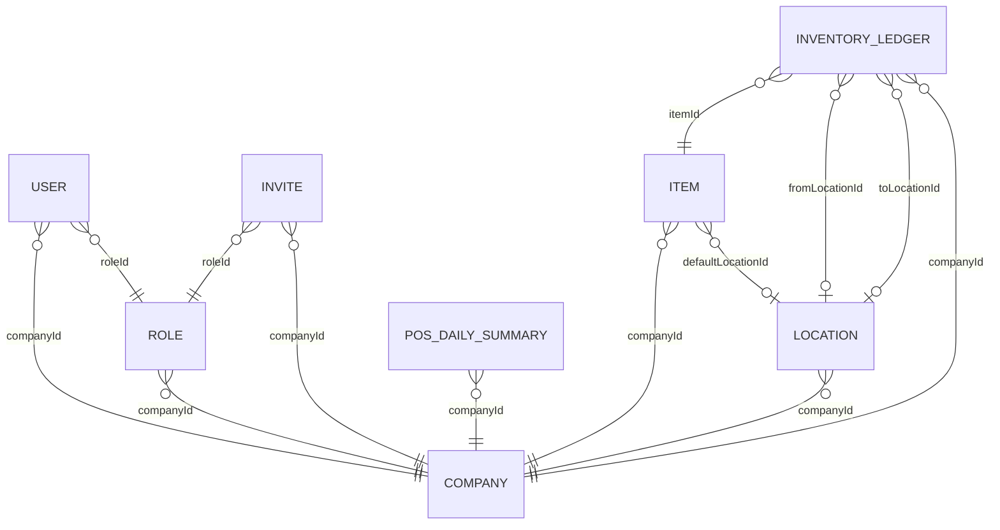
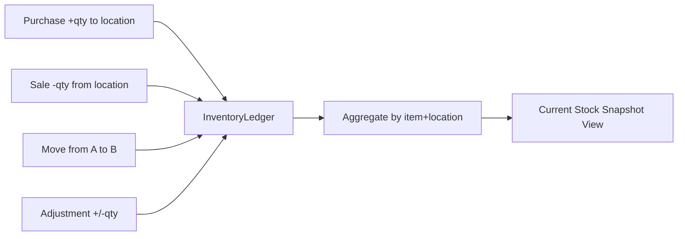

# Data Model

## ER Overview

## Core Collections

### Company

- `name`
- `code` (unique, `RS-XXXXXX`)
- `businessType`, `address`, `phone`, `email`
- `timezone`, `currency`

### User

- `firstName`, `lastName`, `email` (unique)
- `passwordHash`
- `companyId` (nullable before onboarding)
- `roleId` (nullable before onboarding)
- `isActive`

### Role

- `companyId`
- `name`
- `isSystem`
- `permissions` map keyed by module

### Invite

- `companyId`, `email`, `code` (single-use)
- `roleId`
- `expiresAt`, `acceptedAt`

### POSDailySummary

- `companyId`, `date`, `day`
- `highTax`, `lowTax`, `saleTax`, `totalSales`
- `gas`, `lottery`, `creditCard`
- `lotteryPayout`, `clTotal`
- `cash`, `cashPayout`, `cashExpenses`
- `notes`
- Unique index: `(companyId, date)`

### Item

- `companyId`
- `upc`, `modifier`, `barcode = upc + modifier`
- `description`, `department`, `price`, `sku`
- `defaultLocationId`
- Unique index: `(companyId, barcode)`

### Location

- `companyId`
- `code` (unique per company)
- `type`: `shelf | fridge | freezer | backroom`
- `label`

### InventoryLedger

- `companyId`, `itemId`
- `fromLocationId`, `toLocationId`
- `type`: `purchase | sale | move | adjustment`
- `qty`, `unitCost`
- `referenceType`, `referenceId`
- `notes`, `createdBy`

## Inventory Event Sourcing

Stock is derived from events, not manually edited quantities.

