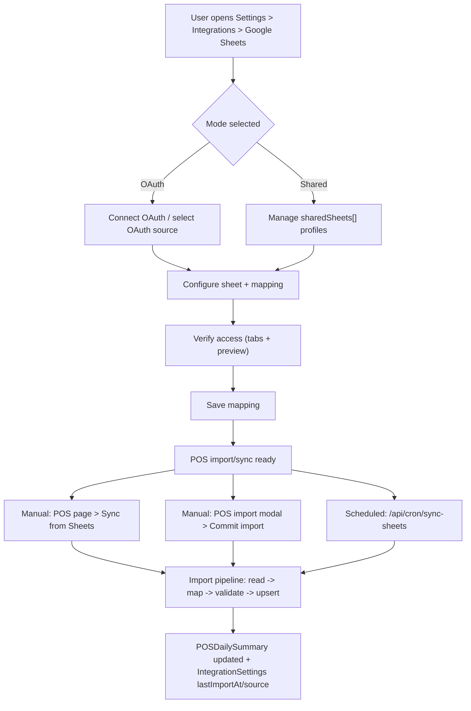
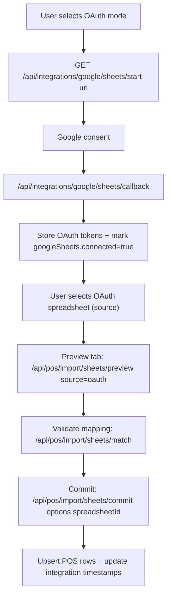
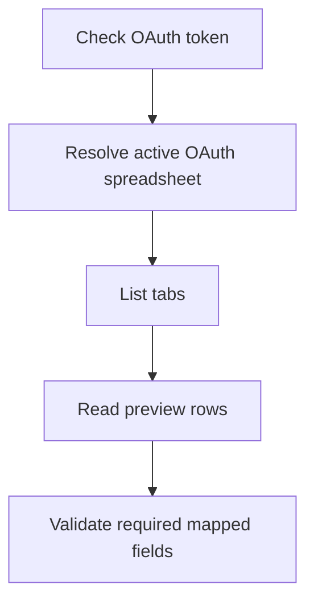
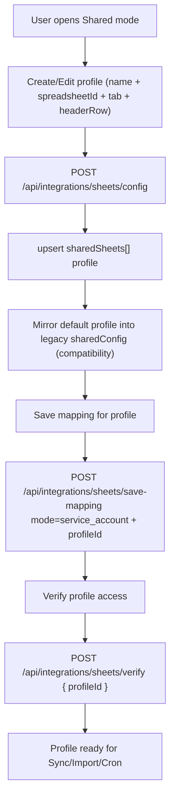
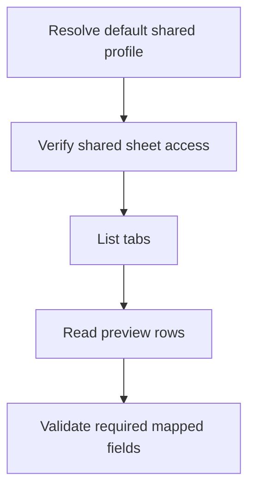
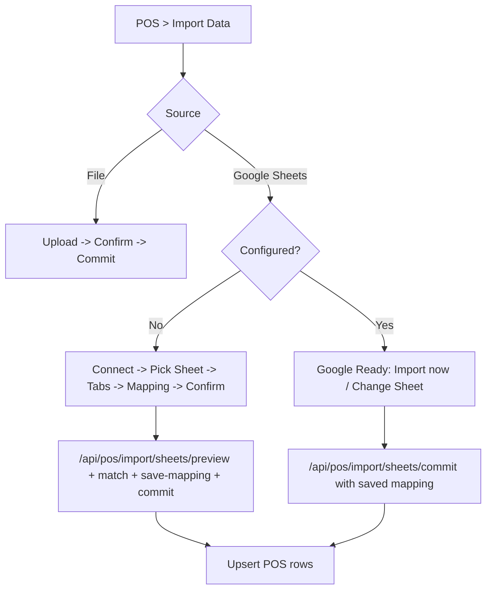
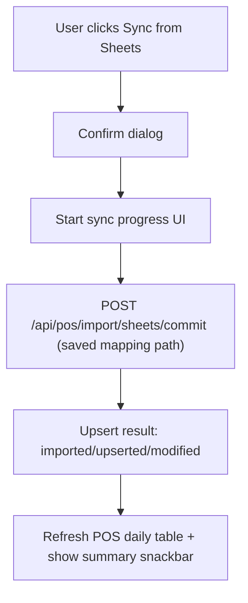
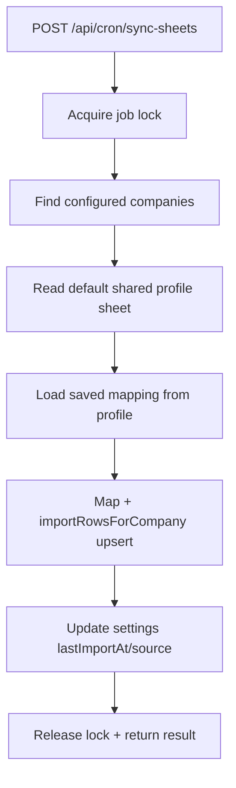

# Google Sheets Integration: End-to-End Flow Charts, Buttons, Paths, and Gaps

This document captures all known user-visible and backend paths for Google Sheets integration in RetailSync, including:

- OAuth sheet integration flow
- Shared sheet profiles flow (multiple named sheets like `POS Data SHEET`, `EFT SHEET`)
- POS import modal workflow
- Sync workflows (manual sync, import commit, cron sync)
- Debug workflow (step-by-step checks)
- Coverage matrix and missing scenarios

---

## 1) Top-Level System Flow

---

## 2) Settings UI Button Map and Behavior

### Google Sheets Card Buttons

| Button | Location | Action |
|---|---|---|
| `Sync now` | Google Sheets card header | Triggers immediate sync from configured/default profile |
| `Reset integration` | Google Sheets card header | Clears Google integration state |
| `Debug` | OAuth block and Shared block | Runs step-by-step diagnostics |
| `Verify access` | OAuth block and Shared block | Calls verify endpoint for selected/default profile |
| `Check connection` | OAuth block | Re-check OAuth token status |
| `Disconnect` | OAuth block | Disconnects OAuth linkage |
| `Use this mode` | OAuth/Shared block when inactive | Switches active mode |
| `Change sheet` | Setup inline | Opens files list and allows selecting another sheet |
| `Save mapping` | Setup inline mapping step | Validates and stores mapping |
| `New profile` | Shared setup inline | Starts creating new shared profile name |

---

## 3) OAuth Flow

### OAuth Debug Steps

---

## 4) Shared Profiles Flow (`sharedSheets[]`)

### Shared Debug Steps

---

## 5) POS Import Modal Flow

---

## 6) Sync Workflows and Continuity

### Manual Sync Button Flow

### Cron Sync Flow

### Continuity Guarantees (Current)

- Repeated imports use upsert semantics by date.
- Existing dates are updated, new dates are inserted.
- Integration `lastImportAt` and `lastImportSource` are refreshed after successful import.

---

## 7) Coverage Matrix (E2E/API)

Implemented in: [sheetsIntegration.e2e.test.ts](/Users/trupal/Projects/RetailSync/server/src/sheetsIntegration.e2e.test.ts)

| Scenario | Covered |
|---|---|
| Multi shared profiles can be created (`POS Data SHEET`, `EFT SHEET`) | Yes |
| Save mapping on shared profile and commit with saved mapping | Yes |
| Shared import continuity across repeated sync/upsert | Yes |
| OAuth mode import with explicit spreadsheet override | Yes |
| Cron sync imports from default shared profile | Yes |

---

## 8) Missing or Weak Spots

These are the current gaps discovered while mapping all paths:

1. No explicit `Set Default Profile` button in Shared UI.
2. No `Delete Profile` path for `sharedSheets[]` entries.
3. Sync progress UI is client-estimated, not server job progress.
4. No dedicated import job status endpoint for long-running visibility/retry.
5. OAuth and Shared mappings are still partially intertwined in some fallback paths (compatibility layer remains).
6. No strict profile-type gating for non-POS profiles (for example, EFT profile still can be selected where POS schema is expected).
7. No full browser-level Playwright/Cypress scenario coverage yet (current tests are API e2e with mocked Google APIs).

---

## 9) Recommended Next Steps

1. Add backend endpoints and UI for profile default selection and profile deletion.
2. Add job progress endpoint and wire progress bar to real server state.
3. Add profile `domain/type` field (for example `pos`, `eft`) and enforce compatibility in import flows.
4. Add browser E2E suite for UI actions: connect, configure, debug, sync, change profile, and continuity checks.
