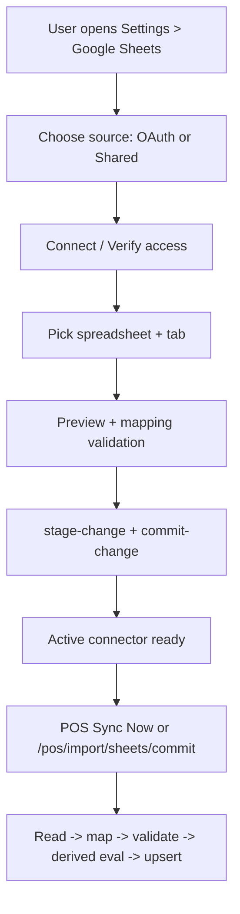
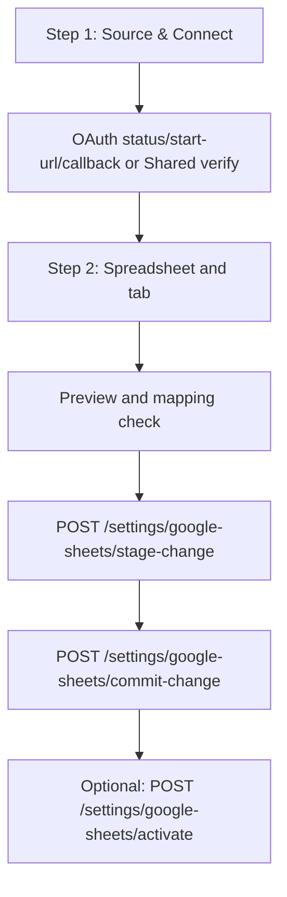
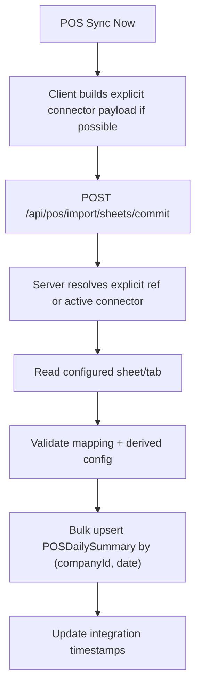

# Google Sheets Integration Flows (Current)

This document describes the current end-to-end architecture and user flows for Google Sheets integration in RetailSync.

## 1) Canonical model

Settings are connector-first:

- `googleSheets.activeIntegration`
- `googleSheets.oauth.sources[].connectors[]`
- `googleSheets.shared.profiles[].connectors[]`

Active refs:

- OAuth: `activeSourceId`, `activeConnectorKey`
- Shared: `activeProfileId`, `activeConnectorKey`

Connector key for POS is `pos_daily`.

## 2) High-level flow

## 3) UI ownership

- Settings page owns Google Sheets setup, sheet selection, mapping, and connector persistence.
- POS Import modal does not maintain a separate Google configuration wizard.
- From POS Import modal, selecting Google Sheets routes to Settings.

## 4) Settings API flow

Key endpoints:

- `GET /api/settings`
- `POST /api/settings/google-sheets/stage-change`
- `POST /api/settings/google-sheets/commit-change`
- `POST /api/settings/google-sheets/activate`
- `GET /api/integrations/google/sheets/oauth-status`
- `GET /api/integrations/google/sheets/files`
- `GET /api/integrations/sheets/shared-files`
- `POST /api/integrations/sheets/tabs`
- `POST /api/settings/google-sheets/shared/verify`

## 5) Runtime import flow

Request options for commit:

- explicit:
  - `{ connectorKey, integrationType: "oauth", sourceId }`
  - `{ connectorKey, integrationType: "shared", profileId }`
- active-resolution:
  - `{ connectorKey }` or empty body

## 6) POS Sync reliability behavior

POS `Sync Now` client logic:

1. parse canonical settings and choose active/usable connector
2. fallback to legacy shape if present
3. if local parsing fails, still call commit with `{ connectorKey: "pos_daily" }`

This allows server-side resolver to run and avoids false local “mapping missing” failures.

## 7) Status and action model (UI)

Per connector readiness:

- `not_configured`
- `invalid`
- `needs_review`
- `ready`

Primary action rules:

- `not_configured`: Setup sheet
- `invalid`: Fix setup
- `needs_review`: Confirm mapping
- `ready`: Sync now

## 8) Known compatibility layer

Legacy endpoints/fields still exist for compatibility in parts of the codebase:

- `PUT /api/settings/google-sheets/mode`
- `PUT /api/settings/google-sheets/source`
- `POST /api/integrations/sheets/config`
- `POST /api/integrations/sheets/save-mapping`

New work should target connector-first endpoints and canonical settings.
