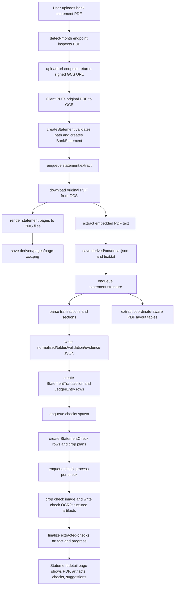

# Statement PDF Processing Workflow

Last updated: 2026-05-14

## Scope

This document describes the real statement PDF pipeline implemented in RetailSync today.

Important clarification:
- RetailSync does not currently generate a brand-new final accounting PDF from templates.
- The live workflow ingests a source bank statement PDF, stores it, renders page images from it, extracts text and layout, creates structured JSON artifacts, spawns per-check extraction jobs, and exposes the results in the statement review workspace.

Primary implementation files:
- `client/src/modules/accounting/components/UploadStatementDialog.tsx`
- `client/src/modules/accounting/api/AccountingApi.ts`
- `server/src/controllers/accountingController.ts`
- `server/src/jobs/accountingQueue.ts`
- `server/src/jobs/accountingTaskRunner.ts`
- `server/src/services/accountingPdfRenderService.ts`
- `server/src/services/accountingStorageService.ts`
- `server/src/services/accountingPdfTextExtractionService.ts`
- `server/src/services/accountingPdfLayoutExtractionService.ts`
- `server/src/services/accountingCheckExtractionService.ts`
- `client/src/modules/accounting/pages/StatementDetailPage.tsx`
- `client/src/modules/accounting/utils/statementDetailHelpers.ts`

## Current Status

- Statement upload pipeline: `DONE`
- Original PDF storage in deterministic company-scoped path: `DONE`
- Statement page rendering to PNGs: `DONE`
- PDF text extraction and layout parsing: `DONE`
- Structured statement artifact generation: `DONE`
- Per-check crop/OCR/structured extraction: `DONE`
- Review workspace artifact viewing: `DONE`
- Release confidence: `PARTIAL`
  - The workflow is implemented and demoable, but broader release confidence still depends on environment/tooling and full validation coverage.

Verified local signal on 2026-05-14:
- `pnpm --filter @retailsync/server run statement:fixture` completed successfully
- fixture output reported `renderedPageCount: 8`
- fixture output reported `extractedCheckCount: 42`
- fixture summary output path:
  - `server/tmp/statement-fixture-output/companies/fixture-company/statements/2025/12/fixture-statement/derived/ocr/fixture-summary.v1.json`

## End-to-End Flow



## Upload and Path Contract

The upload path starts in the accounting client upload dialog.

Sequence:
1. Client optionally calls `POST /api/accounting/statements/detect-month`.
2. Client calls `POST /api/accounting/statements/upload-url`.
3. Server returns a signed upload URL plus a deterministic `gcsPath`.
4. Client uploads the original PDF directly to Google Cloud Storage.
5. Client calls `POST /api/accounting/statements`.

The deterministic root prefix is built by `buildStatementRootPrefix()`:

```text
companies/{companyId}/statements/{yyyy}/{mm}/{statementId}
```

The original uploaded PDF is always expected at:

```text
companies/{companyId}/statements/{yyyy}/{mm}/{statementId}/original/statement.pdf
```

The create-statement controller rejects mismatched client-supplied paths, so downstream processing can rely on a stable storage layout.

## Lifecycle States Defined By The Workflow

The statement lifecycle is defined in shared accounting schemas:

- `uploaded`
- `extracting`
- `structuring`
- `checks_queued`
- `needs_parser_review`
- `ready_for_review`
- `failed`

Progress counters tracked on the statement:
- `totalChecks`
- `checksQueued`
- `checksProcessing`
- `checksReady`
- `checksFailed`
- `completedChecks`
- `remainingChecks`

Check lifecycle states:
- `queued`
- `processing`
- `ready`
- `needs_review`
- `failed`

## What The Workflow Defines

The pipeline defines:
- one immutable source PDF for the statement run
- one deterministic root prefix for all derived artifacts
- one statement lifecycle state machine
- one progress model for long-running work
- one structured transaction model
- one derived checks-cleared table
- one per-check work unit model
- one review surface for artifacts, suggestions, and status

Persistent MongoDB entities created or updated by the flow:
1. `BankStatement`
2. `StatementTransaction`
3. `LedgerEntry`
4. `StatementCheck`
5. `Run`

## What The Workflow Creates

### Source artifact

1. the original uploaded statement PDF

### Statement-level derived artifacts

1. rendered statement page images
2. OCR-style JSON and text artifacts
3. normalized transaction JSON
4. transactions table
5. checks-cleared table
6. transaction-sections table
7. classification output
8. suggestions output
9. processing summary
10. structured statement JSON
11. evidence JSON
12. validation report JSON
13. PDF layout JSON

### Check-level derived artifacts

1. cropped check image
2. check OCR text
3. check OCR JSON
4. check structured JSON
5. per-check proposal/suggestion JSON

## Storage Layout

The statement artifact contract is centralized in `server/src/services/accountingStorageService.ts`.

Representative layout:

```text
companies/{companyId}/statements/{yyyy}/{mm}/{statementId}/
  original/
    statement.pdf
  derived/
    pages/
      page-001.png
      page-002.png
    ocr/
      docai.json
      text.txt
      json/
        tables/
          transactions.json
          checks-cleared.json
          transaction-sections.json
          extracted-checks.json
          classification-output.json
          suggestions-output.json
          processing-summary.json
          structured-statement.v1.json
          evidence.v1.json
          validation-report.v1.json
          pdf-layout.v1.json
    gemini/
      normalized.v1.json
    checks/
      extracted/
        {checkId}/
          front.png
          ocr.txt
          ocr.json
          structured.v1.json
    suggestions/
      {id}.json
```

Important note:
- `derived/ocr/docai.json` is a historical artifact name. In the current code path, the payload can still be generated from local PDF text extraction rather than a live Document AI call.

## Stage-By-Stage Execution

### 1. Detect statement month

Purpose:
- inspect the uploaded PDF before persistence
- infer likely statement month/date evidence

Defines:
- whether the uploaded file is treated as a valid PDF
- preliminary month/date evidence for the record

Creates:
- no durable storage artifact yet

### 2. Signed upload URL and original PDF save

Purpose:
- reserve a deterministic object path
- persist the original statement PDF in GCS

Defines:
- `statementId`
- `rootPrefix`
- canonical `gcsPath`

Creates:
- `original/statement.pdf`

### 3. `createStatement`

Purpose:
- validate the expected storage path
- compute the uploaded PDF hash
- create or update the statement record
- queue background processing

Defines:
- `BankStatement.gcs.rootPrefix`
- `BankStatement.gcs.pdfPath`
- statement dedupe hash
- initial status/progress

Creates:
- `BankStatement`
- queued `statement.extract` job

### 4. `statement.extract`

Purpose:
- download the original PDF
- render each page to PNG
- extract PDF text
- persist statement-level OCR artifacts

Defines:
- `pageImagePaths`
- `ocrPath`
- `ocrTextPath`
- detected statement month/date evidence
- stage timestamps for `extracting` and `structuring`

Creates:
- `derived/pages/page-xxx.png`
- `derived/ocr/docai.json`
- `derived/ocr/text.txt`

### 5. `statement.structure`

Purpose:
- parse transactions from saved OCR/PDF text
- derive checks-cleared rows and section-aware data
- run layout extraction from the PDF
- write structured artifacts
- rebuild statement transaction and ledger rows

Defines:
- normalized transaction model
- parser version
- validation status
- extraction issues
- whether the statement moves to `checks_queued` or `needs_parser_review`

Creates:
- `derived/gemini/normalized.v1.json`
- `derived/ocr/json/tables/transactions.json`
- `derived/ocr/json/tables/checks-cleared.json`
- `derived/ocr/json/tables/transaction-sections.json`
- `derived/ocr/json/tables/classification-output.json`
- `derived/ocr/json/tables/suggestions-output.json`
- `derived/ocr/json/tables/processing-summary.json`
- `derived/ocr/json/tables/structured-statement.v1.json`
- `derived/ocr/json/tables/evidence.v1.json`
- `derived/ocr/json/tables/validation-report.v1.json`
- `derived/ocr/json/tables/pdf-layout.v1.json`
- `StatementTransaction` rows
- `LedgerEntry` rows

### 6. `checks.spawn`

Purpose:
- determine which checks require detailed extraction
- create independent per-check work items
- queue fan-out processing

Defines:
- expected check set
- check page number and crop bounding boxes when available
- total check counts used for statement progress

Creates:
- `StatementCheck` rows
- queued `check.process` jobs

### 7. `check.process`

Purpose:
- crop the target check image from the original statement PDF
- extract check fields
- persist check-level artifacts
- link the check back to its statement transaction and ledger entry

Defines:
- extracted check number/date/payee/amount/memo
- per-check confidence
- check status: `ready` or `needs_review`
- linked evidence/proposal paths

Creates:
- `derived/checks/extracted/{checkId}/front.png`
- `derived/checks/extracted/{checkId}/ocr.txt`
- `derived/checks/extracted/{checkId}/ocr.json`
- `derived/checks/extracted/{checkId}/structured.v1.json`
- per-check internal suggestion/proposal artifact

### 8. Finalization and review readiness

Purpose:
- recompute statement progress as checks finish
- write the final consolidated extracted-checks artifact once
- make the statement reviewable in the UI

Defines:
- terminal statement progress
- final statement readiness status

Creates:
- `derived/ocr/json/tables/extracted-checks.json`
- final review-ready artifact set

## Artifact Tree

```mermaid
flowchart TD
    A["rootPrefix"] --> B["original/statement.pdf"]
    A --> C["derived/pages/page-001.png ..."]
    A --> D["derived/ocr/docai.json"]
    A --> E["derived/ocr/text.txt"]
    A --> F["derived/ocr/json/tables/*.json"]
    A --> G["derived/gemini/normalized.v1.json"]
    A --> H["derived/checks/extracted/{checkId}/front.png"]
    A --> I["derived/checks/extracted/{checkId}/ocr.txt"]
    A --> J["derived/checks/extracted/{checkId}/ocr.json"]
    A --> K["derived/checks/extracted/{checkId}/structured.v1.json"]
    A --> L["derived/suggestions/{id}.json"]
```



## UI Consumption

The statement detail workspace reads these artifacts back through the secure statement artifact endpoint and exposes them in viewer tabs.

Primary UI readers:
- `client/src/modules/accounting/pages/StatementDetailPage.tsx`
- `client/src/modules/accounting/utils/statementDetailHelpers.ts`

Visible review outputs include:
- source PDF
- OCR text
- OCR JSON
- normalized JSON
- transactions table
- checks-cleared table
- extracted checks
- classification output
- suggestions output
- processing summary
- structured statement
- evidence
- validation report

## Fixture / Repro Path

The local fixture script reproduces the statement PDF pipeline from the sample PDF:

- source fixture:
  - `shared/src/accounting/testStatmentPDF.pdf`
- runner:
  - `server/src/scripts/runStatementFixtureExtraction.ts`
- local output root:
  - `server/tmp/statement-fixture-output`

This is the best local verification path when changing the PDF-processing pipeline without going through the full app UI.

## Notes and Boundaries

- The production statement pipeline is PDF-ingestion-first, not template-to-PDF generation.
- QuickBooks posting is downstream of review/approval and is not part of the core PDF extraction stages themselves.
- The checked-in quarterly report PDFs under `docs/QRs/` are static repo artifacts and are not generated by this statement-processing pipeline.
