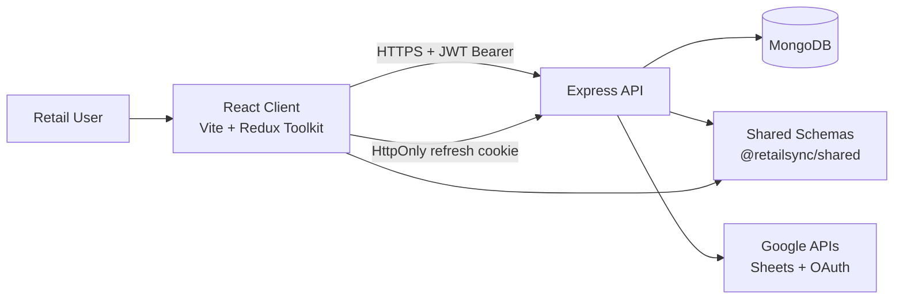
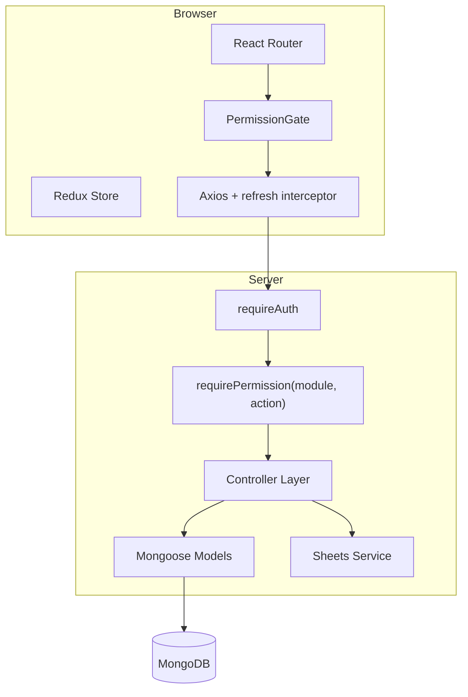
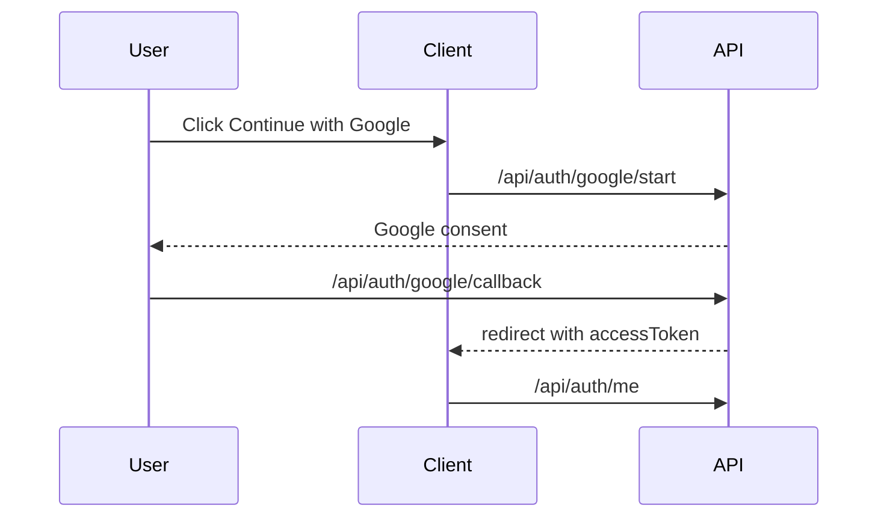

# System Overview

## Purpose

RetailSync is a multi-tenant retail operations platform with strict company isolation, server-authoritative RBAC, and integration points for Google Sheets.

## High-Level Architecture

## Runtime Component Model

## Tenant Isolation Strategy

1. `requireAuth` resolves user and sets tenant context.
2. Protected controllers reject requests without tenant/company identity.
3. Tenant entities include `companyId`.
4. Queries use `{ companyId: req.companyId }` filters.
5. Role permissions are resolved in tenant scope.

## Auth Model (Server API)

## Integration Model

- Google Sheets: service account reads + OAuth token flow for user-connected sheets.
- Integration settings and secrets are split for safe UI exposure vs secure token storage.

## Current Domain Coverage

- Login/onboarding/dashboard routing, RBAC
- POS and reports
- Items, locations, immutable inventory ledger
- Integrations settings shell + Google Sheets read/connect flows
- Server-side Google auth (google start/callback + refresh/logout/me)

## See also

- [Workflows and usage](workflows-and-usage.md) — detailed login, onboarding, POS import sources, no-POS-data behavior, reports, and RBAC.
