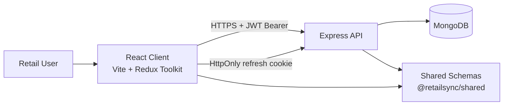

# System Overview

## Purpose

RetailSync is a multi-tenant retail operations platform with strict company isolation, permission-based RBAC, and extensible module architecture for POS ingestion, inventory movement, invoices, and reconciliation.

## High-Level Architecture



## Runtime Component Model

```mermaid
flowchart TD
  subgraph Browser
    Router[React Router]
    Store[Redux Persist Store]
    Guard[PermissionGate / ProtectedRoute]
    Axios[Axios Client + 401 Refresh Interceptor]
  end

  subgraph Server
    Auth[requireAuth]
    Perm[requirePermission(module, action)]
    Ctrl[Controller Layer]
    Models[Mongoose Models]
  end

  Router --> Guard --> Axios --> Auth --> Perm --> Ctrl --> Models
  Models --> DB[(MongoDB)]
```

## Tenant Isolation Strategy

1. `requireAuth` resolves user and sets `req.companyId`.
2. Protected controllers reject requests without `companyId`.
3. All tenant entities include `companyId`.
4. All queries filter with `{ companyId: req.companyId }`.
5. Role permission checks are scoped to `{ _id: roleId, companyId }`.

## Current Domain Coverage

- Foundation: auth, onboarding, RBAC
- POS + Reports
- Items + Locations + Inventory ledger movements
- Remaining major domains (invoices OCR, bank reconciliation) are next milestones.
