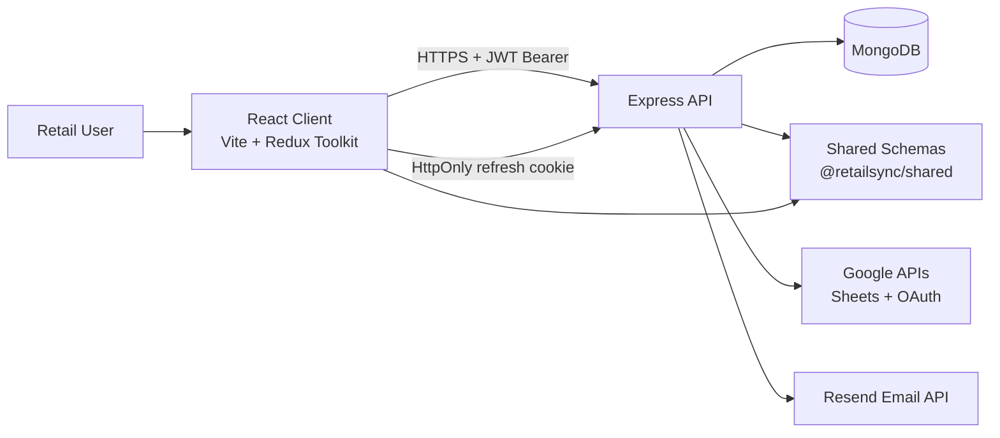
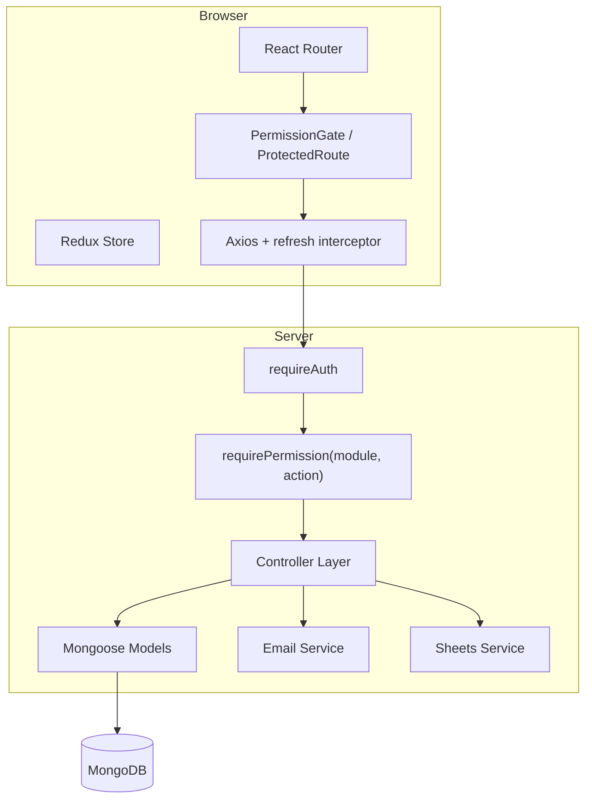
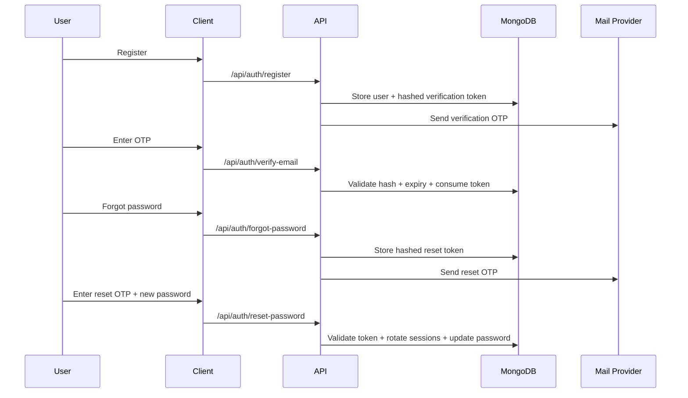

# System Overview

## Purpose

RetailSync is a multi-tenant retail operations platform with strict company isolation, server-authoritative RBAC, OTP-based auth recovery/verification, and integration points for Google Sheets and email delivery.

## High-Level Architecture

## Runtime Component Model

## Tenant Isolation Strategy

1. `requireAuth` resolves user and sets tenant context.
2. Protected controllers reject requests without tenant/company identity.
3. Tenant entities include `companyId`.
4. Queries use `{ companyId: req.companyId }` filters.
5. Role permissions are resolved in tenant scope.

## Auth and Recovery Model

## Integration Model

- Google Sheets: service account reads + OAuth token flow for user-connected sheets.
- Email delivery: Resend for verification and reset OTP.
- Integration settings and secrets are split for safe UI exposure vs secure token storage.

## Current Domain Coverage

- Auth, onboarding, RBAC
- POS and reports
- Items, locations, immutable inventory ledger
- Integrations settings shell + Google Sheets read/connect flows
- OTP email verification and password recovery
