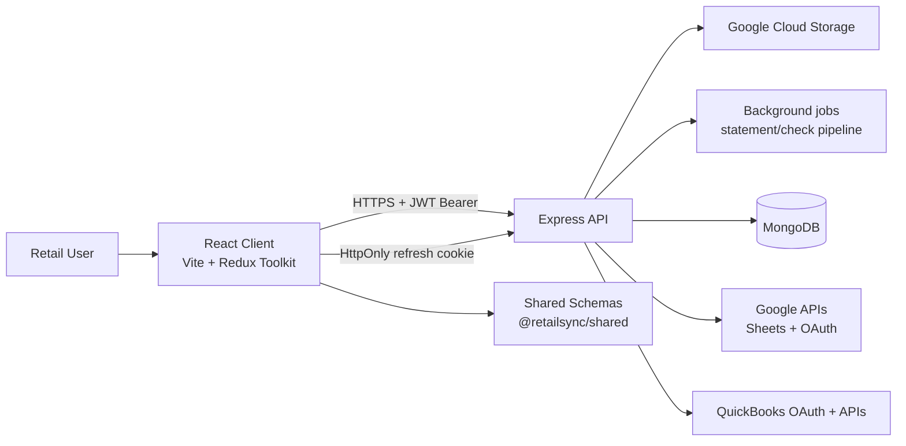
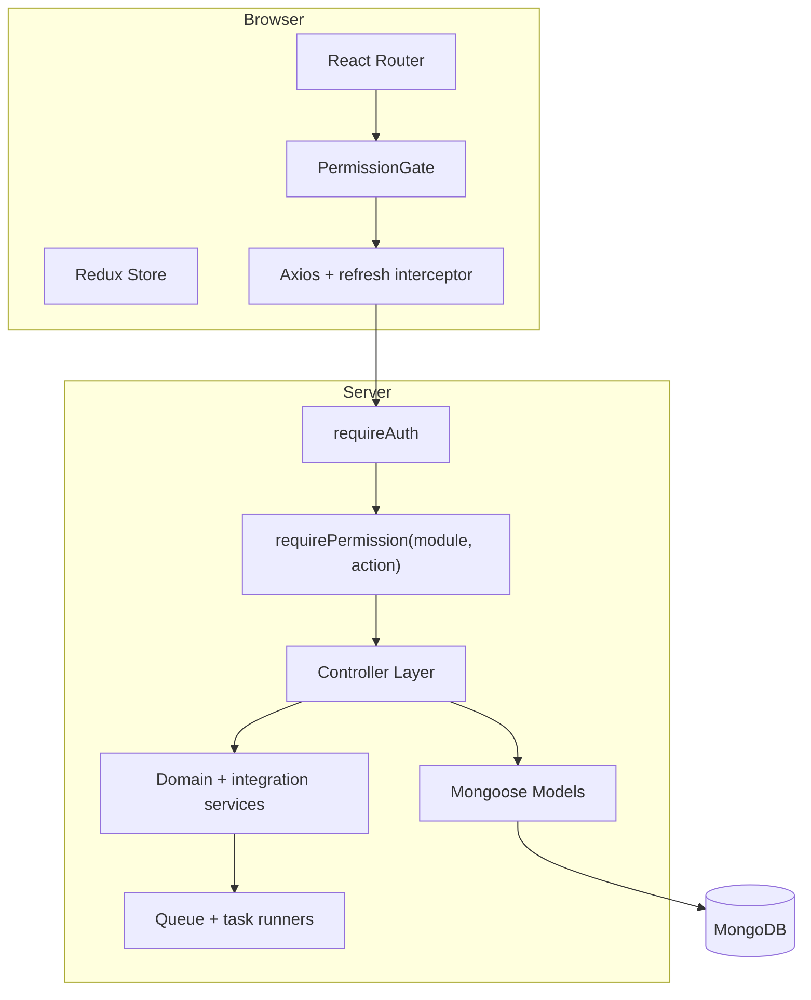
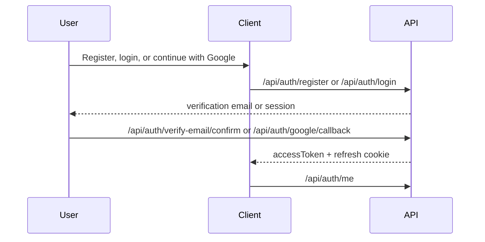

# System Overview

Last updated: 2026-05-17

## Purpose

RetailSync is a multi-tenant retail operations platform that combines authentication, company-scoped access, POS workflows, accounting statement review, QuickBooks operations, and integration management in one system. The core architectural goals are:

- strict company isolation
- server-authoritative RBAC
- reusable shared contracts between client and server
- async handling for long-running accounting workflows
- clear boundaries around Google and QuickBooks integrations

## High-Level Architecture

Official rendered diagram asset:
- [client/public/architecture-diagram.png](../../client/public/architecture-diagram.png)

```mermaid
flowchart LR
  User["Retail User"] --> Client["React Client\nVite + Redux Toolkit"]
  Client -->|"HTTPS + JWT Bearer"| API["Express API"]
  Client -->|"HttpOnly refresh cookie"| API
  Client --> Shared["Shared Schemas\n@retailsync/shared"]
  API --> Storage["Google Cloud Storage"]
  API --> Queue["Background jobs\nstatement/check pipeline"]
  API --> Mongo[("MongoDB")]
  API --> Google["Google APIs\nSheets + OAuth"]
  API --> QuickBooks["QuickBooks OAuth + APIs"]
```

## Runtime Component Model

```mermaid
flowchart TD
  subgraph Browser
    Router["React Router"]
    Store["Redux Store"]
    Guard["PermissionGate"]
    Axios["Axios + refresh interceptor"]
  end

  subgraph Server
    Auth["requireAuth"]
    Perm["requirePermission(module, action)"]
    Ctrl["Controller Layer"]
    Models["Mongoose Models"]
    Services["Domain + integration services"]
    Jobs["Queue + task runners"]
  end

  Router --> Guard --> Axios --> Auth --> Perm --> Ctrl --> Models
  Ctrl --> Services
  Services --> Jobs
  Models --> DB[("MongoDB")]
```

## Product Surface

The active top-level workspaces are:

- Dashboard
- POS
- Accounting
- QuickBooks
- Settings
- Access

Important current shape:

- Accounting is intentionally statements-first in the visible UI.
- QuickBooks is a separate operational workspace rather than an accounting tab.
- Procurement and inventory are not part of the active supported demo surface.

## Tenant Isolation Strategy

1. `requireAuth` resolves user and sets tenant context.
2. Protected controllers reject requests without tenant/company identity.
3. Tenant entities include `companyId`.
4. Queries use `{ companyId: req.companyId }` filters.
5. Role permissions are resolved in tenant scope.

## Auth Model (Server API)

```mermaid
sequenceDiagram
  participant U as User
  participant C as Client
  participant A as API
  U->>C: Register, login, or continue with Google
  C->>A: /api/auth/register or /api/auth/login
  A-->>U: verification email or session
  U->>A: /api/auth/verify-email/confirm or /api/auth/google/callback
  A-->>C: accessToken + refresh cookie
  C->>A: /api/auth/me
```

## Integration Model

- Google Sheets: service account reads + OAuth token flow for user-connected sheets.
- QuickBooks: OAuth connection plus operational reads/writes for accounting workflows.
- Integration settings and secrets are split for safe UI exposure vs secure token storage.

## Current Domain Coverage

- Login, onboarding, dashboard routing, and RBAC
- Email/password auth, verification, forgot/reset, invites, and Google sign-in
- POS imports, summaries, analytics, and reports
- Accounting statements upload, async processing, artifact review, and retry/reprocess controls
- Standalone QuickBooks workspace for accounts, contacts, sales, money, operations, reports, and tax
- Settings flows for Google Sheets and QuickBooks integration management
- Shared backend services for ledger-adjacent records, validation, and operational diagnostics

## Strongest Demo Path

The most integrated demo path is:

1. authenticate into a company-scoped account
2. show the workspace shell and RBAC-aware navigation
3. open the accounting statements workflow
4. upload or inspect a statement and review progress/artifacts
5. show how the workflow hands off into downstream QuickBooks operations

## See also

- [Workflows and usage](workflows-and-usage.md) — detailed login, onboarding, POS import sources, no-POS-data behavior, reports, and RBAC.
- [Accounting docs](../accounting/README.md) — end-to-end accounting lifecycle and module-by-module documentation.
- [Statement PDF processing workflow](statement-pdf-processing-workflow.md) — storage contract, job pipeline, and artifact model for the strongest demo path.
