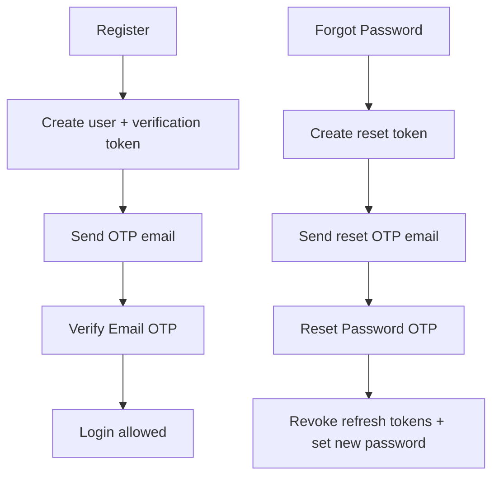
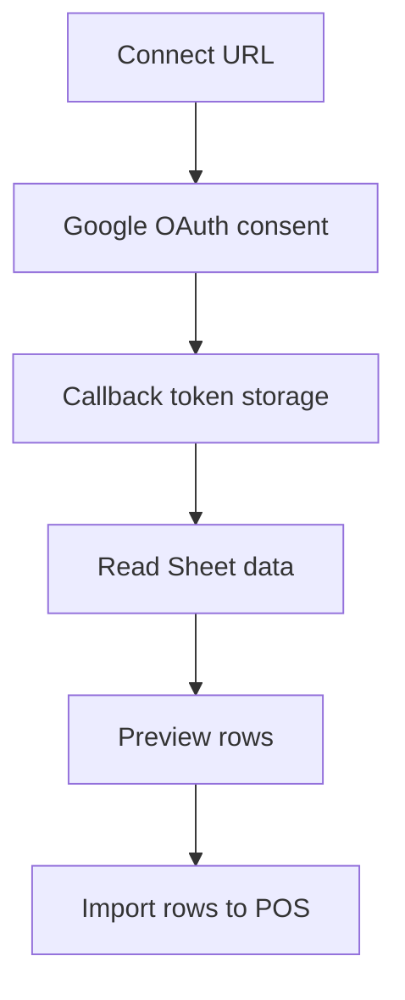
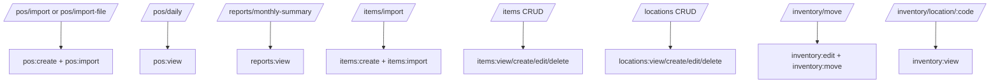

# API Reference

Base URL: `http://localhost:4000/api`

## Response Contract

- success: `{ "status": "ok", "data": ... }`
- error: `{ "status": "error", "message": "...", "details"?: ... }`

## Auth Endpoints

### `POST /auth/register`

Creates account and triggers verification OTP email.

Request:

```json
{
  "firstName": "Jane",
  "lastName": "Doe",
  "email": "jane@example.com",
  "password": "Password123",
  "confirmPassword": "Password123"
}
```

Response (dev):

```json
{
  "status": "ok",
  "data": {
    "verificationSent": true,
    "message": "Account created. Verify your email with the OTP code before login.",
    "verifyCode": "123-456"
  }
}
```

### `POST /auth/verify-email`

Verifies email by OTP code (`123-456`).

Request:

```json
{
  "token": "123-456"
}
```

### `POST /auth/resend-verification`

Regenerates and sends verification OTP.

Request:

```json
{
  "email": "jane@example.com"
}
```

### `POST /auth/login`

Requires email verification to be completed.

### `POST /auth/forgot-password`

Generates reset OTP and emails it.

Request:

```json
{
  "email": "jane@example.com"
}
```

Response:

```json
{
  "status": "ok",
  "data": {
    "message": "Password reset code generated."
  }
}
```

If email delivery fails in non-production, response includes `emailDebug`.

### `POST /auth/reset-password`

Consumes reset OTP and sets new password.

Request:

```json
{
  "token": "123-456",
  "password": "NewPassword123",
  "confirmPassword": "NewPassword123"
}
```

### `POST /auth/refresh`
### `POST /auth/logout`
### `GET /auth/me`

## Company Onboarding

- `POST /company/create`
- `POST /company/join`
- `GET /company/mine`

## RBAC Roles

- `GET /roles/modules`
- `GET /roles`
- `POST /roles`
- `PUT /roles/:id`
- `DELETE /roles/:id`

## Users / Invites

- `GET /users`
- `PUT /users/:id/role`
- `POST /invites`
- `GET /invites`
- `DELETE /invites/:id`

## POS and Reports

- `POST /pos/import` (multipart `file`)
- `POST /pos/import-file` (multipart `file`)
- `POST /pos/import-rows` (JSON rows)
- `GET /pos/daily?start=YYYY-MM-DD&end=YYYY-MM-DD`
- `GET /reports/monthly-summary?month=YYYY-MM`

## Items, Locations, Inventory

- `GET /items`
- `POST /items`
- `PUT /items/:id`
- `DELETE /items/:id`
- `POST /items/import` (multipart `file`)

- `GET /locations`
- `POST /locations`
- `PUT /locations/:id`
- `DELETE /locations/:id`

- `POST /inventory/move`
- `GET /inventory/location/:code`

## Google / Sheets Integrations

- `GET /google/connect-url` (auth required, returns OAuth URL)
- `GET /google/connect` (placeholder/public flow depending on route config)
- `GET /google/callback`
- `GET /sheets/read?spreadsheetId=...&range=...`

## Integration Settings

- `GET /settings/`
- `POST /settings/google-sheets/test`
- `PUT /settings/google-sheets/mode`
- `PUT /settings/google-sheets/source`
- `POST /settings/quickbooks/connect`
- `PUT /settings/quickbooks`
- `POST /settings/disconnect/google`
- `POST /settings/disconnect/quickbooks`

## Placeholder CRUD Shell Endpoints

Also available under `/api/<module>` for generic module shells:

- `GET /<module>`
- `POST /<module>`
- `PUT /<module>/:id`
- `DELETE /<module>/:id`

## Workflow: Auth Recovery and Verification



## Workflow: Google Sheets Import



## Permission Matrix by Endpoint (Current)


