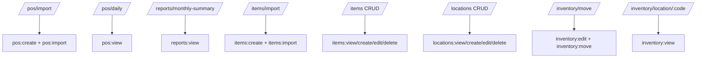

# API Reference

Base URL: `http://localhost:4000/api`

Response shape:

- success: `{ "status": "ok", "data": ... }`
- error: `{ "status": "error", "message": "...", "details"?: ... }`

## Auth

- `POST /auth/register`
- `POST /auth/login`
- `POST /auth/refresh`
- `POST /auth/logout`
- `GET /auth/me`

## Company Onboarding

- `POST /company/create`
- `POST /company/join`
- `GET /company/mine`

## RBAC Roles

- `GET /roles/modules`
- `GET /roles`
- `POST /roles`
- `PUT /roles/:id`
- `DELETE /roles/:id`

## Users / Invites

- `GET /users`
- `PUT /users/:id/role`
- `POST /invites`
- `GET /invites`
- `DELETE /invites/:id`

## POS and Reports

- `POST /pos/import` (multipart `file`)
- `GET /pos/daily?start=YYYY-MM-DD&end=YYYY-MM-DD`
- `GET /reports/monthly-summary?month=YYYY-MM`

## Items, Locations, Inventory

- `GET /items`
- `POST /items`
- `PUT /items/:id`
- `DELETE /items/:id`
- `POST /items/import` (multipart `file`)

- `GET /locations`
- `POST /locations`
- `PUT /locations/:id`
- `DELETE /locations/:id`

- `POST /inventory/move`
- `GET /inventory/location/:code`

## Placeholder CRUD Shell Endpoints

Also available under `/api/<module>` for generic module shells:
- `GET /<module>`
- `POST /<module>`
- `PUT /<module>/:id`
- `DELETE /<module>/:id`

## Permission Matrix by Endpoint (Current)

