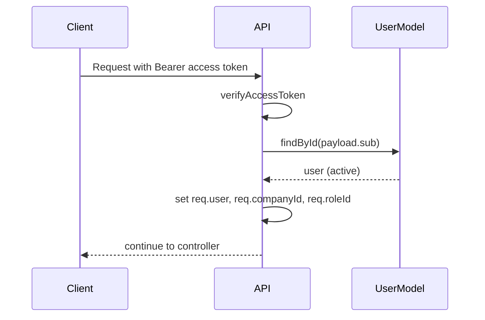
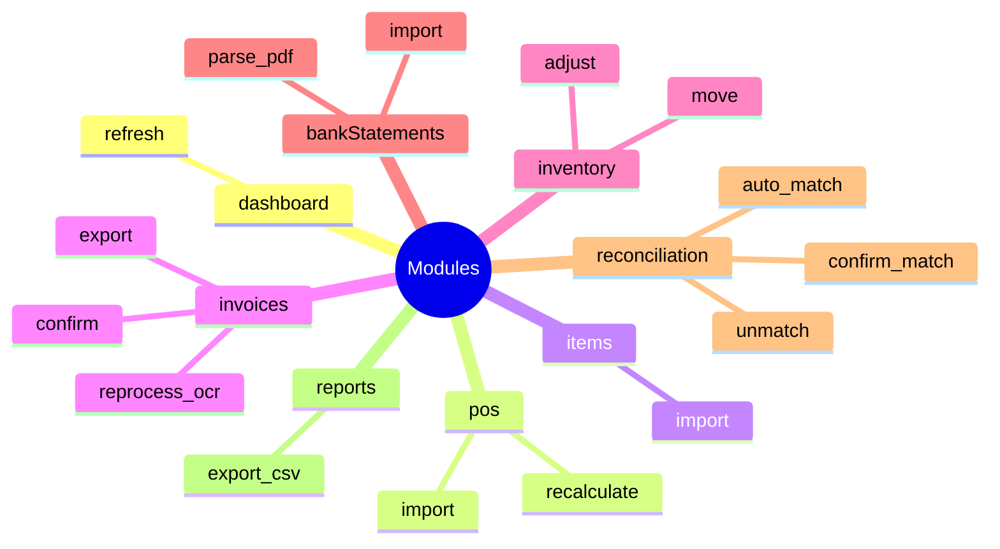

# RBAC and Security

## Authentication

- Access token (JWT): 15 minutes
- Refresh token (JWT): 7 days
- Refresh token stored in cookie:
  - `HttpOnly`
  - `SameSite=Lax`
  - `secure` in production

## Request Auth Flow

## Permission Enforcement

Server middleware: `requirePermission(module, action)`

- Resolves role by `roleId + companyId`
- Reads permission object for requested module
- Supports:
  - CRUD checks: `view/create/edit/delete`
  - custom action checks in `actions[]`
  - wildcard `"*"` for all custom actions

## Role Defaults

Created per company on company creation:

- `Admin`: full CRUD + `actions: ["*"]` on all modules
- `Member`: operational defaults (POS/items/inventory enabled)
- `Viewer`: read-only defaults

## Modules and Custom Actions

## Client-Side Enforcement

- Sidebar links rendered only with `hasPermission(module, "view")`
- `PermissionGate` controls button visibility/disabled state
- Direct URL access still protected by server middleware

## Security Notes

- Never trust client-only gating
- Always scope tenant data with `companyId`
- Prefer server-side audit events on state-changing endpoints
- Keep JWT secrets strong and rotated per environment
