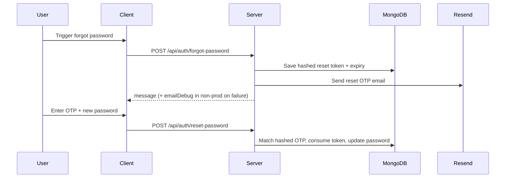

# Email System Guide

## Purpose

RetailSync uses email for OTP-based account verification and password reset.

## Email Types

1. Verification email
- subject: `Verify your RetailSync account`
- template: `verifyEmailTemplate`
- OTP expires in 24 hours

2. Password reset email
- subject: `RetailSync password reset`
- template: `resetPasswordTemplate`
- OTP expires in 30 minutes

## Brand Rendering

HTML templates include:

- brand icon (`RESEND_BRAND_ICON_URL` or `${CLIENT_URL}/brand/icon.png`)
- RetailSync header styles
- OTP code block (`123-456`)

## End-to-End Flow



## Required Environment

| Variable | Required | Notes |
|---|---|---|
| `RESEND_API_KEY` | Yes (for real delivery) | API key from Resend |
| `RESEND_FROM` | Yes (for real delivery) | must satisfy domain/testing policy |
| `RESEND_BRAND_ICON_URL` | No | optional explicit logo URL |
| `CLIENT_URL` | Yes | fallback icon URL source |

## Delivery Failure Behavior

- API keeps privacy-safe success shape for user lookups.
- In non-production, `emailDebug` is returned when delivery fails.
- Forgot-password UI blocks navigation to reset page when `emailDebug` is present.

## Common Delivery Errors

1. `403 validation_error` and testing-mode recipient restriction:
- only own inbox allowed until domain verification is completed.
- if you use `onboarding@resend.dev`, Resend allows only the account-owner inbox.
- this is expected behavior and not an application bug.

2. unverified sender domain:
- verify domain in Resend and use matching sender.

3. invalid/revoked API key:
- rotate key and update env.

## Debug Checklist

```bash
# 1) Check server env
cat /Users/trupal/Projects/RetailSync/server/.env | rg "RESEND_API_KEY|RESEND_FROM|RESEND_BRAND_ICON_URL"

# 2) Trigger forgot password and inspect response for emailDebug

# 3) Verify server logs for provider response status/body
```

## Tests

- `/Users/trupal/Projects/RetailSync/server/src/services/emailService.test.ts`
- `/Users/trupal/Projects/RetailSync/server/src/services/emailTemplates.test.ts`
- `/Users/trupal/Projects/RetailSync/server/src/auth.account-recovery.e2e.test.ts`

Test policy note:

- tests do not call live Resend in CI; transport behavior is validated via mocked responses and `NODE_ENV=test` outbox capture.
- a dedicated unit test covers provider-side 403 rejection propagation for sandbox/domain restrictions.

Run:

```bash
pnpm --filter @retailsync/server exec vitest run src/services/emailService.test.ts
pnpm --filter @retailsync/server exec vitest run src/services/emailTemplates.test.ts
```
