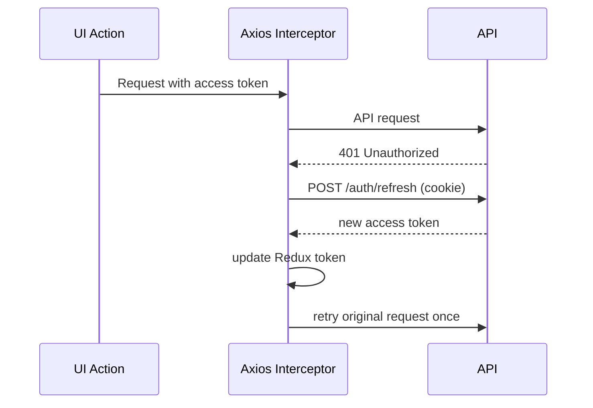

# Client Architecture

## Stack

- Vite + React + TypeScript
- MUI for UI
- React Router for routing
- Redux Toolkit + redux-persist
- Axios with refresh-token retry interceptor

## State Slices

- `authSlice`
  - `accessToken`, `user`, `role`, `permissions`
- `companySlice`
  - current company profile
- `rbacSlice`
  - module catalog, roles list
- `uiSlice`
  - snackbar notifications
- `itemsSlice`
  - cached item list, loading/error state, lastLoadedAt (used by inventory workspace)
- `locationsSlice`
  - cached locations, loading/error state (used by inventory workspace + layout viewer)

## Token Flow

## Routing Structure

- default route: `/` -> `/login`
- login route: `/login`
- onboarding guarded routes: `/onboarding/*`
- protected app shell: `/dashboard/*`
- Google callback route: `/auth/google/success`
- informational routes remain public: `/playground`, `/privacy`, `/terms`, `/data-deletion`, `/home-demo`

Main dashboard pages currently:
- `/dashboard/pos`
- `/dashboard/reports`
- `/dashboard/operations` (Inventory workspace: items, locations, layout)
- `/dashboard/users`
- `/dashboard/roles`

## Permission Rendering Rules

- Sidebar module link appears if user has `view` for that module.
- `PermissionGate` checks actions for each button.
- Pages render `NoAccess` when module view permission is absent.
