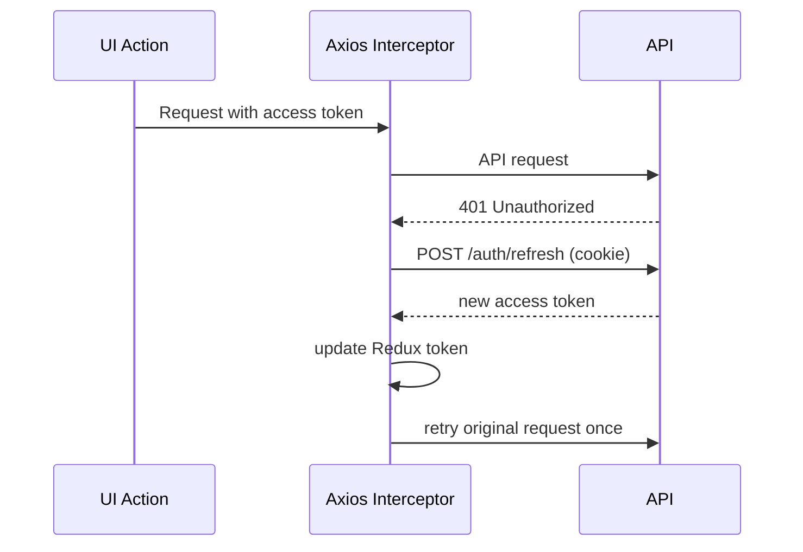

# Client Architecture

## Stack

- Vite + React + TypeScript
- MUI for UI
- React Router for routing
- Redux Toolkit + redux-persist
- Axios with refresh-token retry interceptor

## State Slices

- `authSlice`
  - `accessToken`, `user`, `role`, `permissions`
- `companySlice`
  - current company profile
- `rbacSlice`
  - module catalog, roles list
- `uiSlice`
  - snackbar notifications

## Token Flow

## Routing Structure

- public: `/login`, `/register`
- onboarding guarded: `/onboarding/*`
- protected app shell: `/dashboard/*`

Main dashboard pages currently:
- `/dashboard/pos`
- `/dashboard/reports`
- `/dashboard/items`
- `/dashboard/locations`
- `/dashboard/inventory`
- `/dashboard/users`
- `/dashboard/roles`

## Permission Rendering Rules

- Sidebar module link appears if user has `view` for that module.
- `PermissionGate` checks actions for each button.
- Pages render `NoAccess` when module view permission is absent.
