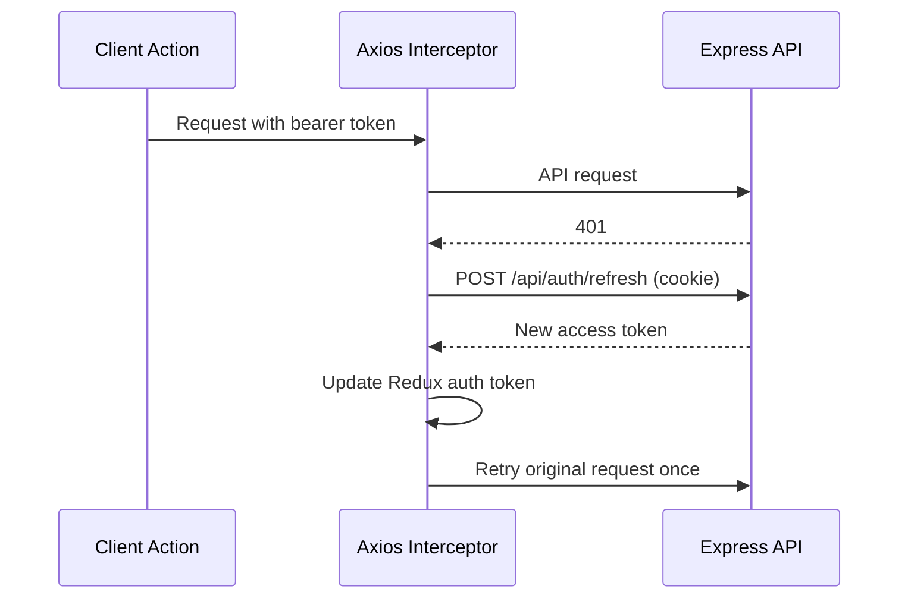

# Client Architecture

## Stack

- Vite + React 18 + TypeScript
- Material UI
- React Router v6
- Redux Toolkit + redux-persist
- Axios with refresh-token retry
- Vitest + React Testing Library

## App Layers

```text
client/src/
  app/
    api/            # global axios client + shared API barrel
    store/          # store infra only (index, rootReducer, hooks, uiSlice)
    guards/         # ProtectedRoute, OnboardingGuard, PermissionGate
    layout/         # Dashboard shell
  modules/
    auth/
    inventory/
    pos/
    procurement/
    users/
    rbac/
    settings/
    dev/
  components/       # shared reusable UI
  layout/           # shared module shell page
```

## Redux Pattern (Hybrid)

- Global infra lives in `client/src/app/store/*`.
- Feature state lives in `client/src/modules/<module>/state/*`.
- Root reducer imports module reducers from module entrypoints.

Current reducer keys:

- `auth`
- `company` (users module state)
- `rbac`
- `ui`
- `items` (inventory)
- `locations` (inventory)
- `settings`
- `pos`

## Routing

Public routes:

- `/login`
- `/home-demo`
- `/privacy`
- `/terms`
- `/data-deletion`
- `/auth/google/success`
- `/401`, `/403`, `/404`, `/500`
- `/playground`

Onboarding routes (guarded by `OnboardingGuard`):

- `/onboarding`
- `/onboarding/create-company`
- `/onboarding/join-company`

Protected routes (guarded by `ProtectedRoute` under `/dashboard`):

- `/dashboard` (inventory dashboard home)
- `/dashboard/pos`
- `/dashboard/operations`
- `/dashboard/items`
- `/dashboard/locations`
- `/dashboard/procurement`
- `/dashboard/users`
- `/dashboard/access`
- `/dashboard/roles`
- `/dashboard/settings`
- `/dashboard/playground`
- plus module-shell pages (`invoices`, `suppliers`, `reconciliation`, `bankStatements`, `rolesSettings`)

## Module Conventions

Each module may contain:

- `state/` for slices/thunks/selectors
- `api/` for module API wrappers
- `pages/` for route-level screens
- `components/` for module-only UI
- `charts/` and `utils/` when needed
- `tests/` for module tests

## Auth + Token Refresh Flow


```mermaid
sequenceDiagram
  participant UI as Client Action
  participant AX as Axios Interceptor
  participant API as Express API

  UI->>AX: Request with bearer token
  AX->>API: API request
  API-->>AX: 401
  AX->>API: POST /api/auth/refresh (cookie)
  API-->>AX: New access token
  AX->>AX: Update Redux auth token
  AX->>API: Retry original request once
```

## Permissions

- Route access and sidebar visibility are permission-aware.
- `PermissionGate` enforces module/action visibility for controls.
- `hasPermission` allows custom actions as `actions:<key>`.
