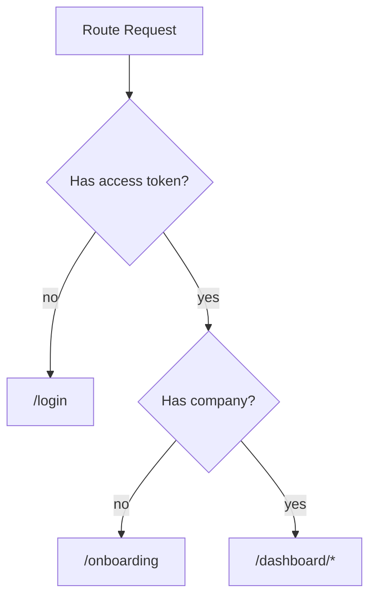

# Routing and Permission Gates

## Route Behavior

## Active Gate Components

- `ProtectedRoute`: blocks unauthenticated access
- `OnboardingGuard`: routes users without company to onboarding
- `PermissionGate`: module/action-level element control
- `NoAccess`: module page fallback screen

## Button Gating Examples

- POS import: `module="pos" action="actions:import"`
- Item delete: `module="items" action="delete"`
- Inventory move: `module="inventory" action="actions:move"`

## Recommended UX Convention

- Use `mode="hide"` for destructive actions if user lacks permission.
- Use `mode="disable"` when you want discoverability with explicit lockout.
