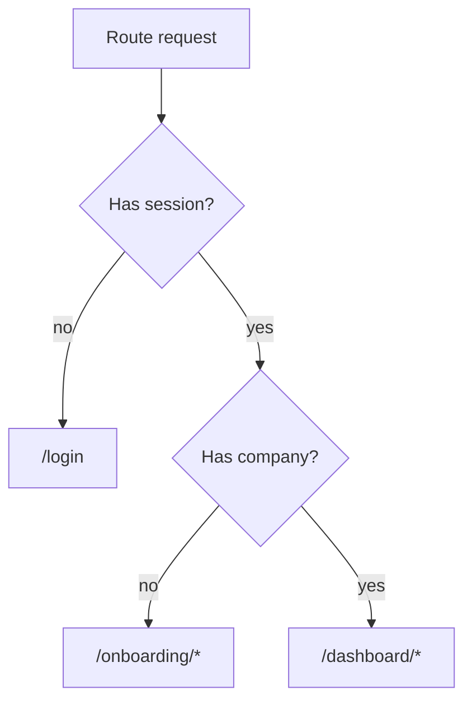

# Routing and Permission Gates

## Public Routes

- `/login`
- `/register`
- `/accept-invite`
- `/forgot-password`
- `/reset-password`
- `/verify-email`
- `/auth/google/success`
- legal and demo/dev pages

## Protected Flow

```mermaid
flowchart TD
  Start["Route request"] --> Session{Has session?}
  Session -- "no" --> Login["/login"]
  Session -- "yes" --> Company{Has company?}
  Company -- "no" --> Onboarding["/onboarding/*"]
  Company -- "yes" --> Dashboard["/dashboard/*"]
```

## Active Protected Route Tree

- `/dashboard`
- `/dashboard/pos`
- `/dashboard/accounting/statements`
- `/dashboard/accounting/statements/:statementId`
- `/dashboard/quickbooks/*`
- `/dashboard/settings`
- `/dashboard/access/users`
- `/dashboard/access/roles`

Compatibility redirects still exist for older paths such as:
- `/dashboard/users`
- `/dashboard/roles`
- older accounting QuickBooks paths
- older QuickBooks `transactions`, `live`, and `write` aliases

## Gate Components

- `ProtectedRoute`
- `OnboardingGuard`
- `PermissionGate`
- `NoAccess`

## Permission Conventions

- Navigation visibility is driven by `view` access.
- Action buttons are driven by action-level checks such as `create`, `edit`, `delete`, `invite`, and `actions:*`.
- Hidden/legacy routes should redirect into canonical pages rather than expose stale dead ends.
