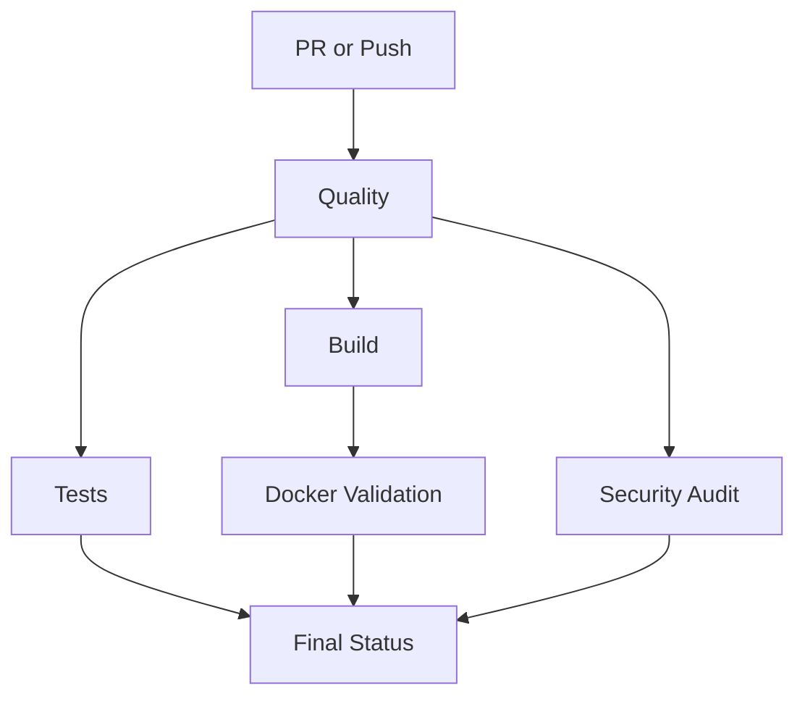
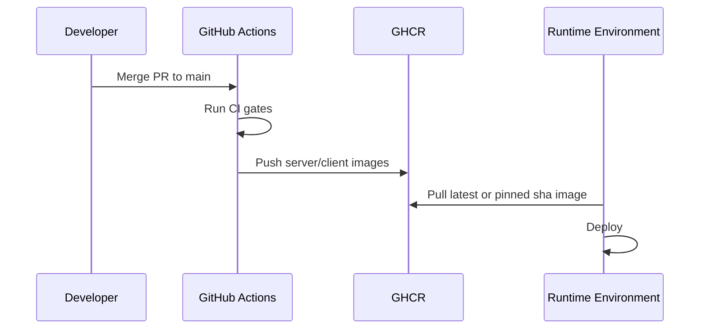

# CI/CD Pipeline (Production)

This project uses two GitHub Actions workflows:

- CI gate: `.github/workflows/ci-production.yml`
- Release images: `.github/workflows/release-images.yml`

## CI Gate Workflow

Triggers:

- pull requests to any branch
- pushes to `main`, `develop`, `release/**`, `hotfix/**`

Gates (all required):

1. `quality`
   - `pnpm typecheck`
   - `pnpm lint`
2. `tests`
   - `pnpm test`
3. `build`
   - `pnpm build`
   - uploads build artifacts
4. `docker-validation`
   - `docker compose config`
   - server/client Docker build validation (no push)
5. `security-audit`
   - `pnpm audit --prod --audit-level high`
6. `final-status`
   - fails if any prior gate failed

## Release Workflow

Triggers:

- push to `main`
- push tags `v*`

Behavior:

- logs into GHCR with `GITHUB_TOKEN`
- builds and pushes:
  - `ghcr.io/<owner>/retailsync-server`
  - `ghcr.io/<owner>/retailsync-client`
- tags include:
  - `sha-...`
  - `latest` (main only)
  - git tag ref (for tag pushes)

## Required Branch Protection Rules

Set on `main`:

- Require pull request before merge
- Require status checks to pass
  - `Typecheck + Lint`
  - `Test Suite`
  - `Build Artifacts`
  - `Docker Build Validation`
  - `Security Audit (Production Dependencies)`
  - `Final CI Status`
- Require conversation resolution
- Restrict force-push and branch deletion

## Required Repository Settings

1. Actions permissions:
   - Workflow permissions: `Read and write`
2. Package permissions:
   - allow GitHub Actions to publish packages
3. Dependabot alerts enabled
4. Secret scanning enabled

## Operational Playbook

### PR validation

- open PR -> CI gate runs automatically
- fix failing job
- merge only after all gates pass

### Production image release

- merge to `main` -> release workflow pushes `latest` + `sha`
- optional version tag `vX.Y.Z` -> pushes semver-tagged image refs

### Rollback strategy

- pull previous `sha-...` image from GHCR
- redeploy server/client with pinned image tags

