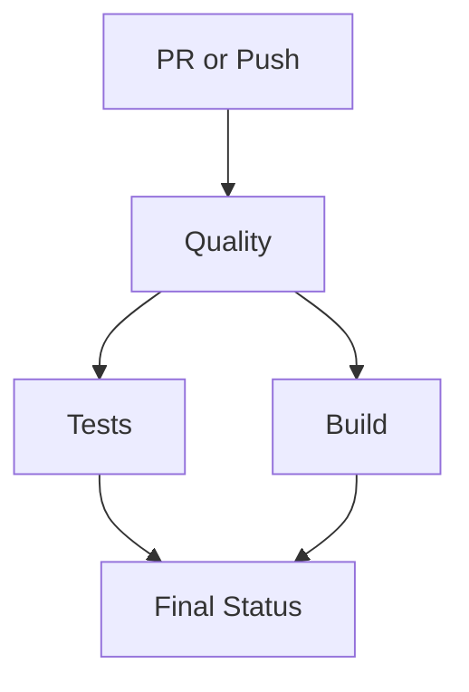
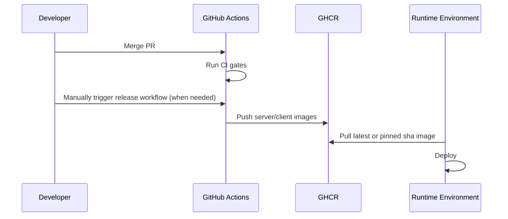

# CI/CD Pipeline (Production)

This project uses two GitHub Actions workflows:

- CI gate: `.github/workflows/ci-production.yml`
- Release images: `.github/workflows/release-images.yml`

## CI Gate Workflow

Triggers:

- pull requests to any branch
- pushes to `main`, `develop`, `release/**`, `hotfix/**`

Gates (all required):

1. `quality`
   - `pnpm typecheck`
   - `pnpm lint`
2. `tests`
   - `pnpm test`
   - sets `MONGOMS_DOWNLOAD_DIR` explicitly
   - caches mongodb-memory-server binaries
   - clears stale mongodb-memory-server lock files
3. `build`
   - `pnpm build`
   - uploads build artifacts
4. `final-status`
   - fails if any prior gate failed

## Release Workflow

Triggers:

- manual run only (`workflow_dispatch`)

Behavior:

- logs into GHCR with `GITHUB_TOKEN`
- builds and pushes:
  - `ghcr.io/<owner>/retailsync-server`
  - `ghcr.io/<owner>/retailsync-client`
- tags include:
  - `sha-...`
  - `latest` (main only)
  - git tag ref (for tag pushes)

## Required Branch Protection Rules

Set on `main`:

- Require pull request before merge
- Require status checks to pass
  - `Typecheck + Lint`
  - `Test Suite`
  - `Build Artifacts`
  - `Final CI Status`
- Require conversation resolution
- Restrict force-push and branch deletion

## Recommended Repository Settings

1. Actions permissions:
   - Workflow permissions: `Read and write`
2. Package permissions:
   - allow GitHub Actions to publish packages when running release workflow
3. Dependabot alerts enabled
4. Secret scanning enabled

## Operational Playbook

### PR validation

1. Run local gate before push:
   - `make check`
2. Open PR:
   - CI gate runs automatically.
3. Fix failing jobs and re-run.
4. Merge only after all gates pass.

### Production image release

- manually trigger `Release Docker Images` workflow when image publishing is needed
- workflow publishes `sha` tags and `latest` when run against `main`

## CI Troubleshooting

1. `actions/setup-node` says lock file missing:
- Ensure `/Users/trupal/Projects/RetailSync/pnpm-lock.yaml` is tracked in git.

2. `actions/cache` fails with `Input required and not supplied: path`:
- Ensure `Resolve pnpm store path` step exists before each pnpm cache step.

3. `mkdir: cannot create directory ''` in tests:
- Ensure `MONGOMS_DOWNLOAD_DIR` is set before mkdir (via `$GITHUB_ENV`).

4. mongodb-memory-server lock errors in CI:
- Keep per-job cache dir and stale `.lock` cleanup step in test job.

### Rollback strategy

- pull previous `sha-...` image from GHCR
- redeploy server/client with pinned image tags

