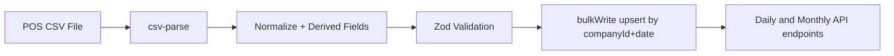

# Seeding and Sample Data

## POS Sample CSV

Sample file path:

- `/Users/trupal/Projects/RetailSync/server/src/data/pos-sample.csv`

Columns:

- `Timestamp`
- `DATE`
- `HIGH TAX`
- `LOW TAX`
- `SALE TAX`
- `GAS`
- `LOTTERY SOLD`
- `CREDIT CARD`
- `LOTTERY PAYOUT CASH`
- `CASH EXPENSES`
- `DESCRIPTION`

## Seed Command

Requires a real company id already created through onboarding:

```bash
pnpm --filter @retailsync/server seed:pos <companyId>
```

## Data Import Pipeline


