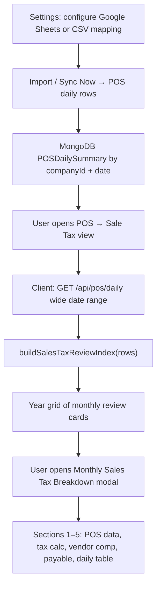

# POS Georgia Sales Tax Review — End-to-End Workflow

Last updated: 2026-05-20

This document describes the **Georgia / Troup County monthly sales tax review** implemented in the POS **Sale Tax** workspace view. It covers data sources, calculation rules, UI structure, validation behavior, and the code paths a developer or reviewer should follow.

## Purpose

Retail operators need a month-close view that:

1. Summarizes imported POS daily records for taxable and reference sales categories.
2. Calculates Georgia state tax and Troup County local tax from those sales bases.
3. Applies Georgia vendor compensation brackets against tax collected from POS.
4. Produces **payable sales tax** for filing review.

The review is **client-computed** from company-scoped daily POS rows already stored in MongoDB. There is no separate sales-tax API or persistence layer today.

## Where it lives in the product

| Surface | Route / entry | Component |
| --- | --- | --- |
| POS workspace | `/pos` (protected) | `POSWorkspacePage` |
| Sale Tax view | POS toolbar → **Sale Tax** | `POSSaleTaxPage` |
| Redux view key | `pos.view === 'saleTax'` | `client/src/modules/pos/state/posSlice.ts` |

Legacy URL aliases may map old `ai` view tokens to `saleTax` in slice normalization; the visible toolbar label is **Sale Tax**.

POS tab visibility is gated by product capabilities (`pos.table`, `pos.analytics`, `pos.saleTax`) via `client/src/utils/productPermissions.ts`.

## End-to-end flow



### Step-by-step

1. **Configure source** — In Settings, map required POS targets (`date`, `highTax`, `lowTax`, `saleTax`, `gas`, `lottery`, …). See [google-sheets-e2e.md](../operations/google-sheets-e2e.md).
2. **Import data** — CSV upload or Google Sheets commit upserts `(companyId, date)` daily rows.
3. **Open Sale Tax view** — Toolbar switches workspace to `POSSaleTaxPage`.
4. **Load rows** — Page calls `posApi.daily('2000-01-01', '2100-12-31')` to fetch all company daily records for aggregation.
5. **Build monthly index** — `buildSalesTaxReviewIndex` groups rows by `YYYY-MM`, computes totals and tax math per month.
6. **Browse by year** — Year pager shows one card per month with headline totals.
7. **Open breakdown modal** — Card click opens the five-section modal documented below.

## Required POS fields for sales tax

Sales tax review depends on these persisted `POSDailySummary` fields:

| Field | Role in review |
| --- | --- |
| `date` | Month grouping key (`YYYY-MM`) |
| `highTax` | Full-rate taxable sales base (UI: **High Tax Food**) |
| `lowTax` | Local-only taxable sales base (UI: **Low Tax Grocery**) |
| `saleTax` | Daily tax collected from POS; summed into **Total Tax Collected** |
| `gas` | Reference gasoline sales |
| `lottery` | Reference lottery sales |
| `notes` | Optional; scanned for manual tax adjustment patterns (included in collected tax total, not shown as a separate modal line) |

Other POS fields (`creditCard`, `cash`, `totalSales`, …) are stored but **not** used in the sales tax modal sections today.

### Manual adjustment from notes

`extractManualAdjustmentFromNotes` parses daily `notes` for patterns such as `manual adjustment`, `tax adjustment`, or generic `adjustment` followed by a dollar amount. Parsed amounts are summed into `manualAdjustment`, which rolls into:

```text
totalTaxCollected = posSalesTaxCollected + manualAdjustment
```

The modal does **not** expose POS collected, manual adjustment, or collected-vs-calculated difference as separate rows. **Total Tax Collected** is the only collected-tax figure shown in the UI (Monthly POS Data + Payable Sales Tax).

## Jurisdiction and rate constants

Defined in `client/src/modules/pos/utils/saleTaxReview.ts`:

| Constant | Value | Meaning |
| --- | --- | --- |
| `GEORGIA_STATE_TAX_RATE` | 4% | Georgia state portion |
| `TROUP_COUNTY_LOCAL_TAX_RATE` | 3% | Troup County local portion |
| `HIGH_TAX_RATE` | 7% | State + county on high-tax base |
| `LOW_TAX_RATE` | 3% | County only on low-tax base |

Subtitle on each month: `{Month Year} — Troup County, GA`.

## Monthly aggregation formulas

For each calendar month, daily rows are summed then rounded to cents (`Number(value.toFixed(2))`).

### Sales bases

| Computed field | Formula |
| --- | --- |
| `highTaxSales` | Σ `highTax` |
| `lowTaxSales` | Σ `lowTax` |
| `gasSales` / `gasolineSales` | Σ `gas` |
| `lotterySold` / `lotterySales` | Σ `lottery` |
| `totalSales` | `highTaxSales + lowTaxSales + gasSales + lotterySold` |
| `posSalesTaxCollected` | Σ `saleTax` |
| `totalTaxCollected` | `posSalesTaxCollected + manualAdjustment` |

Internal aliases: `grocerySales = highTaxSales`, `foodSales = lowTaxSales` (legacy naming in the review object).

### Tax calculation

| Computed field | Formula |
| --- | --- |
| `georgiaStateTaxBase` | `highTaxSales` |
| `georgiaStateTaxDue` | `highTaxSales × 4%` |
| `troupCountyTaxBase` | `highTaxSales + lowTaxSales` |
| `troupCountyTaxDue` | `troupCountyTaxBase × 3%` |
| `calculatedSalesTax` | `(highTaxSales × 7%) + (lowTaxSales × 3%)` equivalently `georgiaStateTaxDue + troupCountyTaxDue` |

### Vendor compensation (Georgia bracket rule)

Function: `calculateGeorgiaVendorCompensation(totalTaxCollected)`

| Bracket | Base | Rate | Compensation |
| --- | --- | --- | --- |
| First | `min(totalTaxCollected, 3000)` | 3% | `firstBracketBase × 3%` |
| Excess | `max(totalTaxCollected - 3000, 0)` | 0.5% | `overBracketBase × 0.5%` |
| **Total** | — | — | sum of bracket compensations |

### Payable sales tax

```text
amountPayableSalesTax = totalTaxCollected - vendorCompensation.total
```

## Year grid (landing view)

Each month card shows:

- Month label (e.g. `January 2026`)
- **Total Tax Collected**
- **Vendor Compensation**
- **Payable Sales Tax**

Click **View Breakdown** to open the modal.

Validation status (`ready` \| `needs_review` \| `missing_data`) and `needsReviewReasons` are computed in `saleTaxReview.ts` but are **not** currently rendered as a dedicated banner in the modal. Reasons include missing required fields, collected vs calculated tax drift over $1, partial month coverage, notes present, and unusual vendor compensation.

## Monthly Sales Tax Breakdown modal

Title: **Monthly Sales Tax Breakdown**  
Subtitle: `{Month Year} — Troup County, GA`

Modal sections (in order):

### 1. Monthly POS Data

Single card, 3 | 3 column split (vertical divider on desktop, stacked on mobile).

**Left column**

| Label | Helper |
| --- | --- |
| High Tax Food | Full-rate taxable sales. |
| Low Tax Grocery | Local-only taxable sales. |
| Total Tax Collected | POS/imported tax collected. |

**Right column**

| Label | Helper |
| --- | --- |
| Gasoline Sales | Reference POS sales. |
| Lottery Sales | Reference POS sales. |
| Total Sales | High + Low + Gas + Lottery. |

Values are right-aligned; helpers appear under labels.

### 2. Tax Calculation

One combined card:

**Top — two columns**

| State Tax | County Tax |
| --- | --- |
| Tax Base = Georgia state base | Tax Base = Troup county base |
| Rate 4% | Rate 3% |
| Tax Due | Tax Due |
| Helper: High Tax Sales × 4% | Helper: Local Tax Base × 3% |

**Bottom — full width**

- **Calculated Sales Tax** (bold)
- Helper: `Georgia State Tax Due + Troup County Tax Due`
- Helper: `= $stateDue + $countyDue`

There is **no** collected-vs-calculated comparison section in the modal.

### 3. Vendor Compensation

Line items: Vendor Compensation Base, First Bracket, First Bracket Rate (3%), First Bracket Compensation, Excess Bracket, Excess Bracket Rate (0.5%), Excess Bracket Compensation, **Total Vendor Compensation**.

### 4. Payable Sales Tax

- Total Tax Collected — *Tax collected from POS.*
- Less Vendor Compensation
- **Payable Sales Tax** — *Total Tax Collected − Vendor Compensation*

### 5. Daily POS Records

Scrollable table:

| Date | Day | High Tax | Low Tax | Sale Tax | Gasoline | Lottery |

Footer **Totals** row sums the numeric columns for the month. Notes are not shown.

Modal actions: **Close** only (no invoice confirmation action in current implementation).

## API and persistence boundaries

| Layer | Behavior |
| --- | --- |
| **Database** | `POSDailySummary` documents; unique `(companyId, date)` |
| **API** | Existing POS daily list/range endpoints; no sales-tax-specific route |
| **Client engine** | `buildSalesTaxReviewIndex` pure function over daily rows |
| **UI** | `POSSaleTaxPage` + modal components |

This matches the RetailSync workflow rule: no backend change was required because review math is derived from stable POS daily contracts.

## Code map

| Responsibility | File |
| --- | --- |
| Page + modal UI | `client/src/modules/pos/pages/POSSaleTaxPage.tsx` |
| Review types, rates, aggregation, validation | `client/src/modules/pos/utils/saleTaxReview.ts` |
| Unit tests (formulas + grouping) | `client/src/modules/pos/utils/saleTaxReview.test.ts` |
| Page test (year pager + modal sections) | `client/src/modules/pos/tests/POSSaleTaxPage.test.tsx` |
| Workspace routing | `client/src/modules/pos/pages/POSWorkspacePage.tsx` |
| Toolbar view toggle | `client/src/modules/pos/components/PosToolbar.tsx` |
| View persistence | `client/src/modules/pos/state/posSlice.ts` |
| POS daily API client | `client/src/modules/pos/api` |
| Server daily CRUD / import | `server/src/controllers/posController.ts` |
| Shared row schema | `shared/src/pos/schemas.ts`, `shared/src/schemas/index.ts` |

## Tests

Automated coverage today:

```bash
cd client
npm test -- src/modules/pos/utils/saleTaxReview.test.ts
npm test -- src/modules/pos/tests/POSSaleTaxPage.test.tsx
npm test -- src/modules/pos/
```

`saleTaxReview.test.ts` asserts vendor compensation brackets and monthly grouping with `needs_review` when notes exist.

`POSSaleTaxPage.test.tsx` asserts year navigation, modal open, section titles, and absence of removed comparison rows (POS Sales Tax Collected, Manual Adjustment, Difference as modal labels).

Server POS import tests (`posAndReports.test.ts`, `syncSheets.test.ts`) remain the guard for upstream data quality.

## Manual verification checklist

1. Import or sync at least one month of POS data with non-zero `highTax`, `lowTax`, and `saleTax`.
2. Open **POS → Sale Tax**; confirm year and month cards render.
3. Open a month modal; confirm five sections and 3 | 3 Monthly POS Data layout.
4. Confirm **Calculated Sales Tax** equals state due + county due in section 2.
5. Confirm **Payable Sales Tax** equals collected tax minus vendor compensation in section 4.
6. Confirm daily table totals match section 1 aggregates.
7. Optionally add a note with `manual adjustment $10.00` on a daily row and confirm **Total Tax Collected** increases without showing a separate adjustment row in the modal.

## Related documentation

- [POS module index](README.md)
- [POS wireframe](../wireframes/pos-module.md)
- [Workflows and usage — POS flow](../architecture/workflows-and-usage.md#pos-flow)
- [Google Sheets E2E — required mapping](../operations/google-sheets-e2e.md)
- [Data model — POSDailySummary](../architecture/data-model.md)

## Intentional non-goals (current release)

- No QuickBooks tax filing export from this view
- No server-persisted monthly tax snapshot or audit ledger
- No modal display of collected-vs-calculated tax difference (logic remains for internal review status only)
- No **Confirm Invoices** action in the modal footer

Future work should extend this doc and `docs/status.md` when any of the above change.
