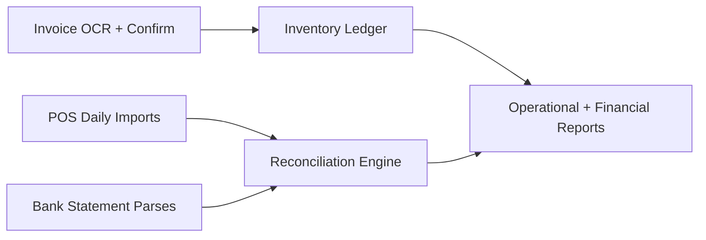

# Milestones Roadmap

## Delivered

### Phase 0: Foundation

- Auth + refresh cookie
- Company onboarding (create/join)
- Multi-tenant scoping
- RBAC (module + CRUD + custom actions)
- Dashboard shell

### Phase 1: Data ingestion and operational baseline

- POS daily import via CSV
- Daily and monthly summary reporting
- Item catalog (CSV import + CRUD)
- Location CRUD
- Inventory move events
- Inventory by-location aggregation

## Next

### Phase 2: Supplier invoice OCR

- File upload for invoice docs
- OCR adapter abstraction and parse pipeline
- Human confirmation UI
- Create supplier invoice and inventory purchase ledger entries

### Phase 3: Bank statement parsing and reconciliation

- Bank document ingestion
- Transaction parsing
- Auto-match suggestions (deposits/EFT/vendor)
- Confirm/unmatch workflows and payment allocation

### Phase 4: Reporting and audit maturity

- Daily/monthly KPI boards
- Unmatched queues and variance reports
- Export tools and audit timeline

## End-to-End Future State

