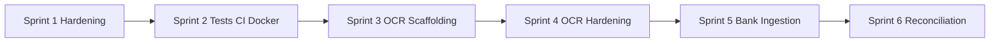

# RetailSync Sprint Plan (Phase + Module + Ticket)

Status legend:
- `TODO`
- `IN_PROGRESS`
- `BLOCKED`
- `DONE`

## Sprint 1: Multi-tenant + Security Hardening

### EPIC S1-E1 Tenant Isolation Enforcement
- S1-1 Tenant query enforcement layer (wrapper/plugin/repository): `TODO`
- S1-2 Tenant aggregate helper + lint rule: `TODO`
- S1-3 Tenant breach regression suite: `TODO`

### EPIC S1-E2 Auth + Refresh Security
- S1-4 Refresh token rotation + revoke: `TODO`
- S1-5 Auth middleware contract hardening: `TODO`

### EPIC S1-E3 Immutability + Delete Governance
- S1-6 Inventory ledger immutability enforcement: `TODO`
- S1-7 Never-delete framework + void contract: `TODO`

### EPIC S1-E4 Audit Foundation
- S1-8 AuditLog model + critical action logging: `TODO`

Sprint 1 close criteria:
- tenant isolation regression tests green
- auth rotation tests green
- audit logging in critical write paths

## Sprint 2: Tests + CI + Docker Reliability

### EPIC S2-E1 Server Tests
- S2-1 POS idempotency + row error tests: `TODO`
- S2-2 Inventory aggregation correctness tests: `TODO`
- S2-3 RBAC middleware coverage tests: `TODO`

### EPIC S2-E2 Frontend Tests
- S2-4 PermissionGate behavior tests: `TODO`
- S2-5 Axios refresh flow tests: `TODO`

### EPIC S2-E3 E2E Smoke Suite
- S2-6 Playwright smoke paths (Phase 0-2): `TODO`

### EPIC S2-E4 CI/CD + Docker
- S2-7 CI execution confirmation + branch protections: `TODO`
- S2-8 Docker compose single-command boot hardening: `TODO`
- S2-9 Registry/BuildKit reliability runbook: `TODO`

Sprint 2 close criteria:
- CI green in hosted runner
- Docker build and compose smoke green
- E2E smoke suite green

## Sprint 3: Phase 3 OCR Scaffolding

### EPIC S3-E1 Ingestion Pipeline
- S3-1 IngestionFile model + lifecycle: `TODO`
- S3-2 Storage provider abstraction (local + S3/R2 skeleton): `TODO`

### EPIC S3-E2 Supplier + Invoice Models
- S3-3 Supplier model + endpoints: `TODO`
- S3-4 SupplierInvoice schema + rules: `TODO`

### EPIC S3-E3 OCR Layer
- S3-5 OCR provider interface + mock: `TODO`
- S3-6 Preview endpoint: `TODO`

### EPIC S3-E4 Confirm Flow
- S3-7 Confirm endpoint + transactional ledger writes: `TODO`

### EPIC S3-E5 Frontend Invoice UI
- S3-8 Upload + preview UI: `TODO`
- S3-9 Item mapping UX: `TODO`

Sprint 3 close criteria:
- Upload -> preview -> confirm path complete and tested

## Sprint 4: Phase 3 Hardening + Release Readiness

### EPIC S4-E1 Invoice Hardening
- S4-1 Void flow + reversal strategy: `TODO`
- S4-2 Invoice reporting endpoints: `TODO`

### EPIC S4-E2 Tests
- S4-3 OCR preview/confirm full integration test: `TODO`

### EPIC S4-E3 CI+Docker Coverage
- S4-4 E2E invoice scenario in Playwright: `TODO`

Sprint 4 close criteria:
- invoice module meets full DoD

## Sprint 5: Phase 4 Bank Ingestion

### EPIC S5-E1 Bank Core
- S5-1 BankTransaction model + immutability: `TODO`
- S5-2 Bank parser stub + preview flow: `TODO`

Sprint 5 close criteria:
- bank upload + parsed review available and tenant-safe

## Sprint 6: Reconciliation + Payments

### EPIC S6-E1 Suggestion Engines
- S6-1 Deposit matching API: `TODO`
- S6-2 EFT matching API: `TODO`
- S6-3 Supplier payment matching API: `TODO`

### EPIC S6-E2 Confirmation + Allocation
- S6-4 Match confirm/unmatch endpoints: `TODO`
- S6-5 Payment allocation endpoint: `TODO`

Sprint 6 close criteria:
- reconciliation suggestions + confirmation + payments allocation complete

## Dependency Chain

