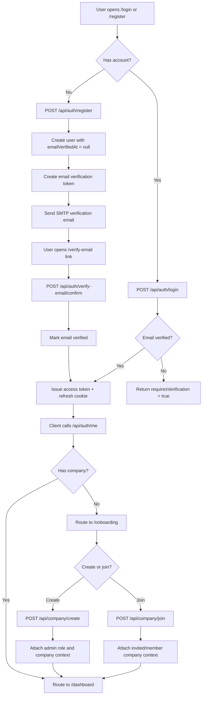
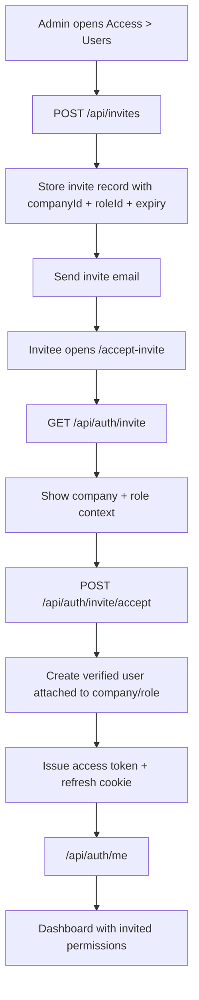
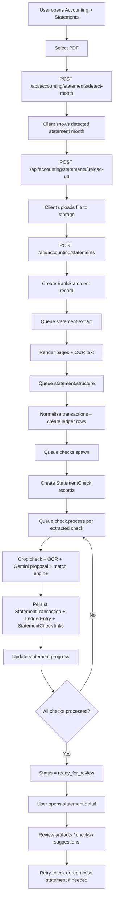
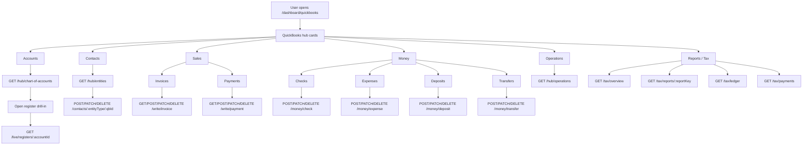
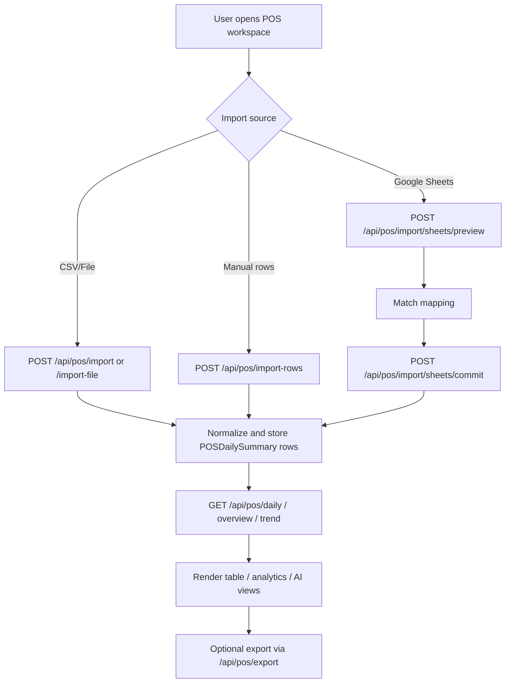
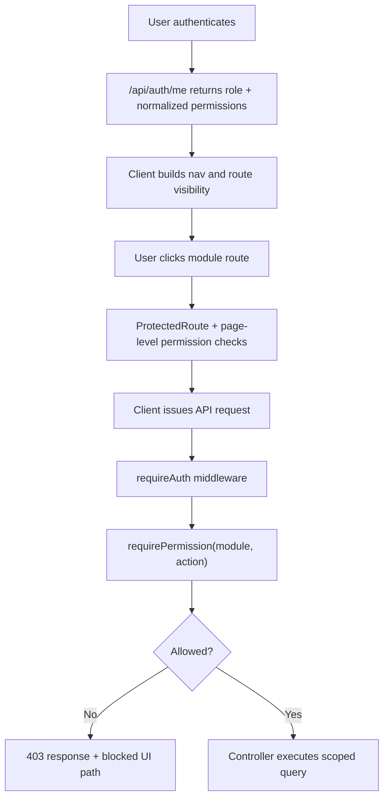

# RetailSync Full Module Audit

Last updated: 2026-04-19

Purpose:
- capture the current status of each active module
- list the main testable functions for each module
- define end-to-end and edge-case test coverage needed before broad production hardening
- document the main user and processing flows with Mermaid diagrams

Important scope note:
- this document tracks **product functions and major API/service flows**, not every single source-level helper function in the repository
- procurement is still routable but not treated as release-ready
- inventory is no longer part of the active product surface

Companion docs:
- [status.md](/Users/trupal/Projects/RetailSync/docs/status.md)
- [module-test-matrix.md](/Users/trupal/Projects/RetailSync/docs/testing/module-test-matrix.md)
- [module-e2e-cases.md](/Users/trupal/Projects/RetailSync/docs/testing/module-e2e-cases.md)
- [workflows-and-usage.md](/Users/trupal/Projects/RetailSync/docs/architecture/workflows-and-usage.md)
- [api-reference.md](/Users/trupal/Projects/RetailSync/docs/backend/api-reference.md)

## 1. Active Product Surface

### Current top-level product areas
- Auth and onboarding
- Dashboard shell
- POS
- Accounting statements
- QuickBooks
- Settings
- Access / RBAC

### Present but not primary
- Procurement
- Reports as API/product-flow support rather than dedicated visible workspace
- Dev/legal/public utility pages

### Removed from active product
- Inventory

## 2. Module Status

| Module | Purpose | Main routes/pages | Main backend areas | Completeness | Release confidence |
|---|---|---|---|---|---|
| Auth | Register, sign in, verify email, reset password, session bootstrap | `/login`, `/register`, `/forgot-password`, `/reset-password`, `/verify-email`, `/accept-invite` | `authRoutes`, `authController`, `authGoogleController`, `authSessionService`, `mailer` | `90%` | `PARTIAL` |
| Onboarding / Company | Create company, join company, QuickBooks-assisted onboarding | `/onboarding`, `/onboarding/create-company`, `/onboarding/join-company` | `companyRoutes`, `companyController`, `companyOnboardingService`, `QuickBooksOnboarding` | `85%` | `PARTIAL` |
| Dashboard shell | Protected app shell, route ownership, nav based on RBAC | `/dashboard/*` | client-side only with `/api/auth/me` and permission context | `80%` | `PARTIAL` |
| Access / RBAC | Users, roles, invites, permission matrix | `/dashboard/access/users`, `/dashboard/access/roles` | `userRoutes`, `roleRoutes`, `inviteRoutes`, `requirePermission` | `80%` | `PARTIAL` |
| POS | Import, table, analytics, AI review, export | `/dashboard/pos` | `posRoutes`, `posController`, `reportsController`, POS models/services | `85%` | `PARTIAL` |
| Accounting statements | Upload statement, track status, inspect artifacts, retry/reprocess | `/dashboard/accounting/statements`, `/dashboard/accounting/statements/:statementId` | `accountingRoutes`, `accountingController`, accounting jobs/services/models | `80%` | `PARTIAL` |
| QuickBooks | Accounts, contacts, sales, money, operations, reports, tax | `/dashboard/quickbooks/*` | `quickbooksIntegrationRoutes`, `quickbooksController`, `quickbooksTaxController`, QuickBooks services | `85%` | `PARTIAL` |
| Settings | Integration and settings management | `/dashboard/settings` | `settingsRoutes`, Google Sheets + QuickBooks settings controllers | `80%` | `PARTIAL` |
| Google Sheets | POS/import and settings-side spreadsheet sync/config | inside Settings and POS import helpers | `sheetsRoutes`, `googleRoutes`, `integrationGoogleSheetsRoutes`, `syncSheets`, connectors/controllers | `75%` | `PARTIAL` |
| Procurement | Placeholder invoices/suppliers workspace | `/dashboard/procurement` | limited/no full server domain flow | `25%` | `LOW` |
| Dev / Legal / Public | demo pages and legal pages | `/home-demo`, `/privacy`, `/terms`, `/data-deletion`, `/playground` | mostly client/static | `70%` | `MEDIUM` |

## 3. Function Inventory And Test Checklist

This section lists the main user-facing and API-facing functions that should be tested.

### 3.1 Auth

#### Main user functions
- Register with email/password
- Request email verification resend
- Confirm email verification token
- Login with verified account
- Login with unverified account
- Start Google sign-in
- Complete Google callback
- Request password reset
- Confirm password reset token
- Refresh cookie session
- Logout
- Load `/api/auth/me`
- Accept invite and create account into invited company
- Lookup invite metadata from invite link

#### Main backend routes
- `POST /api/auth/register`
- `GET /api/auth/invite`
- `POST /api/auth/invite/accept`
- `POST /api/auth/login`
- `POST /api/auth/forgot-password`
- `POST /api/auth/reset-password`
- `POST /api/auth/verify-email/request`
- `POST /api/auth/verify-email/confirm`
- `GET /api/auth/google/start`
- `GET /api/auth/google/callback`
- `POST /api/auth/refresh`
- `POST /api/auth/logout`
- `GET /api/auth/me`

#### Must-test cases
- Valid register sends verification email
- Duplicate email register returns conflict
- Login before verification returns `requiresVerification`
- Verification token can only be used once
- Expired verification token fails cleanly
- Forgot-password for known email sends reset email
- Forgot-password for unknown email does not leak account existence
- Reset-password rejects expired/used token
- Login with old password fails after reset
- Refresh rotates token and rejects replayed refresh token
- Logout revokes refresh token
- Invite acceptance provisions company and role correctly
- Invite acceptance rejects expired invite
- Google callback preserves onboarding path when no company exists

#### Edge cases
- email normalization and case-insensitive login
- invite token for already-registered email
- missing or malformed cookie on refresh/logout
- SMTP failure during register/verification/reset
- user inactive state

### 3.2 Onboarding / Company

#### Main user functions
- Create company manually
- Join company with company/invite code flow
- Start QuickBooks-assisted onboarding
- Auto-create company from QuickBooks onboarding result
- Load current company

#### Main backend routes
- `POST /api/company/create`
- `GET /api/company/quickbooks/onboarding`
- `POST /api/company/quickbooks/connect`
- `POST /api/company/join`
- `GET /api/company/mine`

#### Must-test cases
- create company assigns admin role and company context
- create company rejects duplicate/invalid data
- join company attaches user to target company
- join company rejects invalid code or expired invite linkage
- QuickBooks onboarding status returns pending context when present
- QuickBooks onboarding start sets handoff correctly
- company context is reflected in `/api/auth/me` after creation

#### Edge cases
- user already belongs to company
- user tries to join a second company
- QuickBooks onboarding exists but company create is abandoned
- company create after QuickBooks onboarding claims pending integration correctly

### 3.3 Dashboard Shell

#### Main user functions
- Protected route redirect when not authenticated
- Onboarding guard redirect when authenticated but not company-bound
- Nav hides unauthorized modules
- Legacy aliases redirect to canonical routes

#### Must-test cases
- unauthenticated user cannot open `/dashboard/*`
- authenticated no-company user lands in onboarding
- limited role sees only allowed nav items
- `/dashboard/users` redirects to `/dashboard/access/users`
- `/dashboard/bankStatements` redirects to statements
- old accounting QuickBooks aliases redirect to new QuickBooks workspace

#### Edge cases
- stale permission state during bootstrap
- browser refresh on nested protected route
- hidden module still accessible by direct URL but blocked by permissions

### 3.4 Access / RBAC

#### Main user functions
- View users
- Assign user role
- View roles
- View modules catalog
- Create role
- Edit role
- Delete role
- Send invite
- List invites
- Delete invite

#### Main backend routes
- `GET /api/users`
- `PUT /api/users/:id/role`
- `GET /api/roles/modules`
- `GET /api/roles`
- `POST /api/roles`
- `PUT /api/roles/:id`
- `DELETE /api/roles/:id`
- `POST /api/invites`
- `GET /api/invites`
- `DELETE /api/invites/:id`

#### Must-test cases
- role CRUD persists permissions
- action modal only shows valid actions per module
- assigning role updates user access on next auth context fetch
- invite creation sends email and stores invite
- deleting invite invalidates acceptance path
- users without role management permission cannot mutate roles

#### Edge cases
- delete role currently in use
- create role with invalid permission payload
- invite email already belongs to company member
- role matrix drift when nav modules are hidden/removed

### 3.5 POS

#### Main user functions
- Import CSV file
- Import mapped file
- Import raw rows
- Preview Google Sheets import
- Commit Google Sheets import
- Match Google Sheets mapping
- Clear POS data
- List daily POS rows
- View trend
- View paged daily data
- View overview
- Query POS AI
- Export CSV

#### Main backend routes
- `POST /api/pos/import`
- `POST /api/pos/import-file`
- `POST /api/pos/import-rows`
- `POST /api/pos/import/sheets/preview`
- `POST /api/pos/import/sheets/commit`
- `POST /api/pos/import/google-sheets`
- `POST /api/pos/import/sheets/match`
- `POST /api/pos/clear`
- `GET /api/pos/daily`
- `GET /api/pos/trend`
- `GET /api/pos/daily-paged`
- `GET /api/pos/overview`
- `POST /api/pos/ai/query`
- `GET /api/pos/export`

#### Must-test cases
- file import accepts valid input and normalizes rows
- invalid file shape returns useful validation errors
- preview does not persist rows
- commit persists rows
- import mapping detects expected columns
- overview/trend reflect imported data
- export returns CSV with expected headers
- clear removes only scoped company data
- AI query returns validated response payload

#### Edge cases
- duplicate dates/rows
- partial row invalidation
- blank rows in source sheet
- timezone-sensitive daily summaries
- importing with missing Google Sheets connector config
- AI fallback or empty dataset behavior

### 3.6 Accounting Statements

#### Main user functions
- Detect statement month from uploaded PDF
- Request upload URL
- Create statement
- List statements
- View statement detail
- View statement status
- View checks
- View suggestions
- Download/view artifacts
- Stream statement artifact
- Reprocess statement
- Retry individual check
- Delete statement

#### Main backend routes
- `POST /api/accounting/statements/detect-month`
- `GET /api/accounting/statements`
- `GET /api/accounting/statements/:id`
- `GET /api/accounting/statements/:id/status`
- `GET /api/accounting/statements/:id/checks`
- `GET /api/accounting/statements/:id/suggestions`
- `GET /api/accounting/statements/:id/artifact`
- `GET /api/accounting/statements/:id/stream`
- `POST /api/accounting/statements/upload-url`
- `POST /api/accounting/statements`
- `DELETE /api/accounting/statements/:id`
- `POST /api/accounting/statements/:id/reprocess`
- `POST /api/accounting/statements/:id/checks/:checkId/retry`

#### Processing services and jobs to test
- PDF render
- OCR extraction
- PDF analysis and month detection
- check crop service
- check extraction service
- Gemini proposal service
- matching engine
- accounting queue
- accounting task runner
- daily accounting sync scheduler

#### Must-test cases
- month detection auto-applies when confident
- upload URL request returns company-scoped GCS path
- create statement starts pipeline correctly
- status transitions: `uploaded -> extracting -> structuring -> checks_queued -> ready_for_review`
- statement detail surfaces artifacts and check statuses
- reprocess resets and restarts pipeline
- retry check restarts only failed/stuck check
- delete statement removes scoped record
- suggestions payload renders expected buckets

#### Edge cases
- PDF with no detectable month
- storage upload CORS failure
- OCR failure on one page
- extracted checks mismatch statement transactions
- Gemini unavailable and deterministic fallback path
- repeated reprocess calls
- retry after already-ready check
- artifact path missing from storage
- long-running or partially completed queue tasks

### 3.7 QuickBooks

#### Main user functions
- Read OAuth status
- Read integration settings
- Update settings
- Generate connect URL
- Start OAuth connect
- Disconnect QuickBooks
- Refresh reference data
- Post approved sync
- Run raw read query
- Read account register
- Read live transactions by type
- Read live transaction detail
- CRUD money transactions
- CRUD write transactions
- Read chart of accounts
- Read hub entities
- CRUD contacts
- Read hub operations
- Read tax overview
- Read tax reports
- Read tax chart of accounts
- Read tax ledger
- Read tax payments
- Recover payment
- Create journal adjustment

#### Main backend routes
- `GET /api/integrations/quickbooks/oauth-status`
- `GET /api/integrations/quickbooks/settings`
- `PUT /api/integrations/quickbooks/settings`
- `GET /api/integrations/quickbooks/start-url`
- `GET /api/integrations/quickbooks/start`
- `POST /api/integrations/quickbooks/sync/refresh-reference-data`
- `POST /api/integrations/quickbooks/sync/post-approved`
- `POST /api/integrations/quickbooks/query`
- `GET /api/integrations/quickbooks/live/registers/:accountId`
- `GET /api/integrations/quickbooks/live/transactions/:type`
- `GET /api/integrations/quickbooks/live/transaction/:qbTxnId`
- `POST/PATCH/DELETE /api/integrations/quickbooks/money/:txnType`
- `GET/POST/PATCH/DELETE /api/integrations/quickbooks/write/:txnType`
- `GET /api/integrations/quickbooks/hub/chart-of-accounts`
- `GET /api/integrations/quickbooks/hub/entities`
- `GET/POST/PATCH/DELETE /api/integrations/quickbooks/contacts/:entityType`
- `GET /api/integrations/quickbooks/hub/operations`
- `GET /api/integrations/quickbooks/tax/*`
- `POST /api/integrations/quickbooks/tax/recover-payment`
- `POST /api/integrations/quickbooks/tax/journal-adjustment`
- `POST /api/integrations/quickbooks/disconnect`
- `GET /api/integrations/quickbooks/callback`

#### Must-test cases
- connect/disconnect flow
- accounts page loads and register drill-in works
- contacts page create/edit/deactivate for customer and vendor
- sales page invoice CRUD works
- sales page payment CRUD works
- money page check CRUD works
- money page expense CRUD works
- money page deposit CRUD works
- money page transfer CRUD works
- operations page loads
- reports/tax pages load expected report payloads
- permission gates block write actions without `quickbooks:post`

#### Edge cases
- expired OAuth token / reconnect needed
- missing company QuickBooks integration
- unsupported `txnType`
- invalid QuickBooks id in detail or edit path
- upstream QuickBooks 400/401/500 propagation
- write succeeds upstream but local sync queue is stale
- payment recovery duplicates
- chart-of-accounts empty or partial result

### 3.8 Settings / Google Sheets

#### Main user functions
- Load settings overview
- List OAuth sources
- List shared profiles
- View sync overview
- Activate Google Sheets
- Stage change
- Commit change
- Create OAuth source
- Update OAuth connector
- Create shared profile
- Update shared connector
- Set mode
- Upsert source
- Test sheet access
- Reset Google Sheets integration
- Verify shared sheets config
- Disconnect Google
- Update QuickBooks settings from settings page
- Connect QuickBooks from settings page
- Disconnect QuickBooks from settings page

#### Main backend routes
- `GET /api/settings`
- `GET /api/settings/google-sheets/oauth/sources`
- `GET /api/settings/google-sheets/shared/profiles`
- `GET /api/settings/google-sheets/sync-overview`
- `POST /api/settings/google-sheets/activate`
- `POST /api/settings/google-sheets/stage-change`
- `POST /api/settings/google-sheets/commit-change`
- `POST /api/settings/google-sheets/oauth/sources`
- `PUT /api/settings/google-sheets/oauth/sources/:sourceId/connectors/:connectorKey`
- `POST /api/settings/google-sheets/shared/profiles`
- `PUT /api/settings/google-sheets/shared/profiles/:profileId/connectors/:connectorKey`
- `PUT /api/settings/google-sheets/mode`
- `PUT /api/settings/google-sheets/source`
- `POST /api/settings/google-sheets/test`
- `POST /api/settings/google-sheets/reset`
- `POST /api/settings/google-sheets/shared/verify`
- `POST /api/settings/disconnect/google`
- `PUT /api/settings/quickbooks`
- `POST /api/settings/quickbooks/connect`
- `POST /api/settings/disconnect/quickbooks`

#### Must-test cases
- settings overview loads with current integration state
- Google Sheets connector update persists
- staging then commit writes expected config
- verify/test endpoints catch invalid sheets details
- mode switching updates active sync mode
- reset clears Sheets integration safely
- QuickBooks settings connect/disconnect from settings stays in sync with QuickBooks workspace

#### Edge cases
- invalid spreadsheet id
- missing connector-specific credentials
- partial shared profile configuration
- settings update by unauthorized role
- switching modes while sync jobs are in flight

### 3.9 Procurement

#### Main user functions
- View procurement hub
- Inspect invoices placeholder table
- Inspect suppliers placeholder table

#### Must-test cases
- route still loads without crashing
- hidden nav remains hidden
- placeholder data does not leak into live flows

#### Edge cases
- direct route access by user with permissions
- future backend integration can replace placeholder without route breakage

## 4. End-To-End Test Journeys

### 4.1 Core release path
1. Register user
2. Verify email
3. Login
4. Create company
5. Load dashboard shell
6. Confirm RBAC-aware nav
7. Open settings and confirm integrations state
8. Open POS and import data
9. Open accounting statements and upload statement
10. Watch statement pipeline progress
11. Open QuickBooks and confirm operational surfaces
12. Send invite and accept invite as second user

### 4.2 High-value smoke journeys
- Auth-only journey
- QuickBooks connect plus customer/vendor CRUD
- QuickBooks invoice/payment journey
- QuickBooks money journey
- POS import plus export journey
- Statement upload plus reprocess journey
- Access role restriction journey

## 5. Mermaid Flowcharts

### 5.1 Auth and onboarding



### 5.2 Invite flow



### 5.3 Statement upload and accounting pipeline



### 5.4 QuickBooks workspace



### 5.5 POS import flow



### 5.6 RBAC enforcement



## 6. Edge-Case Matrix By Module

| Module | Highest-risk edge cases |
|---|---|
| Auth | duplicate email, stale refresh cookie, SMTP failure, expired verification token, password reset replay |
| Onboarding | user without company after auth, QuickBooks onboarding partial state, joining wrong company, role attachment failure |
| Access / RBAC | hidden module still direct-link reachable, delete role in use, stale permission cache, invite expiry |
| POS | malformed CSV, duplicate rows, timezone drift, missing connector config, empty AI dataset |
| Accounting statements | CORS upload failure, OCR failure, queue retry drift, artifact missing, partially processed check set |
| QuickBooks | OAuth expiry, upstream 400/401/500, unsupported transaction type, duplicate payment recovery, stale reference data |
| Settings / Sheets | invalid spreadsheet config, partial connector update, reset during active sync, unauthorized edit |
| Procurement | route still exposed despite hidden nav, placeholder data mistaken for production-ready state |

## 7. Current Automated Coverage Summary

### Strongest automated areas
- auth page/API flows on the client
- auth/session and email/invite flows on the server
- QuickBooks contact/money/write/read service tests
- accounting task runner and accounting services
- POS controller and AI service coverage
- architecture boundary tests

### Environment-limited or partial areas
- server integration suites using `mongodb-memory-server`
- cron routes when sandbox disallows socket binding
- full browser E2E journeys

### Recommended command set before production hardening

```bash
pnpm -r typecheck
pnpm -r build
pnpm -C server test
pnpm -C client test
pnpm -C server exec vitest run src/auth.email.test.ts src/companyController.test.ts src/jobs/accountingTaskRunner.test.ts src/services/quickbooksContactCrudService.test.ts src/services/quickbooksMoneyService.test.ts
pnpm -C client exec vitest run src/modules/auth/pages/RegisterPage.test.tsx src/modules/auth/pages/LoginPage.test.tsx src/modules/accounting/components/UploadStatementDialog.test.tsx src/modules/accounting/pages/QuickBooksMoneyPages.test.tsx src/modules/quickbooks/pages/Contacts.test.tsx
```

## 8. Recommended Manual Release Checklist

1. Register, verify email, log in, log out, refresh.
2. Forgot-password and reset-password.
3. Create company manually.
4. QuickBooks-assisted company onboarding.
5. Invite second user and accept invite.
6. Confirm access nav changes by role.
7. Import POS data and verify analytics + export.
8. Upload statement, wait for processing, inspect detail, retry/reprocess.
9. Connect QuickBooks and test:
   - contacts CRUD
   - invoice/payment CRUD
   - deposit/check/expense/transfer CRUD
   - accounts register drill-in
10. Open settings and verify Google Sheets and QuickBooks configuration persistence.

## 9. Biggest Current Gaps

1. Browser E2E is still manual/documented rather than enforced in CI.
2. Procurement is routable but not product-complete.
3. Some legacy accounting aliases and compatibility redirects still exist.
4. Full release confidence still depends on running integration suites in an environment that permits local bind/listen behavior for Mongo memory server and supertest.
