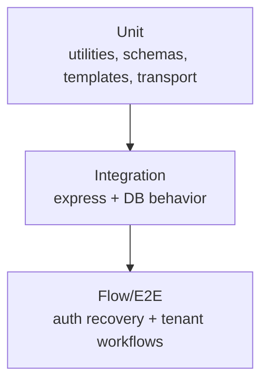
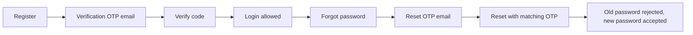

# Testing Strategy

## Current Implemented Tests

### Server

- `/Users/trupal/Projects/RetailSync/server/src/app.test.ts`
  - health endpoint contract
- `/Users/trupal/Projects/RetailSync/server/src/auth.refresh.test.ts`
  - refresh rotation and old token reuse rejection
- `/Users/trupal/Projects/RetailSync/server/src/tenantIsolation.test.ts`
  - cross-tenant isolation + scoped aggregates
- `/Users/trupal/Projects/RetailSync/server/src/inventoryLedger.immutability.test.ts`
  - immutable ledger behavior
- `/Users/trupal/Projects/RetailSync/server/src/auth.account-recovery.e2e.test.ts`
  - register -> verify OTP -> forgot -> reset OTP -> login with new password
- `/Users/trupal/Projects/RetailSync/server/src/services/emailService.test.ts`
  - email transport behavior (`test_capture`, not configured, success, provider failure)
- `/Users/trupal/Projects/RetailSync/server/src/services/emailTemplates.test.ts`
  - branded logo presence and template distinctness

### Client

- `/Users/trupal/Projects/RetailSync/client/src/utils/permissions.test.ts`
- `/Users/trupal/Projects/RetailSync/client/src/components/PermissionGate.test.tsx`
- `/Users/trupal/Projects/RetailSync/client/src/components/ImportPOSDataModal.test.tsx`

## Run Commands

```bash
pnpm --filter @retailsync/server test
pnpm --filter @retailsync/client test
pnpm test
```

Targeted runs:

```bash
pnpm --filter @retailsync/server exec vitest run src/services/emailService.test.ts
pnpm --filter @retailsync/server exec vitest run src/services/emailTemplates.test.ts
```

## Test Pyramid



## Scenario Coverage: Auth Recovery



## CI Notes

- Some suites require `mongodb-memory-server` runtime support.
- Environments that block ephemeral bind/listen operations can fail DB-backed tests.
- Use targeted unit test commands for transport/template verification when DB tests are unavailable.

## Next Priority

1. Add dedicated auth API integration tests for non-email error paths (`emailDebug`).
2. Add E2E browser automation (Playwright) for complete UI auth flows.
3. Add coverage thresholds in CI.
